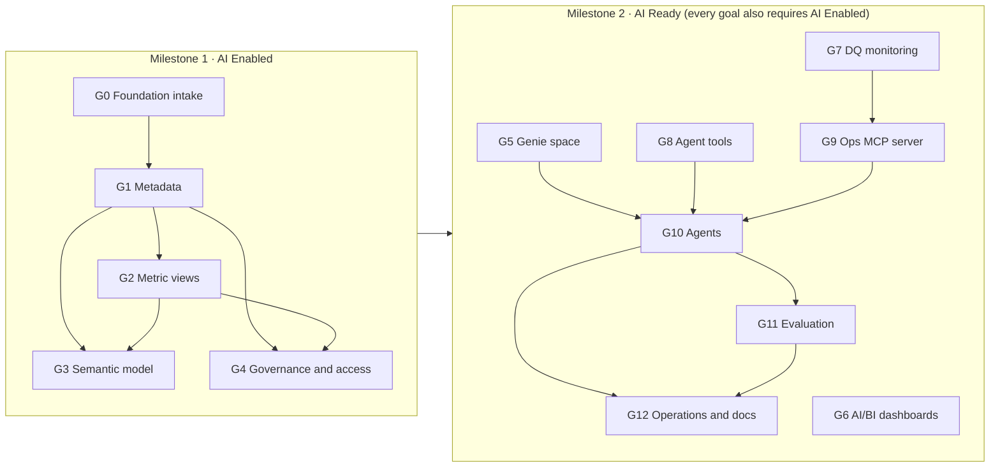
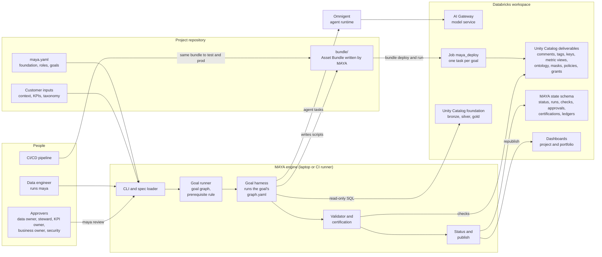

# MAYA Databricks AI Accelerator

A goal engine that takes an existing Bronze/Silver/Gold data foundation and makes it **AI Enabled** (milestone 1,
goals G0 to G4, available now) and then **AI Ready** (milestone 2, goals G5 to G12; G5 is available now, G6 to G12
will be released later).
Each goal is declared in YAML, runs as a graph harness (deterministic steps, agents, validated gates), is checked
by its own validator and is certified. Every deliverable is a script delivered through the project's Databricks
Asset Bundle; promotion between environments is left to your CI/CD.

## Two milestones: AI Enabled, then AI Ready

MAYA works through a chain of 13 goals (G0 to G12) grouped into two milestones. A goal runs only when every
prerequisite goal is complete, validated and certified; when a certified goal changes, the goals after it are
re-validated. Every item of the AI Enabled & AI Ready Certification Checklist belongs to exactly one goal's validator:
AE items to the AI Enabled goals, AR items to the AI Ready goals.



### Milestone 1 · AI Enabled (available now)

The data foundation is described, measured, modelled and governed. **AI Enabled = G0 to G4 certified.**

| Goal | Outcome | Prerequisites | Certified by | Checklist |
|------|---------|---------------|--------------|-----------|
| [G0 Foundation intake](maya/goals/g00_foundation/README.md) | The Bronze, Silver and Gold foundation is in place and every asset is registered. Read-only. | - | Data owner | AE-1 to AE-4, AE-8.1 |
| [G1 Metadata](maya/goals/g01_metadata/README.md) | Every table, view and column is described, classified for sensitivity and connected by keys. | G0 | Data steward, data owner | AE-3.2, AE-5.1 to AE-5.5 |
| [G2 Metric views](maya/goals/g02_metric_views/README.md) | Every KPI is a Unity Catalog metric view with business-friendly measures, proven against independent SQL. | G1 | KPI owner, data steward | AE-5.1, AE-6.1 to AE-6.3 |
| [G3 Semantic model](maya/goals/g03_semantic_model/README.md) | Domains, subdomains and pages are defined; every Silver, Gold and metric-view asset sits on exactly one page. | G1, G2 | Business owner | AE-7.1 to AE-7.4 |
| [G4 Governance and access](maya/goals/g04_governance/README.md) | Least-privilege access; every sensitive column masked; row filters; audit. | G1, G2 | Security | AE-3.4, AE-8.1 to AE-8.4 |

`maya status` reports the milestone (`milestone AI Enabled: reached`) once G0 to G4 are certified. Each goal's
page shows its architecture: inputs, harness graph, outputs and checks.

### Milestone 2 · AI Ready (G5 available now; G6 to G12 will be released later)

On top of AI Enabled, the data product is usable by people and agents. **AI Ready = AI Enabled plus G5 to G12
certified.** Every AI Ready goal also requires AI Enabled.

| Goal | Outcome | Prerequisites | Certified by | Checklist |
|------|---------|---------------|--------------|-----------|
| [G5 Genie space](maya/goals/g05_genie_space/README.md) | A Genie space over metric views and Gold that answers business questions correctly. | G2, G3 | Business owner | AR-1.1 to AR-1.4 |
| G6 AI/BI dashboards | One dashboard page per semantic page, built only on metric views, published and scheduled. | G2, G3 | Business owner | AR-2.1 to AR-2.3 |
| G7 Data quality monitoring | Foundation data quality is visible and alerts fire on failures. | G1 | Data owner | AR-2.4, AR-7.2 |
| G8 Agent tools (UC functions) | Reusable business actions as self-describing Unity Catalog functions agents can call. | G2, G3 | Security | AR-3.1 to AR-3.4 |
| G9 Operations MCP server | Operational notebooks run as parameterised jobs that agents call through an MCP server. | G4, G7 | Security | AR-4.1 to AR-4.4 |
| G10 Agents | A supervisor with capability-scoped sub-agents, deployed and traced. | G5, G8, G9 | Product owner | AR-5.1 to AR-5.4 |
| G11 Evaluation | Agent and Genie answers verified against SQL truth, with regression on change. | G10 | Business owner | AR-6.1 to AR-6.3 |
| G12 Operations and documentation | The system is operable and documented for its consumers. | G10, G11 | Platform owner | AR-7.1, AR-7.3, AR-7.4, AR-8.1, AR-8.2 |

G6 to G12 are not in this release; they will be released later. Until they are, `maya status` reports
`milestone AI Ready: not yet` and names the goals still to be released.

## How it works



The full picture, including a goal run end to end, goal statuses, delivery and promotion, and the state model, is in
[docs/ARCHITECTURE.md](docs/ARCHITECTURE.md).

- `maya.yaml` declares the project, its foundation and the inputs of each goal. Inputs are validated against each
  goal's `inputs.schema.json` before anything runs.
- A goal runs only when its prerequisites are certified. Certification is frictionless: gates and sign-off are
  approved automatically once validation passes (`certification.approvals: auto`), and a goal that is already done
  can be self-certified in `maya.yaml` under `certification.self_certified`.
- Goal outputs are written as scripts into the project's Asset Bundle and deployed by it. MAYA writes only its own
  state and registry directly.
- Models are called through the Databricks AI Gateway.

## Quick start

```bash
python3.12 -m venv .venv && .venv/bin/pip install -e . && source .venv/bin/activate
export DATABRICKS_CONFIG_PROFILE=<profile> MAYA_WAREHOUSE_ID=<warehouse-id> MAYA_APPROVER=<you@example.com>
# G4 roles in the commercial_analytics example: two account-level groups in your workspace
export MAYA_CONSUMER_GROUP=<consumer-group> MAYA_ENGINEER_GROUP=<engineer-group>

cd examples/commercial_analytics
maya validate
maya init
maya goals
maya run --goal G0     # then G1, G2, G3, G4 - or just `maya run`, which picks the next ready goal
maya status            # goals, checks, certifications and the AI Enabled milestone
```

Other commands: `plan`, `review`, `bundle`, `migrate`, `projects`, `portfolio` (see `maya --help`).

## Documentation

| Document | For |
|----------|-----|
| [Architecture](docs/ARCHITECTURE.md) | How MAYA works: components, the two levels of graph, a goal run end to end, statuses, delivery through the Asset Bundle and CI/CD, the state model |
| [Example: from a synthetic foundation to AI Enabled](docs/TUTORIAL.md) | Learning MAYA: deploys a sample foundation and runs G0 to G5 on it, explaining every goal, check and command |
| [Your own foundation to AI Enabled](docs/TUTORIAL_YOUR_FOUNDATION.md) | Using MAYA on your data: inventory, `maya.yaml` for your layers, your context, KPIs, taxonomy and access model, then CI/CD |

## Layout

- `maya/core`: engine (spec, runner, harness, state, certification, bundle)
- `maya/goals/gNN_*`: one folder per goal with `goal.yaml`, `inputs.schema.json`, `code/`, `harness/` and `validator/`,
  and a `README.md` with the goal's architecture diagram
- `maya/bundle`: the script runner deployed with the Asset Bundle
- `maya/status`: status report and dashboards
- `examples/`: `commercial_analytics` (G0 to G5) and `supply_chain`

Workspace-specific values (profile, warehouse, approver, groups) come from environment variables referenced as
`${env:NAME}` in `maya.yaml`. The examples use the catalog `solution_builder`; change `foundation.catalog`,
`target.state_schema`, `target.registry` and the SQL in `kpis/metric_views.yaml` to use another. Each example's Asset Bundle (`examples/*/bundle/`) is
generated in your checkout by `maya run` and `maya bundle` and is not committed here.

## License

Apache-2.0
