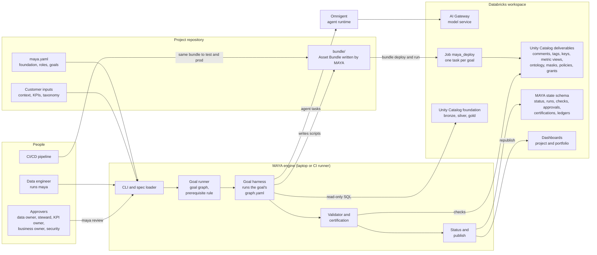
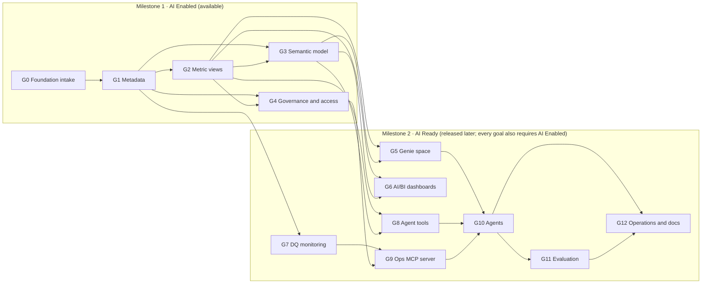
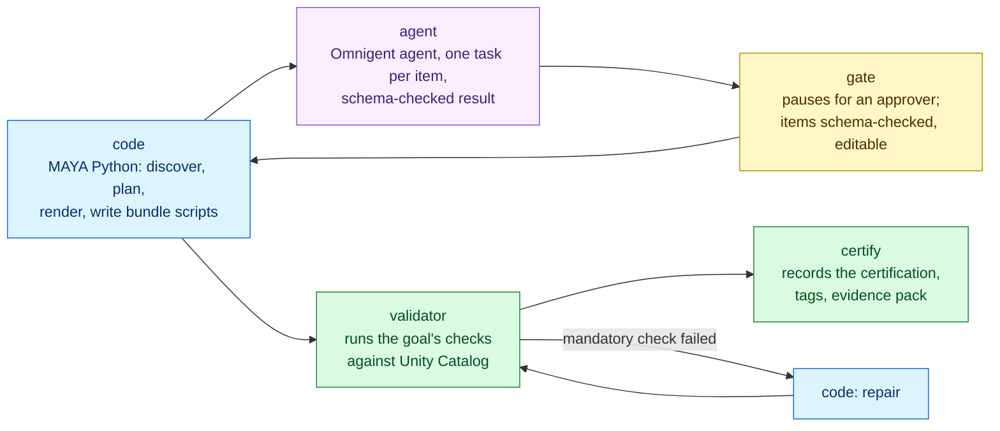
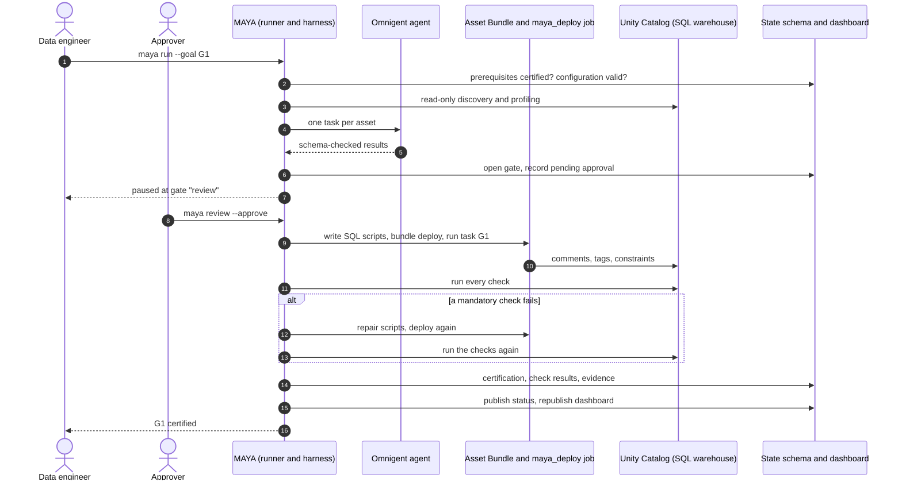
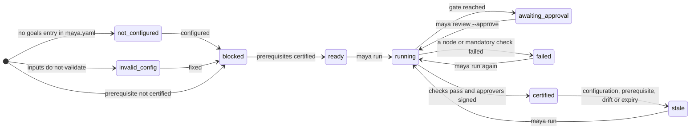
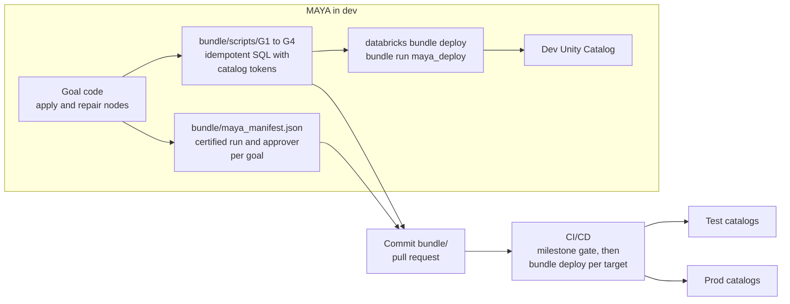
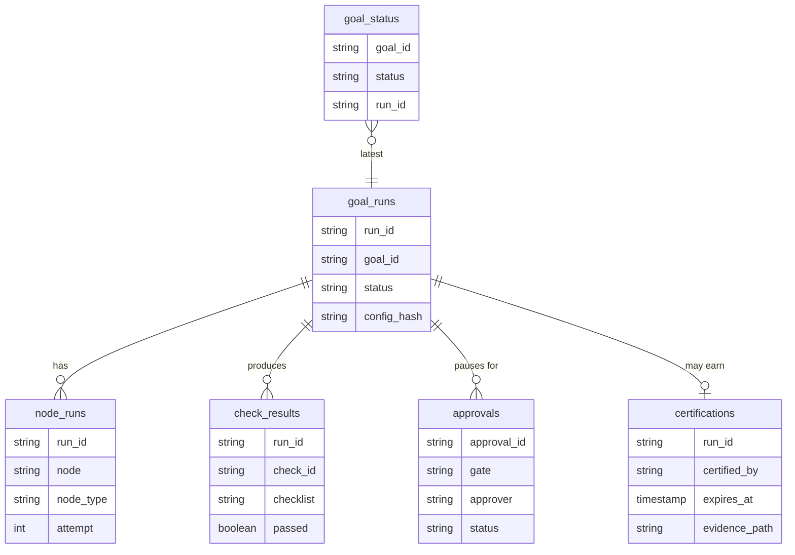

# MAYA architecture

MAYA is a goal engine. It takes an existing Bronze / Silver / Gold foundation in Unity Catalog and works through a chain
of goals until the data product is **AI Enabled** (goals G0 to G4, available now) and then **AI Ready** (goals G5 to G12,
to be released later). This page shows how the pieces fit together; each goal's own page shows its internals:

| Goal | Architecture |
|------|--------------|
| G0 Foundation intake | [maya/goals/g00_foundation](../maya/goals/g00_foundation/README.md) |
| G1 Metadata | [maya/goals/g01_metadata](../maya/goals/g01_metadata/README.md) |
| G2 Metric views | [maya/goals/g02_metric_views](../maya/goals/g02_metric_views/README.md) |
| G3 Semantic model | [maya/goals/g03_semantic_model](../maya/goals/g03_semantic_model/README.md) |
| G4 Governance and access | [maya/goals/g04_governance](../maya/goals/g04_governance/README.md) |

## 1. Overall architecture

Five rules hold the design together:

1. **The foundation is never changed directly.** MAYA reads it; everything a goal delivers to Unity Catalog is an
   idempotent SQL script in the project's Asset Bundle, run by the bundle's `maya_deploy` job. The same scripts are
   what CI/CD promotes.
2. **MAYA does not know environments.** It works in one (dev) workspace. Scripts name catalogs with tokens, and the
   bundle's variables map them to each environment's catalogs.
3. **Agents cannot reach the workspace.** An agent node reads a task input prepared by MAYA code and returns one
   result that must validate against a JSON Schema. Every change it suggests goes through code, a gate and the bundle.
4. **Every goal proves itself.** A goal is certified only when every mandatory check passes against the live workspace
   and its approvers have signed off (or the project approves automatically with `certification.approvals: auto`). Any later change (configuration, prerequisite, workspace drift, expiry) makes it
   stale.
5. **MAYA leaves what it did not make.** Grants, tags and comments it did not create are reported, never revoked.

## 2. Two levels of graph

The **goal graph** says which goals may run: a goal runs only when its prerequisites are certified. Inside each goal,
the **harness graph** (`harness/graph.yaml`) says how the goal does its work.

## 3. Inside a goal

Every goal is one package under `maya/goals/`:

| Part | What it holds |
|------|---------------|
| `goal.yaml` | The goal's standard: id, milestone, prerequisites, inputs schema, harness graph, outputs, validation checks (each tied to a checklist item), certification approvers and validity |
| `inputs.schema.json` | JSON Schema for the goal's block under `goals:` in `maya.yaml` |
| `harness/graph.yaml` | The harness graph: nodes and edges, including conditional and repair edges |
| `harness/agents/` | Omnigent agent definitions and their instructions |
| `harness/schemas/` | JSON Schemas for agent results and for every item a gate shows its approver |
| `code/` | Python the code nodes run, plus the goal's state tables and its drift check |
| `validator/checks.py` | One function per check in `goal.yaml`, each returning an observed value and evidence |

The harness runs five node types:

The same colours are used in every goal's page.

## 4. A goal run, end to end

## 5. Goal status

`maya status` derives each goal's status from its configuration, the state schema and the workspace:

## 6. Delivery and promotion

Goal code never writes deliverables to the workspace directly. It writes scripts into the project bundle; the bundle
deploys them. CI/CD deploys the same, committed bundle to other environments.

`run_scripts.py`, the job task, replaces each `{{catalog:<dev name>}}` token with the target's catalog from the
bundle variables, so one set of files deploys anywhere. `maya status` writes `reports/status.json`, whose
`milestones` entry says whether AI Enabled is reached, so a pipeline can gate promotion on it.

## 7. State model

Each project owns its state schema (`target.state_schema`). MAYA creates and upgrades it additively on every command,
recording each table's Delta version first as a restore point.

Goals add their own tables: `asset_inventory` (G0), `metadata_ledger` (G1), `metric_view_ledger` (G2),
`semantic_ledger` (G3) and `governance_ledger` (G4). The ledgers record what each certified run delivered, which is
how drift is detected. `systems` and `goal_overview` feed the project dashboard; the optional workspace registry feeds
the portfolio dashboard across projects.

## 8. Where the code lives

| Module | Role |
|--------|------|
| `maya/cli.py` | The `maya` command |
| `maya/core/spec.py` | Loads `maya.yaml` and the goal packages; resolves `${env:...}` |
| `maya/core/runner.py` | Goal graph, statuses, prerequisite rule, run and resume |
| `maya/core/harness.py`, `graph.py` | Harness graph execution and the five node types |
| `maya/core/agents.py`, `agent_tools.py` | Omnigent agents on the AI Gateway model; the tools every agent gets |
| `maya/core/gates.py` | Gate items: schema checks, approver edits, byte-for-byte approval |
| `maya/core/validation.py`, `certify.py` | Checks and certification |
| `maya/core/bundle.py`, `maya/bundle/run_scripts.py` | The project bundle and its job task |
| `maya/core/state.py`, `project.py` | State tables, upgrades, project dashboard |
| `maya/core/catalog.py`, `workspace.py` | Unity Catalog discovery and SQL access |
| `maya/status/` | Status report, publishing, dashboards |
