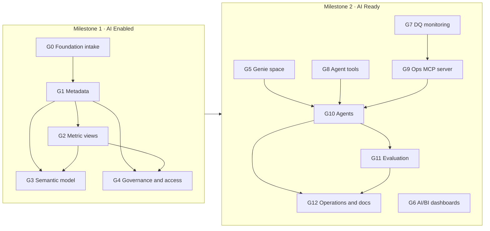

# MAYA tutorial: from a Bronze/Silver/Gold foundation to AI Enabled

MAYA makes a data foundation **AI Enabled** (milestone 1: goals G0 to G4) and then **AI Ready** (milestone 2:
goals G5 to G12). This tutorial takes you from an empty checkout to the AI Enabled milestone: a data product with
certified metadata, metric views, a semantic model and governed access, one goal at a time. It uses the
`commercial_analytics` example, which ships with a synthetic foundation you deploy yourself, so you can follow every
step on any Unity Catalog workspace. Section 18 then takes the example on to the first AI Ready goal, G5 Genie
space, and the last parts show how to point MAYA at your own foundation.

The AI Enabled goals G0 to G4 and the first AI Ready goal, G5 Genie space, are available now. G6 to G12 will be
released later.

> **Bringing your own foundation?** Do this tutorial once to learn MAYA, then follow
> [Take your own data foundation to AI Enabled](TUTORIAL_YOUR_FOUNDATION.md), which walks through the same goals with
> your own catalogs, tables, KPIs, taxonomy and groups.

Contents

0. [The two milestones: AI Enabled and AI Ready](#0-the-two-milestones-ai-enabled-and-ai-ready)
1. [Concepts in five minutes](#1-concepts-in-five-minutes)
2. [Prerequisites](#2-prerequisites)
3. [Install MAYA](#3-install-maya)
4. [Configure your workspace connection](#4-configure-your-workspace-connection)
5. [Deploy the example foundation](#5-deploy-the-example-foundation)
6. [Point the example at your workspace](#6-point-the-example-at-your-workspace)
7. [Initialise the project](#7-initialise-the-project)
8. [G0 Foundation intake](#8-g0-foundation-intake)
9. [G1 Metadata](#9-g1-metadata)
10. [G2 Metric views](#10-g2-metric-views)
11. [G3 Semantic model](#11-g3-semantic-model)
12. [G4 Governance and access](#12-g4-governance-and-access)
    - [Milestone reached: AI Enabled](#milestone-reached-ai-enabled)
13. [Status, dashboards and the portfolio](#13-status-dashboards-and-the-portfolio)
14. [Changing things after certification](#14-changing-things-after-certification)
15. [Certification options: automatic, manual, self-certified](#15-certification-options-automatic-manual-self-certified)
16. [The Asset Bundle and CI/CD](#16-the-asset-bundle-and-cicd)
17. [Using MAYA on your own foundation](#17-using-maya-on-your-own-foundation)
18. [AI Ready: G5 Genie space and the goals to come](#18-ai-ready-g5-genie-space-and-the-goals-to-come)
19. [Command reference](#19-command-reference)
20. [Troubleshooting](#20-troubleshooting)
21. [Cleaning up](#21-cleaning-up)

---

## 0. The two milestones: AI Enabled and AI Ready

MAYA's 13 goals are grouped into two milestones. They follow the AI Enabled & AI Ready Certification Checklist:
every checklist item belongs to exactly one goal's validator. The AE items belong to the AI Enabled goals and the AR
items to the AI Ready goals.

| Milestone | Goals | Reached when | What it means | Release |
|-----------|-------|--------------|---------------|---------|
| **1 · AI Enabled** | G0 Foundation intake, G1 Metadata, G2 Metric views, G3 Semantic model, G4 Governance and access | G0 to G4 are certified | The foundation is described, measured, modelled and governed: an AI system can find, understand and safely use the data | Available now |
| **2 · AI Ready** | G5 Genie space, G6 AI/BI dashboards, G7 Data quality monitoring, G8 Agent tools, G9 Operations MCP server, G10 Agents, G11 Evaluation, G12 Operations and documentation | AI Enabled, plus G5 to G12 certified | People and agents use the data product: Genie, dashboards, monitored quality, tools, agents, evaluation and operations | G5 available now; G6 to G12 released later |

Every AI Ready goal also requires the AI Enabled milestone, so you finish G0 to G4 first.



Sections 8 to 12 walk through the five AI Enabled goals in order; at the end of section 12 the example reaches AI
Enabled. Section 18 runs G5 Genie space, the first AI Ready goal, and describes the goals still to come.

---

## 1. Concepts in five minutes

The diagrams in [ARCHITECTURE.md](ARCHITECTURE.md) show how these concepts fit together.

**Project.** One `maya.yaml` describes one data product: the workspace connection, the foundation (which catalogs,
schemas and tables are in scope), the inputs of each goal and who certifies them. Nothing outside what `maya.yaml`
declares is ever scanned or changed.

**Goal.** A unit of work with a clear, checkable outcome, for example "every column has a description and a
sensitivity tag". Each goal has:

- prerequisites (G1 needs G0 certified, G3 needs G1 and G2, and so on);
- an inputs schema, so your YAML is validated before anything runs;
- a graph harness: deterministic code steps, AI agents where judgement is needed, and gates;
- a validator: a list of mandatory and advisory checks run against the live workspace;
- a certification, valid for a number of days.

| Milestone | Goal | Title | Needs | What you get |
|-----------|------|-------|-------|--------------|
| AI Enabled | G0 | Foundation intake | - | Inventory of every in-scope asset; readability, emptiness and freshness checks; an analyst agent's attestation |
| AI Enabled | G1 | Metadata | G0 | Table and column descriptions, sensitivity tags, verified primary and foreign keys, all in Unity Catalog |
| AI Enabled | G2 | Metric views | G1 | Every KPI as a Unity Catalog metric view, each measure proven against an independent reference SQL |
| AI Enabled | G3 | Semantic model | G1, G2 | Domain > subdomain > page taxonomy, tags on every asset, ontology registry, business glossary, `ontology_lookup()` |
| AI Enabled | G4 | Governance and access | G1, G2 | Roles and grants, ABAC policies and column masks over sensitive columns, row filters, an audit view |
| AI Ready | G5 to G12 | Genie space, AI/BI dashboards, data quality monitoring, agent tools, Ops MCP server, agents, evaluation, operations and documentation | AI Enabled | G5 now, G6 to G12 later (section 18) |

**Milestone.** Each goal's `goal.yaml` names its milestone (`metadata.milestone`). `maya status` reports a milestone
as reached when all its goals are certified.

**Gate.** A checkpoint where items (proposals, plans) are validated against a JSON schema and goal-specific checks
before the run continues. With automatic approvals (the default), a gate passes as soon as its items validate.

**Certification.** When every mandatory check passes, the goal is certified and recorded in the project's state
schema. A certified goal becomes **stale** when its configuration changes, a prerequisite is re-certified, the
workspace drifts from what was certified, or the certification expires. Running it again brings it back.

**Delivery through the Asset Bundle.** MAYA never writes deliverables into the workspace directly. Every goal writes
idempotent SQL scripts into the project's Databricks Asset Bundle (`bundle/` next to `maya.yaml`) and deploys them
by running the bundle's `maya_deploy` job. The same bundle is what your CI/CD promotes to test and production.
MAYA itself has no notion of environments. The only things MAYA writes directly are its own state tables and
the project registry.

**Agents.** Agents run through [Omnigent](https://pypi.org/project/omnigent/) and call a model served by the
Databricks AI Gateway (by default `system.ai.claude-sonnet-4-6`). Their output is always validated against a schema
before it is used.

---

## 2. Prerequisites

### On your machine

- macOS, Linux or WSL.
- Python 3.12 or later.
- [uv](https://docs.astral.sh/uv/) (recommended) or `pip`.
- The [Databricks CLI](https://docs.databricks.com/dev-tools/cli/install.html), a recent version (tested with
  v0.288). MAYA calls `databricks bundle deploy` and `databricks bundle run`.
- Git.

### In your Databricks workspace

- Unity Catalog enabled.
- A SQL warehouse you can use (serverless or pro). Note its ID: in the warehouse's page, **Connection details**, the
  last part of the HTTP path.
- Serverless jobs enabled (the bundle's deploy job runs on serverless).
- Access to an AI Gateway model service. The default is `system.ai.claude-sonnet-4-6`. Any chat model your
  workspace serves through the AI Gateway works; set it in `ai_gateway.model`.
- A catalog where you may `USE CATALOG` and `CREATE SCHEMA`. The examples use `solution_builder`; any name works
  (section 6).
- For G4: two **account-level** groups (not workspace-local groups such as `admins` or `users`, which Unity Catalog
  rejects as principals). One for consumers of the data product, one for engineers.
- Optional, for G3 governed tags: permission to create tag policies (account level). Without it, set
  `governed_tags: false` and the tags are plain tags with the same controlled values.

### Who you are

MAYA runs as you (your Databricks CLI profile). In development the deploy job also runs as you; in CI/CD it runs as
the service principal your pipeline uses. You need to own, or hold `MANAGE` on, the schemas MAYA writes to. When
MAYA creates the schemas, you own them.

---

## 3. Install MAYA

```bash
git clone https://github.com/vasutechgenie/maya-dbx-ai.git
cd maya-dbx-ai

# with uv
uv venv --python 3.12
uv pip install -e .

# or with pip
python3.12 -m venv .venv
.venv/bin/pip install -e .
```

This installs the `maya` command and the `omnigent` agent runtime into `.venv`. Either activate the environment
(`source .venv/bin/activate`) or call `.venv/bin/maya` directly. The rest of this tutorial assumes the environment
is active.

Check it:

```bash
maya --help
```

You should see the commands `validate, goals, plan, run, review, status, bundle, init, migrate, projects, portfolio`.

---

## 4. Configure your workspace connection

### 4.1 Databricks CLI profile

```bash
databricks auth login --host https://<your-workspace-host> --profile maya-dev
databricks current-user me --profile maya-dev    # should print your user
```

Any authentication method the Databricks CLI supports works (OAuth as above, a service principal, environment
variables). MAYA never stores credentials; it uses the profile you name.

### 4.2 Environment variables

The example `maya.yaml` reads every workspace-specific value from the environment, written as `${env:NAME}`. Set
them in your shell (or in a `.env` you source; never commit it):

```bash
export DATABRICKS_CONFIG_PROFILE=maya-dev           # the CLI profile above
export MAYA_WAREHOUSE_ID=<warehouse-id>              # the SQL warehouse that runs MAYA's queries and scripts
export MAYA_APPROVER=<you@company.com>               # recorded as approver and certifier; also the G4 'writer'
export MAYA_CONSUMER_GROUP=<account-group-of-consumers>   # used by G4 in the commercial example
export MAYA_ENGINEER_GROUP=<account-group-of-engineers>   # used by G4 in the commercial example
```

If a referenced variable is not set, MAYA stops with `environment variable NAME is not set`.

---

## 5. Deploy the example foundation

The example ships a synthetic commercial data product: customers, products, regions, orders, shipments and returns,
loaded from CSV files into Bronze, cleaned into Silver and aggregated into Gold.

```bash
cd examples/commercial_analytics/foundation

# 1. generate the CSV source files (deterministic, standard library only) into ./data
python generate_data.py

# 2. create the schemas, upload the files, import the notebooks and run Bronze -> Silver -> Gold
python deploy_foundation.py --profile "$DATABRICKS_CONFIG_PROFILE" --warehouse "$MAYA_WAREHOUSE_ID" \
    --catalog solution_builder
```

Use `--catalog <your-catalog>` if you are not using `solution_builder` (then also follow section 6), and
`--prefix <p>` to name the schemas `<p>_bronze`, `<p>_silver`, `<p>_gold` instead of `maya_*`.

What it creates:

| Object | Name |
|--------|------|
| Schemas | `<catalog>.maya_bronze`, `<catalog>.maya_silver`, `<catalog>.maya_gold` |
| Landing volume | `<catalog>.maya_bronze.landing` with the CSV files |
| Notebooks | `/Users/<you>/maya_example/foundation/01_bronze_load`, `02_silver_build`, `03_gold_build` |
| Job | `maya_example_foundation` (three tasks; a daily schedule, paused) |

The script runs the job once and prints each task's result. When it finishes you have a foundation with no
descriptions, no tags, no keys, no metric views and no access controls: exactly the starting point MAYA is for.

> The foundation is deliberately deployed by a plain script, not by MAYA: in real life the foundation already
> exists and MAYA starts from it.

---

## 6. Point the example at your workspace

Open `examples/commercial_analytics/maya.yaml`. With the environment variables from section 4 set, the only thing
you may need to change is the catalog, if yours is not `solution_builder`:

```yaml
target:
  profile: ${env:DATABRICKS_CONFIG_PROFILE}
  warehouse_id: ${env:MAYA_WAREHOUSE_ID}
  state_schema: solution_builder.maya_state_commercial_analytics   # <catalog>.<schema> for MAYA's own state
  registry: solution_builder.maya_registry                         # <catalog>.<schema> shared by all projects
foundation:
  catalog: solution_builder
```

Replace `solution_builder` in these three places and in the reference SQL of `kpis/metric_views.yaml`
(search for `solution_builder.`).

The file is fully commented; the sections below explain each goal's block as you reach it.

Validate the whole project before running anything:

```bash
cd examples/commercial_analytics
maya validate
```

`--system` defaults to `maya.yaml` in the current folder; from elsewhere use
`maya --system examples/commercial_analytics/maya.yaml validate`. Expected output:

```
  ok   G0 Foundation intake
  ok   G1 Metadata
  ok   G2 Metric views
  ok   G3 Semantic model
  ok   G4 Governance and access
system commercial-analytics: valid  (model system.ai.claude-sonnet-4-6)
```

`validate` checks your inputs against each goal's schema, parses each goal's graph and lints its gate validators. It
does not touch the workspace. A goal you have not configured is shown as `--  ... not configured in maya.yaml` and
does not make the project invalid.

---

## 7. Initialise the project

```bash
maya init
```

This creates (or upgrades) the project's state schema (`target.state_schema`), creates or reuses the project
dashboard, registers the project in the workspace registry (`target.registry`) and publishes the first status.
It is safe to run any number of times.

Now look at the goals:

```bash
maya goals
```

```
  G0   Foundation intake                    ready              needs: -
  G1   Metadata                             blocked            needs: G0
  G2   Metric views                         blocked            needs: G1
  G3   Semantic model                       blocked            needs: G1, G2
  G4   Governance and access                blocked            needs: G1, G2
```

Goal statuses:

| Status | Meaning |
|--------|---------|
| `ready` | Prerequisites certified; can run |
| `blocked` | A prerequisite is not certified |
| `running` | A run is in progress |
| `awaiting_approval`, `awaiting_sign_off` | A run is paused at a gate (manual approvals only) |
| `failed` | The last run failed; run it again after fixing the cause |
| `certified` | Certified and current |
| `stale` | Was certified, but something changed (configuration, a prerequisite, the workspace, or the expiry date) |
| `invalid_config` | The goal's inputs in `maya.yaml` do not validate; the message says why |
| `not_configured` | The goal needs inputs and has no entry under `goals:` in `maya.yaml` yet; add one to use it |

Two commands help before every run:

```bash
maya plan --goal G0     # the resolved inputs and the steps the goal will take
maya run                # without --goal: runs the next goal that is ready or stale
```

---

## 8. G0 Foundation intake

*Milestone 1 · AI Enabled, step 1 of 5.* Architecture of this goal (inputs, harness graph, outputs, checks):
[maya/goals/g00_foundation](../maya/goals/g00_foundation/README.md).

**What it does.** Reads the foundation declared under `foundation:` and nothing else. It inventories every table and
view, checks that each can be queried, is not empty and (where you set a limit) is fresh, and asks the
`foundation_analyst` agent to attest each layer's readiness and list gaps. It changes nothing in the workspace.

**Configuration.** The foundation block decides what is in scope:

```yaml
foundation:
  catalog: solution_builder
  layers:
    bronze: {schemas: [maya_bronze], tables: all, metadata_scope: tables}
    silver: {schemas: [maya_silver], tables: all, metadata_scope: full}
    gold:   {schemas: [maya_gold],   tables: all, metadata_scope: full}
  exclude: ["ingestion_log"]
```

- `schemas`: one or more schemas per layer; `other_catalog.schema` picks a schema from another catalog.
- `tables`: `all`, or a list of names, `schema.name` or globs such as `dim_*`.
- `exclude`: names or globs left out (the top-level `exclude` applies to every layer).
- `metadata_scope`: what G1 documents. `tables` = table descriptions only; `full` = tables and every column.

G0's own inputs:

```yaml
goals:
  G0:
    freshness_hours: {gold: 48}     # the newest Gold asset must be updated within 48 hours
    # min_assets_per_layer: 1       # default
    # row_counts: true              # set false for very large foundations
```

**Run it.**

```bash
maya run --goal G0
```

The log shows each step: `discover`, `assess`, `attest` (the agent), `validate`, `sign_off`, `certify`.

**Checks.**

| Check | Severity | Passes when |
|-------|----------|-------------|
| `layers_populated` | mandatory | Every layer has at least `min_assets_per_layer` assets |
| `assets_readable` | mandatory | Every in-scope asset can be queried |
| `no_empty_tables` | mandatory | No in-scope table or view is empty |
| `layer_freshness` | mandatory | Each layer with a `freshness_hours` limit was updated within it |
| `inventory_recorded` | mandatory | The inventory state table matches what was discovered |
| `attestation_complete` | mandatory | The analyst attested every layer and tied every gap to an asset |
| `undocumented_assets` | advisory | Count of assets without a description (G1 fixes these) |

**If it fails.** The output names the failing check and the assets. Typical causes: a layer schema that does not
exist, a table you cannot `SELECT`, an empty table (exclude it or load it), or a stale layer (re-run your foundation
job, or relax `freshness_hours`). Fix and run `maya run --goal G0` again.

---

## 9. G1 Metadata

*Milestone 1 · AI Enabled, step 2 of 5.* Architecture of this goal (inputs, harness graph, outputs, checks):
[maya/goals/g01_metadata](../maya/goals/g01_metadata/README.md).

**What it does.**

1. Profiles every in-scope asset (types, null and distinct counts, value lists for low-cardinality columns).
2. Classifies column sensitivity: your regex rules first, the `metadata_describer` agent for everything the rules
   do not cover.
3. Asks the agent to describe each table and column and to propose primary and foreign keys.
4. Verifies every key against the data (unique and not null; foreign keys resolve).
5. Validates the proposals at the `review` gate, writes them as bundle scripts (comments, tags, informational
   constraints), deploys them and checks Unity Catalog matches.

**Configuration.**

```yaml
goals:
  G1:
    allow_data: true                       # send sample values to the model (default false: names, types, stats only)
    context: context/business.yaml         # business context for the describer
    declared_keys:
      - {table: maya_silver.customer, primary_key: [customer_id]}
    sensitivity_classes: [public, internal, pii]     # least to most restrictive
    sensitivity_rules:
      - {pattern: "(?i)(^|_)e_?mail(_|$)", class: pii}
      - {pattern: "(?i)(^|_)(phone|mobile|fax)(_|$)", class: pii}
```

The context file gives the agent the business vocabulary:

```yaml
business: A software vendor selling cloud products to business customers in six regions.
glossary:
  fill rate: Units shipped divided by units ordered for shipped orders.
  revenue: Quantity times unit price for orders that are not cancelled.
conventions:
  - Monetary amounts are in USD.
```

Other useful inputs (all optional):

| Input | Default | Use |
|-------|---------|-----|
| `mode` | `incremental` | `incremental` only handles new or changed assets; `full` redoes everything |
| `overwrite_existing` | `false` | `false` never changes descriptions, tags or keys already in Unity Catalog |
| `infer_keys` | `true` | Verify and apply keys the agent proposes |
| `key_candidate_patterns` | `_id$`, `_key$`, `_code$` | Column patterns tried as keys when none is declared or proposed |
| `sensitivity_consistency` | `most_restrictive` | Same-named columns get the most restrictive class any asset assigned |
| `min_description_chars` | `20` | Minimum length of a description |
| `tag_names` | `sensitivity`, `maya_layer` | Tag keys used for sensitivity and layer |
| `model` | `ai_gateway.model` | Model override for this goal |

> If your account has a governed tag named `sensitivity`, its allowed values must include every class in
> `sensitivity_classes`. Otherwise set `tag_names.sensitivity` to another key.

**Run it.**

```bash
maya run --goal G1
```

Steps: `scope`, `profile`, `describe` (agent, one call per asset), `propose`, `keys`, `review` (gate), `apply`,
`validate`, then `repair` and `validate` again if a mandatory check fails, and `certify`. Expect a few minutes for
the example.

**Checks.**

| Check | Severity | Passes when |
|-------|----------|-------------|
| `table_descriptions` | mandatory | Every in-scope table and view has a description |
| `column_descriptions` | mandatory | Every column of every full-scope asset has a description |
| `description_quality` | mandatory | Descriptions are specific: long enough, not the name restated, no placeholders |
| `sensitivity_tagged` | mandatory | Every in-scope column has a sensitivity tag with an allowed value |
| `sensitivity_rules` | mandatory | Columns matched by a rule carry the class the rule requires |
| `declared_keys` | mandatory | Every primary key declared in `maya.yaml` exists |
| `keys_hold` | mandatory | Every key holds in the current data |
| `proposals_applied` | mandatory | Unity Catalog matches the approved proposals |
| `key_coverage` | advisory | Full-scope tables without a verified primary key |

**See the result** in Catalog Explorer: open `maya_silver.customer` and look at the table comment, the column
comments, the `sensitivity` tags (`email` and `phone` are `pii`) and the primary key. Or with SQL:

```sql
DESCRIBE TABLE EXTENDED solution_builder.maya_silver.customer;
SELECT column_name, tag_name, tag_value
FROM solution_builder.information_schema.column_tags
WHERE schema_name = 'maya_silver' AND table_name = 'customer';
```

---

## 10. G2 Metric views

*Milestone 1 · AI Enabled, step 3 of 5.* Architecture of this goal (inputs, harness graph, outputs, checks):
[maya/goals/g02_metric_views](../maya/goals/g02_metric_views/README.md).

**What it does.** You write the complete definition of each KPI as a metric view in YAML, including, for every
measure, an independent reference SQL. MAYA renders and creates the views through the bundle, keeps existing tags
and grants when a view is re-created, has the `metric_reviewer` agent critique the definitions (warnings only), and
proves every measure equals its reference SQL, overall and by the dimensions you name. Then it certifies the views
and tags them `system.certification_status = certified`.

**Configuration.**

```yaml
goals:
  G2:
    schema: maya_metrics                   # where the metric views live; never a foundation layer schema
    definitions: kpis/metric_views.yaml
    # tolerance: 1e-6                      # allowed relative difference against the reference
```

**Writing a metric view.** From `kpis/metric_views.yaml`:

```yaml
metric_views:
  - name: sales_performance
    comment: Net sales KPIs (revenue, orders, units, average order value) by day, region, product and category.
    owner: sales-analytics@example.com
    source: maya_gold.sales_daily             # a Silver or Gold asset (Bronze only with allow_bronze_sources)
    # filter: "status <> 'cancelled'"         # optional
    # joins: [{name: r, source: maya_silver.region, "on": source.region_code = r.region_code}]   # quote "on"
    dimensions:
      - {name: region, expr: region_name, display_name: Region, comment: Sales region of the order., synonyms: [area, territory]}
    measures:
      - name: revenue
        expr: SUM(revenue)
        display_name: Revenue
        comment: Net sales value (quantity x unit price) of non-cancelled orders, in USD.
        synonyms: [sales, net sales, turnover]
        format: {type: currency, currency_code: USD}
        reference:
          by: [region]                        # also compare per region
          sql: |
            SELECT r.region_name AS region, SUM(o.quantity * o.unit_price) AS value
            FROM solution_builder.maya_silver.orders o
            JOIN solution_builder.maya_silver.region r ON o.region_code = r.region_code
            WHERE o.status <> 'cancelled'
            GROUP BY r.region_name
```

Rules:

- A view needs `name`, `source`, `dimensions` and `measures`. Give it a `comment` and an `owner` too.
- Every dimension and measure needs `display_name`, `comment` and `synonyms` (Genie and AI/BI use them), and every
  measure a `format` (`number`, `currency` with `currency_code`, or `percentage`).
- `reference.sql` must return a column named `value`. With `reference.by`, it also returns one column per listed
  dimension, named like the dimension. Write it independently of the metric view, ideally from a different layer
  (the example computes Gold measures from Silver), so the comparison means something.

**Run it.**

```bash
maya run --goal G2
```

Steps: `load`, `render`, `critique` (agent), `collect`, `review` (gate), `apply`, `validate` (with `repair`),
`sign_off`, `mark`, `certify`.

**Checks.**

| Check | Severity | Passes when |
|-------|----------|-------------|
| `metric_views_exist` | mandatory | Every KPI exists as a metric view |
| `definitions_applied` | mandatory | The definition read back from Unity Catalog is exactly the approved one |
| `business_friendly` | mandatory | Every field has a display name, description and synonyms; every measure a format |
| `measures_match_reference` | mandatory | Every measure equals its reference SQL within tolerance |
| `views_described` | mandatory | Every metric view has a specific description |
| `reviewer_warnings` | advisory | Warnings from the reviewer agent |

**Try it:**

```sql
SELECT `Region`, MEASURE(`Revenue`) FROM solution_builder.maya_metrics.sales_performance GROUP BY ALL;
```

If a measure does not match its reference, the failure shows both values and the dimension values where they
differ. Fix the definition or the reference SQL and run G2 again.

---

## 11. G3 Semantic model

*Milestone 1 · AI Enabled, step 4 of 5.* Architecture of this goal (inputs, harness graph, outputs, checks):
[maya/goals/g03_semantic_model](../maya/goals/g03_semantic_model/README.md).

**What it does.** Builds the business taxonomy **domain > subdomain > page** over the data product and places every
Silver, Gold and metric-view asset on exactly one page. You declare domains and subdomains completely; for pages you
write as much as you know:

| You write | MAYA does |
|-----------|-----------|
| `pages: auto` | The `page_designer` agent designs the subdomain's pages; the `asset_assigner` agent places assets |
| `pages: [{name: Order fulfilment}]` | Agents fill in what is missing (id, description) and place the remaining assets |
| `pages: [{id, name, description, assets: [...]}]` | Used exactly as written; listed assets are pinned |
| `allow_new_pages: true` (with a page list) | Agents may add pages for assets that fit none of yours |

It then delivers, through the bundle:

- domain, subdomain and page tags on every placed asset (tag keys `<project>_domain`, `<project>_subdomain`,
  `<project>_page`; as governed tags when `governed_tags: true`);
- the ontology registry tables `ontology_nodes` and `ontology_page_objects`;
- the `business_glossary` table: your terms plus every metric-view measure;
- the table function `ontology_lookup(search_term)`.

**Configuration.**

```yaml
goals:
  G3:
    schema: maya_semantic                  # registry, glossary and ontology_lookup()
    taxonomy: semantic/taxonomy.yaml
    governed_tags: false                   # true needs permission to create tag policies (account level)
    # layers: [silver, gold]               # layers whose assets are placed (default)
    # exclude: [maya_silver.tmp_*]         # assets kept off the model
    # min_confidence: 0.6                  # agent placements below this are reported (advisory)
    # mode: incremental                    # keep certified agent-built pages; 'full' designs them again
```

**Writing the taxonomy.** From `semantic/taxonomy.yaml`:

```yaml
domains:
  - id: commercial                         # the controlled tag value
    name: Commercial
    description: Selling cloud products to business customers - orders, revenue and the customers who buy.
    owner: sales-analytics@example.com
    subdomains:
      - id: sales
        name: Sales
        description: Order intake and net revenue by day, region and product.
        pages:                             # complete page: used exactly as written
          - id: sales_performance
            name: Sales performance
            description: Daily net revenue, orders, units and average order value by region, product and category.
            assets: [maya_gold.sales_daily, maya_metrics.sales_performance, maya_silver.orders]
      - id: customers
        name: Customers
        description: Who the business customers are, their segments and what they buy.
        pages: auto                        # agents design the pages

glossary:
  - term: Fill rate
    definition: Units shipped divided by units ordered for shipped orders.
    synonyms: [unit fill rate]
    links: [maya_metrics.fulfilment.fill_rate]   # objects or fields that implement the term
```

Required: per domain `id`, `name`, `description` (at least 20 characters), `owner`, `subdomains`; per subdomain
`id`, `name`, `description`; per page only `name`; per glossary term `term` and `definition`.

**Run it.**

```bash
maya run --goal G3
```

Steps: `load`, `plan`, `design` (one agent call per subdomain that needs design), `resolve`, `assign` (agent calls
in batches of `assign_batch` assets), `assemble`, `review` (gate), `apply`, `validate` (with `repair`), `mark`,
`certify`.

How placements are decided, in order: pages you pinned in YAML, then placements from the last certified run, then a
single page designer's claim; everything else goes to the assigner agent.

**Fixing what the agents built.** After a run, `.maya/runs/G3/<run_id>/artefacts/taxonomy.resolved.yaml` holds the
complete result in the same format as your taxonomy file. Copy the parts you want to fix into
`semantic/taxonomy.yaml` (for example, pin an asset to a different page) and run G3 again. Only what changed is
redesigned and redeployed; pinned and unchanged parts need no agent calls.

**Checks.**

| Check | Severity | Passes when |
|-------|----------|-------------|
| `taxonomy_registered` | mandatory | The registry holds exactly the approved domains, subdomains and pages |
| `governed_tags` | mandatory | The tag keys allow exactly the taxonomy's values (when `governed_tags: true`) |
| `every_asset_tagged` | mandatory | Every placed asset carries its domain, subdomain and page tags |
| `one_page_per_asset` | mandatory | Every asset is on exactly one page, as approved |
| `glossary_loaded` | mandatory | The glossary holds every term with its links |
| `lookup_works` | mandatory | `ontology_lookup()` answers every term and page |
| `pages_populated` | advisory | Pages without any asset |
| `confident_assignments` | advisory | Agent placements below `min_confidence` |

**Try it:**

```sql
SELECT * FROM solution_builder.maya_semantic.ontology_lookup('unit fill rate');
SELECT * FROM solution_builder.maya_semantic.ontology_nodes ORDER BY node_type, node_id;
```

---

## 12. G4 Governance and access

*Milestone 1 · AI Enabled, step 5 of 5.* Architecture of this goal (inputs, harness graph, outputs, checks):
[maya/goals/g04_governance](../maya/goals/g04_governance/README.md).

**What it does.** Everything about access is declared in YAML and delivered through the bundle:

- **Roles**: groups or service principals and what they may read (`SELECT`) and execute (`EXECUTE`).
- **Masks** on every sensitive column (those G1 tagged `pii`, by default), by exactly one of two methods:
  - a tag-based **ABAC policy** on whole schemas, matching a tag value;
  - a **per-column mask** function on a single column.
- **Row filters** where declared.
- An **audit view** over `system.access.audit` for the product's schemas.

Rules MAYA enforces before deploying anything:

- Every sensitive column is masked exactly once. Covered by both a policy and a column mask, or by neither, is
  refused at load with the column named.
- Grants go to groups and service principals only, never to individual users.
- A role marked `consumer: true` may not read Bronze or Silver.
- The `writers` (the identities that run the foundation jobs) are exempt from every mask and row filter, so a Silver
  build never copies masked values from Bronze.
- Workspace-local groups (`admins`, `users`) are refused: Unity Catalog accepts only account-level principals.

**What MAYA does not do.** It never revokes grants it did not make. Other grants on the product schemas are left as
they are and listed as advisory findings. When you remove something from the YAML that MAYA delivered earlier (a
mask, a policy, a row filter, one of its grants), the next run removes it.

**Configuration** (from the example):

```yaml
goals:
  G4:
    schema: maya_governance                # mask and row-filter functions, audit view
    writers: ["${env:MAYA_APPROVER}"]      # in CI/CD: the service principal that runs the foundation jobs
    catalog_access: existing               # 'grant': MAYA grants USE CATALOG; 'existing': only verified
    roles:
      consumers:
        principals: ["${env:MAYA_CONSUMER_GROUP}"]
        consumer: true
        read: [gold, metric_views, semantic]
        execute: [semantic]                # ontology_lookup()
      engineers:
        principals: ["${env:MAYA_ENGINEER_GROUP}"]
        read: [bronze, silver, gold, metric_views, semantic, governance]
        execute: [semantic, governance]
    mask_functions:
      redact:     {kind: redact, unmasked_for: ["${env:MAYA_ENGINEER_GROUP}"]}
      email_mask: {kind: email,  unmasked_for: ["${env:MAYA_ENGINEER_GROUP}"]}
    masks:
      - {abac: mask_pii, scopes: [bronze], match: {tag: sensitivity, value: pii}, function: redact}
      - {column: maya_silver.customer.email, function: email_mask}
      - {column: maya_silver.customer.phone, function: redact}
    row_filters:
      - table: maya_gold.sales_daily
        columns: [region_name]
        by_group: {"${env:MAYA_CONSUMER_GROUP}": [North America West, North America East]}
        unfiltered_for: ["${env:MAYA_ENGINEER_GROUP}"]
```

> Quote every `${env:...}` that sits inside `[...]` or `{...}`: YAML reads unquoted braces as a mapping.

**Scopes** (used in `read`, `execute` and ABAC `scopes`): `bronze`, `silver`, `gold` (the foundation layers),
`metric_views` (G2's schema), `semantic` (G3's schema), `governance` (G4's schema), or a schema name
(`schema` or `catalog.schema`). Single objects go under `objects: {select: [...], execute: [...]}`.

**Mask functions.** Built-in kinds:

| Kind | Masked value |
|------|--------------|
| `redact` | `***` |
| `null` | `NULL` |
| `hash` | SHA-256 of the value |
| `email` | Keeps the domain: `***@example.com` |
| `last4` | Keeps the last four characters |

Write the `null` kind quoted, `{kind: "null"}`: unquoted, YAML reads it as an empty value.

Or your own SQL over the input `value`: `{sql: "concat(left(value, 1), '***')", type: STRING}`. `type` defaults to
`STRING`; set it to match non-string columns. `unmasked_for` lists the principals who see the real value; the
writers always do.

**Masks.** Either form:

```yaml
- {abac: <policy_name>, scopes: [<scope>, ...], match: {tag: <tag>, value: <value>}, function: <fn>, except: [<principal>]}
- {column: <schema.table.column>, function: <fn>}
```

An ABAC policy is created on every schema of its scopes and masks every column whose tag matches, including columns
added later. A column mask covers one column. `sensitive` (default `{tag: sensitivity, values: [pii]}`) defines
which columns must be covered.

**Row filters.** Either `by_group` (each principal and the values of the single filter column it sees) or `sql` (a
boolean expression over the listed columns). `unfiltered_for` sees every row; writers always do.

**Other inputs.** `audit: {view: audit_access, days: 90}`, `jobs: [<job name>, ...]` (jobs whose run-as identity is
checked; the bundle's deploy job is always checked), `mode: incremental | full`.

**Run it.**

```bash
maya run --goal G4
```

Steps: `load` (builds and checks the plan), `review` (gate), `apply`, `validate` (with `repair`), `mark`, `certify`.
The plan is in `.maya/runs/G4/<run_id>/artefacts/governance_plan.json`.

**Checks.**

| Check | Severity | Passes when |
|-------|----------|-------------|
| `sensitive_data_protected` | mandatory | Every sensitive column is masked by exactly one declared method |
| `functions_as_declared` | mandatory | Every mask and row-filter function exists exactly as declared |
| `policies_as_declared` | mandatory | Every ABAC policy exists on its schemas exactly as declared |
| `column_masks_as_declared` | mandatory | Every column mask is attached, and no removed one remains |
| `row_filters_as_declared` | mandatory | Every row filter is attached, and no removed one remains |
| `grants_as_declared` | mandatory | Every role holds exactly the declared privileges |
| `catalog_access` | mandatory | Every role principal can use the catalogs it reads from |
| `unity_catalog_only` | mandatory | Every object of the data product is a Unity Catalog object |
| `audit_available` | mandatory | The audit view exists and returns events for the product schemas |
| `consumer_exposure` | advisory | Privileges consumers hold on Bronze or Silver (granted by someone else) |
| `other_grants` | advisory | Grants not declared here; individuals flagged |
| `writers_exempt` | advisory | Identities writing from masked sources that are not exempt |
| `jobs_run_as_service_principals` | advisory | Jobs that run as a person or carry a personal token |

In development the deploy job runs as you, so `jobs_run_as_service_principals` reports one finding. That is
expected; in CI/CD the bundle runs as a service principal.

**See the result:**

```sql
SHOW POLICIES ON SCHEMA solution_builder.maya_bronze;
SELECT * FROM solution_builder.information_schema.column_masks WHERE table_schema = 'maya_silver';
SELECT * FROM solution_builder.information_schema.row_filters;
SHOW GRANTS `<consumer-group>` ON SCHEMA solution_builder.maya_gold;
SELECT * FROM solution_builder.maya_governance.audit_access LIMIT 20;
```

To see masking from a consumer's point of view, query `maya_silver.customer` as a member of the consumer group (not
as a writer or engineer): `email` shows `***@domain` and `phone` shows `***`. As a writer you see real values; this
is by design.

### Milestone reached: AI Enabled

With G4 certified, all five AI Enabled goals are certified. Check it:

```bash
maya goals
maya status
```

```
  G0   Foundation intake                  certified          checks 7/7    certified by ...
  G1   Metadata                           certified          checks 9/9    certified by ...
  G2   Metric views                       certified          checks 6/6    certified by ...
  G3   Semantic model                     certified          checks 8/8    certified by ...
  G4   Governance and access              certified          checks 13/13  certified by ...

  milestone AI Enabled: reached
```

What AI Enabled means for the example data product:

| Checklist area | Delivered by | Where to see it |
|----------------|--------------|-----------------|
| Foundation in place, registered and fresh (AE-1 to AE-4, AE-8.1) | G0 | Asset inventory in the state schema |
| Keys and descriptions on every asset, sensitivity classified (AE-3.2, AE-5.1 to AE-5.5) | G1 | Catalog Explorer: comments, tags, constraints |
| KPIs as certified metric views (AE-6.1 to AE-6.3) | G2 | `maya_metrics.*` |
| Business taxonomy, glossary and lookup (AE-7.1 to AE-7.4) | G3 | `maya_semantic.*`, domain / subdomain / page tags |
| Sensitive data masked, least-privilege grants, audit (AE-3.4, AE-8.1 to AE-8.4) | G4 | Policies, masks, row filters, grants, `maya_governance.audit_access` |

The milestone stays reached only while every goal stays certified. If a goal turns stale (section 14), `maya status`
reports `milestone AI Enabled: not yet` until you run it again.

---

## 13. Status, dashboards and the portfolio

```bash
maya status
```

Prints every goal's state, check results and next action, writes `reports/status.html` and `reports/status.json`
(set in `status.out_dir` and `status.formats`), and publishes the status to the state schema, which feeds the
project dashboard created by `maya init`.

Across projects in the same workspace:

```bash
maya projects                    # every project in target.registry, its certified goals and dashboard link
maya portfolio                   # create or update a portfolio dashboard over the registry
maya portfolio --name "Data products" --path /Users/<you>/MAYA
```

---

## 14. Changing things after certification

You change the YAML; MAYA works out what changed.

```bash
maya goals            # the changed goal and the goals after it show 'stale', with the reason
maya run              # runs the next stale goal; repeat until 'nothing to run'
```

A goal turns stale when:

- its inputs in `maya.yaml` (or the files they point to) change;
- a prerequisite is re-certified after it;
- the workspace drifts from what was certified (for example, someone drops a comment, a tag, a mask or a grant
  MAYA delivered);
- its certification expires (90 days by default).

Runs are incremental by default: only what changed is regenerated, and only scripts that differ from the last
certified delivery are deployed. Examples:

- Pin an asset to another page in `taxonomy.yaml`: G3 runs without agent calls and deploys only the affected tag and
  registry scripts.
- Replace the Silver column masks with an ABAC policy in G4: the next run creates the policy and removes the two
  column masks MAYA had attached.

To redo a goal from scratch, set `mode: full` for it (G1, G2, G3, G4), or force a re-run of a current goal:

```bash
maya run --goal G2 --force
```

If a run fails half-way (a network error, a permission you then grant), continue from where it stopped:

```bash
maya run --goal G3 --resume
```

Every run keeps its files in `.maya/runs/<goal>/<run_id>/`: `checkpoint.json` and `artefacts/` (proposals, plans,
agent logs).

---

## 15. Certification options: automatic, manual, self-certified

```yaml
certification:
  approvals: auto                          # default
  approvers:
    data_owner: ${env:MAYA_APPROVER}       # G0, G1
    data_steward: ${env:MAYA_APPROVER}     # G1
    kpi_owner: ${env:MAYA_APPROVER}        # G2
    business_owner: ${env:MAYA_APPROVER}   # G3
    security: ${env:MAYA_APPROVER}         # G4
```

**Automatic (default).** Gates pass and goals are certified as soon as validation passes, recorded as
`auto (<approver>)`. No manual step anywhere.

**Manual.** Set `approvals: manual`. Runs pause at each gate and at sign-off (`awaiting_approval`,
`awaiting_sign_off`); the approver decides with `maya review`:

```bash
maya review                                         # pending approvals and whether their items validate
maya review --goal G1 --export review/              # write the gate's items as YAML to read or edit
maya review --id <approval-id> --edit proposals.json=review/proposals.yaml --approve --note "fixed two descriptions"
maya review --goal G1 --approve                     # approve; the run resumes automatically
maya review --goal G1 --reject --note "wrong owner"
```

An edit is accepted, and an approval recorded, only when every item validates; otherwise nothing changes.
`--no-resume` approves without resuming the run.

**Self-certified.** A goal already done outside MAYA (for example, your platform team owns the foundation) can be
attested in `maya.yaml`; the goals after it can then run:

```yaml
certification:
  self_certified:
    G0: {by: data-platform@example.com, note: foundation attested by the platform team, valid_until: 2027-06-30}
```

`by` is required; `valid_until` is optional (without it the attestation does not expire). `maya goals` shows
`certified` with "self-certified by ...". Remove the entry to have MAYA run the goal itself.
The `supply_chain` example uses this for G0.

---

## 16. The Asset Bundle and CI/CD

Each project's bundle is generated next to its `maya.yaml`:

```
bundle/
  databricks.yml                  written once; add your targets here (MAYA never rewrites it)
  resources/maya_variables.yml    warehouse_id and one variable per catalog the scripts use (default: the dev name)
  resources/maya_deploy.job.yml   job 'maya_deploy': one task per goal, in goal order
  maya_deploy/run_scripts.py      the script runner the tasks execute
  scripts/<goal>/...              idempotent SQL (and JSON for governed tags)
  maya_manifest.json              which certified run produced each goal's scripts
```

Scripts never hard-code catalog names: they use `{{catalog:<dev name>}}` tokens that the deploy job resolves from
the bundle variables. To deploy to another environment, add a target that overrides the variables:

```yaml
# bundle/databricks.yml
targets:
  dev:
    mode: development
    default: true
    workspace: {host: https://<dev-workspace>}
  prod:
    mode: production
    workspace: {host: https://<prod-workspace>}
    run_as: {service_principal_name: <application-id>}
    variables:
      warehouse_id: <prod-warehouse-id>
      catalog_solution_builder: <prod-catalog>
```

In your own project repository, commit `maya.yaml`, its input files and `bundle/`. Your pipeline then runs:

```bash
databricks bundle deploy -t prod
databricks bundle run maya_deploy -t prod
```

To regenerate the bundle from every certified goal (for example, after cloning on a new machine), or to deploy
everything in one go as CI/CD would:

```bash
maya bundle            # rewrite scripts from certified state
maya bundle --deploy   # also deploy and run the whole maya_deploy job
```

Bundle settings in `maya.yaml` (all optional): `bundle: {dir: bundle, target: dev, engine: direct}`.

> In this repository the examples' `bundle/` folders are not committed, because they are generated per workspace.

---

## 17. Using MAYA on your own foundation

The full step-by-step guide is [Take your own data foundation to AI Enabled](TUTORIAL_YOUR_FOUNDATION.md). In short:

1. **Create a project folder** in your own repository, for example `data-products/sales/`, and copy
   `examples/commercial_analytics/maya.yaml` into it.
2. **Name the project and the state schemas:**

   ```yaml
   metadata: {name: sales, owner: sales-data@company.com, description: Sales data product}
   target:
     profile: ${env:DATABRICKS_CONFIG_PROFILE}
     warehouse_id: ${env:MAYA_WAREHOUSE_ID}
     state_schema: <catalog>.maya_state_sales
     registry: <catalog>.maya_registry
   ```

3. **Declare the foundation:** your catalog, the schemas of each layer, the tables (`all`, a list or globs) and the
   `metadata_scope` per layer. Start small: one or two schemas.
4. **Remove the goal blocks you are not ready for.** `validate` shows them as not configured. Start with G0 and G1.
5. **If the foundation is already trusted**, self-certify G0 (section 15) instead of running it.
6. **Write the G1 context file** in your business language, and add `declared_keys` you know.
7. `maya validate`, `maya init`, then `maya run` goal by goal, checking `maya goals` between runs.
8. **Add G2** by writing `metric_views.yaml` with your KPI owners, each measure with a reference SQL.
9. **Add G3**: domains and subdomains in full, pages as `auto` where you do not know them yet.
10. **Add G4**: your account groups or service principals, the writers (your foundation job's run-as), mask
    functions and masks for every sensitive column.
11. **Commit** the project folder and its `bundle/`, and let CI/CD deploy it to the next environment.

Several projects can share one workspace; each has its own state schema and dashboard, and they share the registry.

---

## 18. AI Ready: G5 Genie space and the goals to come

AI Ready is milestone 2. It builds on AI Enabled so that people and agents can use the data product. Every AI Ready
goal requires the AI Enabled milestone, plus the goals listed for it. G5 Genie space is available now; G6 to G12 will
be released later.

### 18.1 G5 Genie space

*Milestone 2 · AI Ready, step 1 of 8.* Architecture of this goal (inputs, harness graph, outputs, checks):
[maya/goals/g05_genie_space](../maya/goals/g05_genie_space/README.md).

**What it does.** G5 delivers a Genie space that business users can ask questions in plain language and that answers
correctly. MAYA builds it from what AI Enabled already certified:

- **Sources**: the metric views (G2) and the Gold tables placed on the semantic model's pages (G3). Bronze and Silver
  are never added unless you set `allow_silver: true`.
- **Instructions**: your business rules, then one entry per KPI naming its metric view measure, the glossary and the
  taxonomy (G3), and one short paragraph of guidance per page.
- **Sample questions**: yours, per page. The `bi_author` agent adds questions until every page has
  `min_questions_per_page` (5 by default), written the way users of that page would ask them.
- **Trusted SQL**: the SQL you attach to a question, and SQL the agent writes for at most two critical questions per
  page. MAYA runs every statement and keeps only those that run and read only the space's sources.
- **Benchmarks**: your questions with the SQL that gives the right answer. After deploying, MAYA has Genie answer
  every benchmark and compares Genie's result with yours. The goal passes only when Genie gets at least
  `pass_threshold` of them right.
- **Access**: `CAN_RUN` (or the level you choose) for the groups you list. What those groups can read is decided by
  G4: Genie answers each user with that user's own permissions, so masks and row filters apply.

**Inputs.** Two files written by the business owner and key users, and a block in `maya.yaml`:

```yaml
goals:
  G5:
    title: Commercial analytics
    description: Ask about sales, customers, fulfilment and returns of the commercial data product.
    questions: genie/questions.yaml        # business rules and the questions users ask, per semantic page
    benchmarks: genie/benchmarks.yaml      # 10+ questions with the SQL that gives the right answer
    pass_threshold: 0.8                    # share of benchmarks Genie must answer correctly
    access:
      - {group: "${env:MAYA_CONSUMER_GROUP}", level: CAN_RUN}
      - {group: "${env:MAYA_ENGINEER_GROUP}", level: CAN_RUN}
```

`genie/questions.yaml` holds the rules and the questions per page (by page id or name). A question can carry trusted
SQL and be marked `critical`:

```yaml
rules:
  - Revenue is quantity times unit price for orders that are not cancelled, in USD.
  - When a question names no period, use the latest full calendar month in the data.
pages:
  sales_performance:
    - question: What was total revenue last month?
      critical: true
      sql: |
        SELECT MEASURE(revenue) AS revenue FROM solution_builder.maya_metrics.sales_performance ...
    - Which products sold the most units this quarter?
```

`genie/benchmarks.yaml` holds the benchmarks. Name the period in every benchmark question ("in August 2026", not "last
month"): Genie's answer and your SQL must mean the same thing, and relative periods drift as time passes.

```yaml
benchmarks:
  - question: What was total revenue in August 2026?
    sql: |
      SELECT MEASURE(revenue) AS revenue
      FROM solution_builder.maya_metrics.sales_performance
      WHERE order_date BETWEEN DATE'2026-08-01' AND DATE'2026-08-31'
```

Optional settings: `min_questions_per_page` (5), `min_benchmarks` (10), `sources` and `exclude` to change the source
list, `parent_path` (the workspace folder for the space, `MAYA` under your home folder by default) and
`benchmark_timeout_minutes`.

**Run it:**

```bash
maya run --goal G5
```

```
Running G5 Genie space  run=g5-...
  [code] load
     7 pages, 8 sources, 12 benchmarks; authoring 7 pages
  [agent] author
     agent author-0: 31.0s
     ...
  [code] assemble
     space: 8 sources, 35 sample questions, 13 trusted SQL, 12 benchmarks
  [gate] review
  [code] apply
     deployed via bundle: 1 scripts, 1 statements (job run ...)
     apply: Genie space 'Commercial analytics'
  [validator] validate
     PASS space_exists: observed 0 (expected == 0)
     ...
     PASS benchmarks_pass: observed 0 (expected == 0)
     ...
  [gate] sign_off
  [code] mark
  [certify] certify
G5 CERTIFIED
```

What happens, in order:

1. **load** checks both files against the semantic model: every page exists, every customer SQL statement and every
   benchmark runs, and every statement reads only the space's sources. A failing statement stops the run with the
   statement and the error named.
2. **author** runs one `bi_author` agent per page that needs questions (four at a time). Pages whose inputs did not
   change since the last certified run reuse that run's questions, so a rerun costs no agent time.
3. **assemble** merges everything into `space.json`: duplicate questions are dropped, agent SQL that fails or reads
   outside the space is dropped, and guidance that names objects outside the space is dropped. Each drop is listed as
   a finding.
4. **review** is a gate: the business owner approves `space.json`, the exact space that will be deployed.
5. **apply** writes `bundle/scripts/G5/10_space/genie_space.json` and deploys the bundle. The job creates the space,
   or updates the one it created before (found by a marker in its description), and sets its permissions.
6. **validate** compares the live space with the approved one, then has Genie answer every benchmark and records the
   result of each in `benchmark_results.json`.
7. **sign_off** is a second gate: the business owner approves the benchmark results.

**Checks.**

| Check | Severity | Passes when |
|-------|----------|-------------|
| `space_exists` | mandatory | The Genie space exists |
| `space_as_approved` | mandatory | Sources, instructions, sample questions, trusted SQL and benchmarks are exactly as approved |
| `curated_sources_only` | mandatory | Every source is a metric view or Gold table (Silver only with `allow_silver`) |
| `instructions_complete` | mandatory | The instructions carry every rule, every KPI with its measure, and the glossary |
| `questions_per_page` | mandatory | Every page has at least `min_questions_per_page` sample questions |
| `benchmarks_defined` | mandatory | At least `min_benchmarks` benchmarks, each with SQL that runs |
| `benchmarks_pass` | mandatory | Genie answers at least `pass_threshold` of the benchmarks correctly |
| `trusted_sql_runs` | mandatory | Every trusted SQL statement runs and reads only the space's sources |
| `access_granted` | mandatory | Every declared group holds its permission on the space |
| `critical_questions_trusted` | advisory | Critical questions that have no trusted SQL |
| `benchmark_review` | advisory | Benchmarks Genie's evaluation could not judge automatically |

If `benchmarks_pass` fails, `benchmark_results.json` shows, for each benchmark Genie got wrong, the SQL Genie wrote
and why it was judged wrong. The usual fixes are a rule in `questions.yaml` ("never average daily fill rates"), a
trusted SQL statement for that kind of question, or a better description on a metric view measure (G2). Then run G5
again.

**See the result.** Open **Genie** in the workspace and select *Commercial analytics* (in the `MAYA` folder under your
home folder). Ask one of the sample questions, or one of your own. As a member of the consumer group you see masked
values exactly as G4 defines them. `maya status` now shows G5:

```
  G5   Genie space                        certified          checks 11/11  certified by ...

  milestone AI Enabled: reached
  milestone AI Ready: not yet (6 of 13 goals certified; G6 to G12 not released yet)
```

AI Ready stays "not yet" until G6 to G12 are released and certified.

### 18.2 The goals to come

| Goal | Outcome | Prerequisites | Certified by | Checklist |
|------|---------|---------------|--------------|-----------|
| G6 AI/BI dashboards | One dashboard page per semantic page, built only on metric-view measures, published and scheduled | G2, G3 | Business owner | AR-2.1 to AR-2.3 |
| G7 Data quality monitoring | Foundation data quality is visible (DQ dashboard) and alerts fire on critical failures and stale Gold | G1 | Data owner | AR-2.4, AR-7.2 |
| G8 Agent tools (UC functions) | Reusable business actions as parameterised, self-describing Unity Catalog functions, tested, granted and exposed through managed MCP | G2, G3 | Security | AR-3.1 to AR-3.4 |
| G9 Operations MCP server | Operational notebooks as parameterised jobs returning JSON, served to agents by an MCP server with OAuth and least privilege | G4, G7 | Security | AR-4.1 to AR-4.4 |
| G10 Agents | A supervisor with capability-scoped sub-agents, registered in Unity Catalog, deployed to Model Serving and traced | G5, G8, G9 | Product owner | AR-5.1 to AR-5.4 |
| G11 Evaluation | Agent and Genie answers verified against SQL truth on the metric views, with a regression job on change | G10 | Business owner | AR-6.1 to AR-6.3 |
| G12 Operations and documentation | Jobs scheduled with retries and notifications, monitoring, runbooks, a product document and an onboarding page | G10, G11 | Platform owner | AR-7.1, AR-7.3, AR-7.4, AR-8.1, AR-8.2 |

**AI Ready = AI Enabled plus G5 to G12 certified.** The goals still to come will work exactly like G0 to G5: a block
per goal under `goals:` in `maya.yaml`, validated inputs, a graph harness with agents and gates, a validator, delivery
through the project's Asset Bundle, and automatic or manual certification. What you build for AI Enabled is what they
use: the metric views (G2) feed dashboards and evaluation, the semantic model (G3) shapes dashboard pages, and the
governance roles (G4) scope the MCP server and agent tools.

---

## 19. Command reference

All commands take `--system <path to maya.yaml>` (default: `maya.yaml` in the current folder).

| Command | What it does |
|---------|--------------|
| `maya validate` | Validate inputs, graphs and gate validators; no workspace access |
| `maya init` | Create or upgrade the state schema and dashboard; register the project |
| `maya goals` | Every goal's status and prerequisites |
| `maya plan [--goal G]` | Resolved inputs and steps of a goal (default: the next one) |
| `maya run [--goal G]` | Run a goal (default: the next ready or stale one) |
| `maya run --resume` | Continue a paused or failed run |
| `maya run --force` | Re-run a goal that is certified and current |
| `maya review [...]` | Manual approvals: `--goal`, `--id`, `--export DIR`, `--edit ITEM=FILE`, `--approve`, `--reject`, `--note`, `--no-resume` |
| `maya status` | Status report (text, HTML, JSON) and publish to the dashboard |
| `maya bundle [--deploy]` | Rebuild the bundle from certified state; optionally deploy and run it |
| `maya projects` | Projects in the workspace registry |
| `maya portfolio [--name N] [--path P]` | Create or update the portfolio dashboard |
| `maya migrate --from <schema>` | Copy this project's history from an older shared state schema |

---

## 20. Troubleshooting

| Symptom | Cause and fix |
|---------|---------------|
| `environment variable NAME is not set` | Export it (section 4.2). New shells do not keep exports; put them in a file you `source`. |
| `invalid_config` in `maya goals` | Run `maya validate`; the message names the input and the schema rule it breaks. |
| `G2 is blocked: prerequisites not certified` | Run the prerequisite first, or self-certify it. |
| `PRINCIPAL_DOES_NOT_EXIST` or a refused principal in G4 | Use account-level groups or service principal application IDs. `admins` and `users` are workspace-local. |
| `User is not authorized to create the tag policy` in G3 | Set `governed_tags: false`, or get permission to create tag policies. |
| A governed tag rejects a value in G1 | Your account's governed `sensitivity` tag does not allow one of `sensitivity_classes`; align them or change `tag_names.sensitivity`. |
| Measure mismatch in G2 | Compare the two values in the output; usually a filter (cancelled orders) or a join differs between the view and the reference. |
| `bundle deploy failed` | Run `databricks bundle validate -p <profile>` in the project's `bundle/` folder; check the CLI version and serverless jobs. |
| An agent "returned no accepted result" | See the agent log path in the message (`.maya/runs/.../agents/*.log`); check the AI Gateway model name and your access to it; run again with `--resume`. |
| A run stopped half-way | `maya run --goal G --resume`. |
| Unquoted `${env:...}` breaks YAML | Quote it inside `[...]` and `{...}`. |
| A key named `on:` becomes `true` | YAML reads `on` as a boolean; quote it. MAYA's own keys avoid it (G4 uses `scopes`). |
| `None is not one of ['redact', 'null', ...]` | Quote it: `kind: "null"`. |
| `Additional properties are not allowed ('2)' ...)` | A comma inside `{...}` split a value such as `DECIMAL(18,2)`; quote it. |

---

## 21. Cleaning up

Remove the example foundation (job, notebooks, Bronze, Silver and Gold schemas):

```bash
cd examples/commercial_analytics/foundation
python deploy_foundation.py --profile "$DATABRICKS_CONFIG_PROFILE" --warehouse "$MAYA_WAREHOUSE_ID" \
    --catalog solution_builder --teardown
```

Then remove what MAYA created:

```sql
DROP SCHEMA IF EXISTS solution_builder.maya_governance CASCADE;
DROP SCHEMA IF EXISTS solution_builder.maya_semantic CASCADE;
DROP SCHEMA IF EXISTS solution_builder.maya_metrics CASCADE;
DROP SCHEMA IF EXISTS solution_builder.maya_state_commercial_analytics CASCADE;
-- the registry is shared by every project; drop it only when no project uses it
DROP SCHEMA IF EXISTS solution_builder.maya_registry CASCADE;
```

Then remove the deployed bundle (`databricks bundle destroy -p <profile>` in `examples/commercial_analytics/bundle`),
the project dashboard and, locally, the generated `bundle/`, `.maya/` and `reports/` folders.
