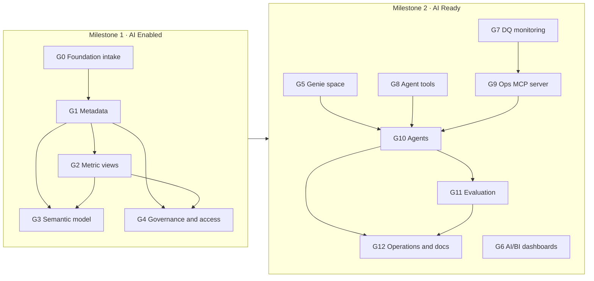

# MAYA tutorial: from a Bronze/Silver/Gold foundation to AI Enabled

MAYA makes a data foundation **AI Enabled** (milestone 1: goals G0 to G4) and then **AI Ready** (milestone 2:
goals G5 to G12). This tutorial takes you from an empty checkout to the AI Enabled milestone: a data product with
certified metadata, metric views, a semantic model and governed access, one goal at a time. It uses the
`commercial_analytics` example, which ships with a synthetic foundation you deploy yourself, so you can follow every
step on any Unity Catalog workspace. Section 18 then takes the example on to the AI Ready goals G5 Genie
space, and G6 AI/BI dashboards; the last parts show how to point MAYA at your own foundation.

The AI Enabled goals G0 to G4 and the AI Ready goals G5 Genie space and G6 AI/BI dashboards are available now. G7
to G12 will be released later.

> **Bringing your own foundation?** Do this tutorial once to learn MAYA, then follow
> [Take your own data foundation to AI Enabled](TUTORIAL_YOUR_FOUNDATION.md), which walks through the same goals with
> your own catalogs, tables, KPIs, taxonomy and groups.

Contents

0. [The two milestones: AI Enabled and AI Ready](#0-the-two-milestones-ai-enabled-and-ai-ready)
1. [Concepts in five minutes](#1-concepts-in-five-minutes)
2. [Prerequisites](#2-prerequisites)
3. [Install MAYA](#3-install-maya)
4. [Configure your workspace connection](#4-configure-your-workspace-connection)
5. [Deploy the example foundation](#5-deploy-the-example-foundation)
6. [Point the example at your workspace](#6-point-the-example-at-your-workspace)
7. [Initialise the project](#7-initialise-the-project)
8. [G0 Foundation intake](#8-g0-foundation-intake)
9. [G1 Metadata](#9-g1-metadata)
10. [G2 Metric views](#10-g2-metric-views)
11. [G3 Semantic model](#11-g3-semantic-model)
12. [G4 Governance and access](#12-g4-governance-and-access)
    - [Milestone reached: AI Enabled](#milestone-reached-ai-enabled)
13. [Status, dashboards and the portfolio](#13-status-dashboards-and-the-portfolio)
14. [Changing things after certification](#14-changing-things-after-certification)
15. [Certification options: automatic, manual, self-certified](#15-certification-options-automatic-manual-self-certified)
16. [The Asset Bundle and CI/CD](#16-the-asset-bundle-and-cicd)
17. [Using MAYA on your own foundation](#17-using-maya-on-your-own-foundation)
18. [AI Ready: G5 to G12](#18-ai-ready-g5-to-g12)
    - [Milestone reached: AI Ready](#189-ai-ready-reached)
19. [Command reference](#19-command-reference)
20. [Troubleshooting](#20-troubleshooting)
21. [Cleaning up](#21-cleaning-up)

---

## 0. The two milestones: AI Enabled and AI Ready

MAYA's 13 goals are grouped into two milestones. They follow the AI Enabled & AI Ready Certification Checklist:
every checklist item belongs to exactly one goal's validator. The AE items belong to the AI Enabled goals and the AR
items to the AI Ready goals.

| Milestone | Goals | Reached when | What it means | Release |
|-----------|-------|--------------|---------------|---------|
| **1 · AI Enabled** | G0 Foundation intake, G1 Metadata, G2 Metric views, G3 Semantic model, G4 Governance and access | G0 to G4 are certified | The foundation is described, measured, modelled and governed: an AI system can find, understand and safely use the data | Available now |
| **2 · AI Ready** | G5 Genie space, G6 AI/BI dashboards, G7 Data quality monitoring, G8 Agent tools, G9 Operations MCP server, G10 Agents, G11 Evaluation, G12 Operations and documentation | AI Enabled, plus G5 to G12 certified | People and agents use the data product: Genie, dashboards, monitored quality, tools, agents, evaluation and operations | Available now |

Every AI Ready goal also requires the AI Enabled milestone, so you finish G0 to G4 first.



Sections 8 to 12 walk through the five AI Enabled goals in order; at the end of section 12 the example reaches AI
Enabled. Section 18 runs the eight AI Ready goals G5 to G12; at the end of it the example reaches AI Ready.

---

## 1. Concepts in five minutes

The diagrams in [ARCHITECTURE.md](ARCHITECTURE.md) show how these concepts fit together.

**Project.** One `maya.yaml` describes one data product: the workspace connection, the foundation (which catalogs,
schemas and tables are in scope), the inputs of each goal and who certifies them. Nothing outside what `maya.yaml`
declares is ever scanned or changed.

**Goal.** A unit of work with a clear, checkable outcome, for example "every column has a description and a
sensitivity tag". Each goal has:

- prerequisites (G1 needs G0 certified, G3 needs G1 and G2, and so on);
- an inputs schema, so your YAML is validated before anything runs;
- a graph harness: deterministic code steps, AI agents where judgement is needed, and gates;
- a validator: a list of mandatory and advisory checks run against the live workspace;
- a certification, valid for a number of days.

| Milestone | Goal | Title | Needs | What you get |
|-----------|------|-------|-------|--------------|
| AI Enabled | G0 | Foundation intake | - | Inventory of every in-scope asset; readability, emptiness and freshness checks; an analyst agent's attestation |
| AI Enabled | G1 | Metadata | G0 | Table and column descriptions, sensitivity tags, verified primary and foreign keys, all in Unity Catalog |
| AI Enabled | G2 | Metric views | G1 | Every KPI as a Unity Catalog metric view, each measure proven against an independent reference SQL |
| AI Enabled | G3 | Semantic model | G1, G2 | Domain > subdomain > page taxonomy, tags on every asset, ontology registry, business glossary, `ontology_lookup()` |
| AI Enabled | G4 | Governance and access | G1, G2 | Roles and grants, ABAC policies and column masks over sensitive columns, row filters, an audit view |
| AI Ready | G5 to G12 | Genie space, AI/BI dashboards, data quality monitoring, agent tools, Ops MCP server, agents, evaluation, operations and documentation | AI Enabled | Section 18 |

**Milestone.** Each goal's `goal.yaml` names its milestone (`metadata.milestone`). `maya status` reports a milestone
as reached when all its goals are certified.

**Gate.** A checkpoint where items (proposals, plans) are validated against a JSON schema and goal-specific checks
before the run continues. With automatic approvals (the default), a gate passes as soon as its items validate.

**Certification.** When every mandatory check passes, the goal is certified and recorded in the project's state
schema. A certified goal becomes **stale** when its configuration changes, a prerequisite is re-certified, the
workspace drifts from what was certified, or the certification expires. Running it again brings it back.

**Delivery through the Asset Bundle.** MAYA never writes deliverables into the workspace directly. Every goal writes
idempotent SQL scripts into the project's Databricks Asset Bundle (`bundle/` next to `maya.yaml`) and deploys them
by running the bundle's `maya_deploy` job. The same bundle is what your CI/CD promotes to test and production.
MAYA itself has no notion of environments. The only things MAYA writes directly are its own state tables and
the project registry.

**Agents.** Agents run through [Omnigent](https://pypi.org/project/omnigent/) and call a model served by the
Databricks AI Gateway (by default `system.ai.claude-sonnet-4-6`). Their output is always validated against a schema
before it is used.

---

## 2. Prerequisites

### On your machine

- macOS, Linux or WSL.
- Python 3.12 or later.
- [uv](https://docs.astral.sh/uv/) (recommended) or `pip`.
- The [Databricks CLI](https://docs.databricks.com/dev-tools/cli/install.html), a recent version (tested with
  v0.288). MAYA calls `databricks bundle deploy` and `databricks bundle run`.
- Git.

### In your Databricks workspace

- Unity Catalog enabled.
- A SQL warehouse you can use (serverless or pro). Note its ID: in the warehouse's page, **Connection details**, the
  last part of the HTTP path.
- Serverless jobs enabled (the bundle's deploy job runs on serverless).
- Access to an AI Gateway model service. The default is `system.ai.claude-sonnet-4-6`. Any chat model your
  workspace serves through the AI Gateway works; set it in `ai_gateway.model`.
- A catalog where you may `USE CATALOG` and `CREATE SCHEMA`. The examples use `solution_builder`; any name works
  (section 6).
- For G4: two **account-level** groups (not workspace-local groups such as `admins` or `users`, which Unity Catalog
  rejects as principals). One for consumers of the data product, one for engineers.
- Optional, for G3 governed tags: permission to create tag policies (account level). Without it, set
  `governed_tags: false` and the tags are plain tags with the same controlled values.

### Who you are

MAYA runs as you (your Databricks CLI profile). In development the deploy job also runs as you; in CI/CD it runs as
the service principal your pipeline uses. You need to own, or hold `MANAGE` on, the schemas MAYA writes to. When
MAYA creates the schemas, you own them.

---

## 3. Install MAYA

```bash
git clone https://github.com/vasutechgenie/maya-dbx-ai.git
cd maya-dbx-ai

# with uv
uv venv --python 3.12
uv pip install -e .

# or with pip
python3.12 -m venv .venv
.venv/bin/pip install -e .
```

This installs the `maya` command and the `omnigent` agent runtime into `.venv`. Either activate the environment
(`source .venv/bin/activate`) or call `.venv/bin/maya` directly. The rest of this tutorial assumes the environment
is active.

Check it:

```bash
maya --help
```

You should see the commands `validate, goals, plan, run, review, status, bundle, init, migrate, projects, portfolio`.

---

## 4. Configure your workspace connection

### 4.1 Databricks CLI profile

```bash
databricks auth login --host https://<your-workspace-host> --profile maya-dev
databricks current-user me --profile maya-dev    # should print your user
```

Any authentication method the Databricks CLI supports works (OAuth as above, a service principal, environment
variables). MAYA never stores credentials; it uses the profile you name.

### 4.2 Environment variables

The example `maya.yaml` reads every workspace-specific value from the environment, written as `${env:NAME}`. Set
them in your shell (or in a `.env` you source; never commit it):

```bash
export DATABRICKS_CONFIG_PROFILE=maya-dev           # the CLI profile above
export MAYA_WAREHOUSE_ID=<warehouse-id>              # the SQL warehouse that runs MAYA's queries and scripts
export MAYA_APPROVER=<you@company.com>               # recorded as approver and certifier; also the G4 'writer'
export MAYA_CONSUMER_GROUP=<account-group-of-consumers>   # used by G4 in the commercial example
export MAYA_ENGINEER_GROUP=<account-group-of-engineers>   # used by G4 in the commercial example
```

If a referenced variable is not set, MAYA stops with `environment variable NAME is not set`.

---

## 5. Deploy the example foundation

The example ships a synthetic commercial data product: customers, products, regions, orders, shipments and returns,
loaded from CSV files into Bronze, cleaned into Silver and aggregated into Gold.

```bash
cd examples/commercial_analytics/foundation

# 1. generate the CSV source files (deterministic, standard library only) into ./data
python generate_data.py

# 2. create the schemas, upload the files, import the notebooks and run Bronze -> Silver -> Gold
python deploy_foundation.py --profile "$DATABRICKS_CONFIG_PROFILE" --warehouse "$MAYA_WAREHOUSE_ID" \
    --catalog solution_builder
```

Use `--catalog <your-catalog>` if you are not using `solution_builder` (then also follow section 6), and
`--prefix <p>` to name the schemas `<p>_bronze`, `<p>_silver`, `<p>_gold` instead of `maya_*`.

What it creates:

| Object | Name |
|--------|------|
| Schemas | `<catalog>.maya_bronze`, `<catalog>.maya_silver`, `<catalog>.maya_gold` |
| Landing volume | `<catalog>.maya_bronze.landing` with the CSV files |
| Notebooks | `/Users/<you>/maya_example/foundation/01_bronze_load`, `02_silver_build`, `03_gold_build` |
| Job | `maya_example_foundation` (three tasks; a daily schedule, paused) |

The script runs the job once and prints each task's result. When it finishes you have a foundation with no
descriptions, no tags, no keys, no metric views and no access controls: exactly the starting point MAYA is for.

> The foundation is deliberately deployed by a plain script, not by MAYA: in real life the foundation already
> exists and MAYA starts from it.

---

## 6. Point the example at your workspace

Open `examples/commercial_analytics/maya.yaml`. With the environment variables from section 4 set, the only thing
you may need to change is the catalog, if yours is not `solution_builder`:

```yaml
target:
  profile: ${env:DATABRICKS_CONFIG_PROFILE}
  warehouse_id: ${env:MAYA_WAREHOUSE_ID}
  state_schema: solution_builder.maya_state_commercial_analytics   # <catalog>.<schema> for MAYA's own state
  registry: solution_builder.maya_registry                         # <catalog>.<schema> shared by all projects
foundation:
  catalog: solution_builder
```

Replace `solution_builder` in these three places and in the reference SQL of `kpis/metric_views.yaml`
(search for `solution_builder.`).

The file is fully commented; the sections below explain each goal's block as you reach it.

Validate the whole project before running anything:

```bash
cd examples/commercial_analytics
maya validate
```

`--system` defaults to `maya.yaml` in the current folder; from elsewhere use
`maya --system examples/commercial_analytics/maya.yaml validate`. Expected output:

```
  ok   G0 Foundation intake
  ok   G1 Metadata
  ok   G2 Metric views
  ok   G3 Semantic model
  ok   G4 Governance and access
system commercial-analytics: valid  (model system.ai.claude-sonnet-4-6)
```

`validate` checks your inputs against each goal's schema, parses each goal's graph and lints its gate validators. It
does not touch the workspace. A goal you have not configured is shown as `--  ... not configured in maya.yaml` and
does not make the project invalid.

---

## 7. Initialise the project

```bash
maya init
```

This creates (or upgrades) the project's state schema (`target.state_schema`), creates or reuses the project
dashboard, registers the project in the workspace registry (`target.registry`) and publishes the first status.
It is safe to run any number of times.

Now look at the goals:

```bash
maya goals
```

```
  G0   Foundation intake                    ready              needs: -
  G1   Metadata                             blocked            needs: G0
  G2   Metric views                         blocked            needs: G1
  G3   Semantic model                       blocked            needs: G1, G2
  G4   Governance and access                blocked            needs: G1, G2
```

Goal statuses:

| Status | Meaning |
|--------|---------|
| `ready` | Prerequisites certified; can run |
| `blocked` | A prerequisite is not certified |
| `running` | A run is in progress |
| `awaiting_approval`, `awaiting_sign_off` | A run is paused at a gate (manual approvals only) |
| `failed` | The last run failed; run it again after fixing the cause |
| `certified` | Certified and current |
| `stale` | Was certified, but something changed (configuration, a prerequisite, the workspace, or the expiry date) |
| `invalid_config` | The goal's inputs in `maya.yaml` do not validate; the message says why |
| `not_configured` | The goal needs inputs and has no entry under `goals:` in `maya.yaml` yet; add one to use it |

Two commands help before every run:

```bash
maya plan --goal G0     # the resolved inputs and the steps the goal will take
maya run                # without --goal: runs the next goal that is ready or stale
```

---

## 8. G0 Foundation intake

*Milestone 1 · AI Enabled, step 1 of 5.* Architecture of this goal (inputs, harness graph, outputs, checks):
[maya/goals/g00_foundation](../maya/goals/g00_foundation/README.md).

**What it does.** Reads the foundation declared under `foundation:` and nothing else. It inventories every table and
view, checks that each can be queried, is not empty and (where you set a limit) is fresh, and asks the
`foundation_analyst` agent to attest each layer's readiness and list gaps. It changes nothing in the workspace.

**Configuration.** The foundation block decides what is in scope:

```yaml
foundation:
  catalog: solution_builder
  layers:
    bronze: {schemas: [maya_bronze], tables: all, metadata_scope: tables}
    silver: {schemas: [maya_silver], tables: all, metadata_scope: full}
    gold:   {schemas: [maya_gold],   tables: all, metadata_scope: full}
  exclude: ["ingestion_log"]
```

- `schemas`: one or more schemas per layer; `other_catalog.schema` picks a schema from another catalog.
- `tables`: `all`, or a list of names, `schema.name` or globs such as `dim_*`.
- `exclude`: names or globs left out (the top-level `exclude` applies to every layer).
- `metadata_scope`: what G1 documents. `tables` = table descriptions only; `full` = tables and every column.

G0's own inputs:

```yaml
goals:
  G0:
    freshness_hours: {gold: 48}     # the newest Gold asset must be updated within 48 hours
    # min_assets_per_layer: 1       # default
    # row_counts: true              # set false for very large foundations
```

**Run it.**

```bash
maya run --goal G0
```

The log shows each step: `discover`, `assess`, `attest` (the agent), `validate`, `sign_off`, `certify`.

**Checks.**

| Check | Severity | Passes when |
|-------|----------|-------------|
| `layers_populated` | mandatory | Every layer has at least `min_assets_per_layer` assets |
| `assets_readable` | mandatory | Every in-scope asset can be queried |
| `no_empty_tables` | mandatory | No in-scope table or view is empty |
| `layer_freshness` | mandatory | Each layer with a `freshness_hours` limit was updated within it |
| `inventory_recorded` | mandatory | The inventory state table matches what was discovered |
| `attestation_complete` | mandatory | The analyst attested every layer and tied every gap to an asset |
| `undocumented_assets` | advisory | Count of assets without a description (G1 fixes these) |

**If it fails.** The output names the failing check and the assets. Typical causes: a layer schema that does not
exist, a table you cannot `SELECT`, an empty table (exclude it or load it), or a stale layer (re-run your foundation
job, or relax `freshness_hours`). Fix and run `maya run --goal G0` again.

---

## 9. G1 Metadata

*Milestone 1 · AI Enabled, step 2 of 5.* Architecture of this goal (inputs, harness graph, outputs, checks):
[maya/goals/g01_metadata](../maya/goals/g01_metadata/README.md).

**What it does.**

1. Profiles every in-scope asset (types, null and distinct counts, value lists for low-cardinality columns).
2. Classifies column sensitivity: your regex rules first, the `metadata_describer` agent for everything the rules
   do not cover.
3. Asks the agent to describe each table and column and to propose primary and foreign keys.
4. Verifies every key against the data (unique and not null; foreign keys resolve).
5. Validates the proposals at the `review` gate, writes them as bundle scripts (comments, tags, informational
   constraints), deploys them and checks Unity Catalog matches.

**Configuration.**

```yaml
goals:
  G1:
    allow_data: true                       # send sample values to the model (default false: names, types, stats only)
    context: context/business.yaml         # business context for the describer
    declared_keys:
      - {table: maya_silver.customer, primary_key: [customer_id]}
    sensitivity_classes: [public, internal, pii]     # least to most restrictive
    sensitivity_rules:
      - {pattern: "(?i)(^|_)e_?mail(_|$)", class: pii}
      - {pattern: "(?i)(^|_)(phone|mobile|fax)(_|$)", class: pii}
```

The context file gives the agent the business vocabulary:

```yaml
business: A software vendor selling cloud products to business customers in six regions.
glossary:
  fill rate: Units shipped divided by units ordered for shipped orders.
  revenue: Quantity times unit price for orders that are not cancelled.
conventions:
  - Monetary amounts are in USD.
```

Other useful inputs (all optional):

| Input | Default | Use |
|-------|---------|-----|
| `mode` | `incremental` | `incremental` only handles new or changed assets; `full` redoes everything |
| `overwrite_existing` | `false` | `false` never changes descriptions, tags or keys already in Unity Catalog |
| `infer_keys` | `true` | Verify and apply keys the agent proposes |
| `key_candidate_patterns` | `_id$`, `_key$`, `_code$` | Column patterns tried as keys when none is declared or proposed |
| `sensitivity_consistency` | `most_restrictive` | Same-named columns get the most restrictive class any asset assigned |
| `min_description_chars` | `20` | Minimum length of a description |
| `tag_names` | `sensitivity`, `maya_layer` | Tag keys used for sensitivity and layer |
| `model` | `ai_gateway.model` | Model override for this goal |

> If your account has a governed tag named `sensitivity`, its allowed values must include every class in
> `sensitivity_classes`. Otherwise set `tag_names.sensitivity` to another key.

**Run it.**

```bash
maya run --goal G1
```

Steps: `scope`, `profile`, `describe` (agent, one call per asset), `propose`, `keys`, `review` (gate), `apply`,
`validate`, then `repair` and `validate` again if a mandatory check fails, and `certify`. Expect a few minutes for
the example.

**Checks.**

| Check | Severity | Passes when |
|-------|----------|-------------|
| `table_descriptions` | mandatory | Every in-scope table and view has a description |
| `column_descriptions` | mandatory | Every column of every full-scope asset has a description |
| `description_quality` | mandatory | Descriptions are specific: long enough, not the name restated, no placeholders |
| `sensitivity_tagged` | mandatory | Every in-scope column has a sensitivity tag with an allowed value |
| `sensitivity_rules` | mandatory | Columns matched by a rule carry the class the rule requires |
| `declared_keys` | mandatory | Every primary key declared in `maya.yaml` exists |
| `keys_hold` | mandatory | Every key holds in the current data |
| `proposals_applied` | mandatory | Unity Catalog matches the approved proposals |
| `key_coverage` | advisory | Full-scope tables without a verified primary key |

**See the result** in Catalog Explorer: open `maya_silver.customer` and look at the table comment, the column
comments, the `sensitivity` tags (`email` and `phone` are `pii`) and the primary key. Or with SQL:

```sql
DESCRIBE TABLE EXTENDED solution_builder.maya_silver.customer;
SELECT column_name, tag_name, tag_value
FROM solution_builder.information_schema.column_tags
WHERE schema_name = 'maya_silver' AND table_name = 'customer';
```

---

## 10. G2 Metric views

*Milestone 1 · AI Enabled, step 3 of 5.* Architecture of this goal (inputs, harness graph, outputs, checks):
[maya/goals/g02_metric_views](../maya/goals/g02_metric_views/README.md).

**What it does.** You write the complete definition of each KPI as a metric view in YAML, including, for every
measure, an independent reference SQL. MAYA renders and creates the views through the bundle, keeps existing tags
and grants when a view is re-created, has the `metric_reviewer` agent critique the definitions (warnings only), and
proves every measure equals its reference SQL, overall and by the dimensions you name. Then it certifies the views
and tags them `system.certification_status = certified`.

**Configuration.**

```yaml
goals:
  G2:
    schema: maya_metrics                   # where the metric views live; never a foundation layer schema
    definitions: kpis/metric_views.yaml
    # tolerance: 1e-6                      # allowed relative difference against the reference
```

**Writing a metric view.** From `kpis/metric_views.yaml`:

```yaml
metric_views:
  - name: sales_performance
    comment: Net sales KPIs (revenue, orders, units, average order value) by day, region, product and category.
    owner: sales-analytics@example.com
    source: maya_gold.sales_daily             # a Silver or Gold asset (Bronze only with allow_bronze_sources)
    # filter: "status <> 'cancelled'"         # optional
    # joins: [{name: r, source: maya_silver.region, "on": source.region_code = r.region_code}]   # quote "on"
    dimensions:
      - {name: region, expr: region_name, display_name: Region, comment: Sales region of the order., synonyms: [area, territory]}
    measures:
      - name: revenue
        expr: SUM(revenue)
        display_name: Revenue
        comment: Net sales value (quantity x unit price) of non-cancelled orders, in USD.
        synonyms: [sales, net sales, turnover]
        format: {type: currency, currency_code: USD}
        reference:
          by: [region]                        # also compare per region
          sql: |
            SELECT r.region_name AS region, SUM(o.quantity * o.unit_price) AS value
            FROM solution_builder.maya_silver.orders o
            JOIN solution_builder.maya_silver.region r ON o.region_code = r.region_code
            WHERE o.status <> 'cancelled'
            GROUP BY r.region_name
```

Rules:

- A view needs `name`, `source`, `dimensions` and `measures`. Give it a `comment` and an `owner` too.
- Every dimension and measure needs `display_name`, `comment` and `synonyms` (Genie and AI/BI use them), and every
  measure a `format` (`number`, `currency` with `currency_code`, or `percentage`).
- `reference.sql` must return a column named `value`. With `reference.by`, it also returns one column per listed
  dimension, named like the dimension. Write it independently of the metric view, ideally from a different layer
  (the example computes Gold measures from Silver), so the comparison means something.

**Run it.**

```bash
maya run --goal G2
```

Steps: `load`, `render`, `critique` (agent), `collect`, `review` (gate), `apply`, `validate` (with `repair`),
`sign_off`, `mark`, `certify`.

**Checks.**

| Check | Severity | Passes when |
|-------|----------|-------------|
| `metric_views_exist` | mandatory | Every KPI exists as a metric view |
| `definitions_applied` | mandatory | The definition read back from Unity Catalog is exactly the approved one |
| `business_friendly` | mandatory | Every field has a display name, description and synonyms; every measure a format |
| `measures_match_reference` | mandatory | Every measure equals its reference SQL within tolerance |
| `views_described` | mandatory | Every metric view has a specific description |
| `reviewer_warnings` | advisory | Warnings from the reviewer agent |

**Try it:**

```sql
SELECT `Region`, MEASURE(`Revenue`) FROM solution_builder.maya_metrics.sales_performance GROUP BY ALL;
```

If a measure does not match its reference, the failure shows both values and the dimension values where they
differ. Fix the definition or the reference SQL and run G2 again.

---

## 11. G3 Semantic model

*Milestone 1 · AI Enabled, step 4 of 5.* Architecture of this goal (inputs, harness graph, outputs, checks):
[maya/goals/g03_semantic_model](../maya/goals/g03_semantic_model/README.md).

**What it does.** Builds the business taxonomy **domain > subdomain > page** over the data product and places every
Silver, Gold and metric-view asset on exactly one page. You declare domains and subdomains completely; for pages you
write as much as you know:

| You write | MAYA does |
|-----------|-----------|
| `pages: auto` | The `page_designer` agent designs the subdomain's pages; the `asset_assigner` agent places assets |
| `pages: [{name: Order fulfilment}]` | Agents fill in what is missing (id, description) and place the remaining assets |
| `pages: [{id, name, description, assets: [...]}]` | Used exactly as written; listed assets are pinned |
| `allow_new_pages: true` (with a page list) | Agents may add pages for assets that fit none of yours |

It then delivers, through the bundle:

- domain, subdomain and page tags on every placed asset (tag keys `<project>_domain`, `<project>_subdomain`,
  `<project>_page`; as governed tags when `governed_tags: true`);
- the ontology registry tables `ontology_nodes` and `ontology_page_objects`;
- the `business_glossary` table: your terms plus every metric-view measure;
- the table function `ontology_lookup(search_term)`.

**Configuration.**

```yaml
goals:
  G3:
    schema: maya_semantic                  # registry, glossary and ontology_lookup()
    taxonomy: semantic/taxonomy.yaml
    governed_tags: false                   # true needs permission to create tag policies (account level)
    # layers: [silver, gold]               # layers whose assets are placed (default)
    # exclude: [maya_silver.tmp_*]         # assets kept off the model
    # min_confidence: 0.6                  # agent placements below this are reported (advisory)
    # mode: incremental                    # keep certified agent-built pages; 'full' designs them again
```

**Writing the taxonomy.** From `semantic/taxonomy.yaml`:

```yaml
domains:
  - id: commercial                         # the controlled tag value
    name: Commercial
    description: Selling cloud products to business customers - orders, revenue and the customers who buy.
    owner: sales-analytics@example.com
    subdomains:
      - id: sales
        name: Sales
        description: Order intake and net revenue by day, region and product.
        pages:                             # complete page: used exactly as written
          - id: sales_performance
            name: Sales performance
            description: Daily net revenue, orders, units and average order value by region, product and category.
            assets: [maya_gold.sales_daily, maya_metrics.sales_performance, maya_silver.orders]
      - id: customers
        name: Customers
        description: Who the business customers are, their segments and what they buy.
        pages: auto                        # agents design the pages

glossary:
  - term: Fill rate
    definition: Units shipped divided by units ordered for shipped orders.
    synonyms: [unit fill rate]
    links: [maya_metrics.fulfilment.fill_rate]   # objects or fields that implement the term
```

Required: per domain `id`, `name`, `description` (at least 20 characters), `owner`, `subdomains`; per subdomain
`id`, `name`, `description`; per page only `name`; per glossary term `term` and `definition`.

**Run it.**

```bash
maya run --goal G3
```

Steps: `load`, `plan`, `design` (one agent call per subdomain that needs design), `resolve`, `assign` (agent calls
in batches of `assign_batch` assets), `assemble`, `review` (gate), `apply`, `validate` (with `repair`), `mark`,
`certify`.

How placements are decided, in order: pages you pinned in YAML, then placements from the last certified run, then a
single page designer's claim; everything else goes to the assigner agent.

**Fixing what the agents built.** After a run, `.maya/runs/G3/<run_id>/artefacts/taxonomy.resolved.yaml` holds the
complete result in the same format as your taxonomy file. Copy the parts you want to fix into
`semantic/taxonomy.yaml` (for example, pin an asset to a different page) and run G3 again. Only what changed is
redesigned and redeployed; pinned and unchanged parts need no agent calls.

**Checks.**

| Check | Severity | Passes when |
|-------|----------|-------------|
| `taxonomy_registered` | mandatory | The registry holds exactly the approved domains, subdomains and pages |
| `governed_tags` | mandatory | The tag keys allow exactly the taxonomy's values (when `governed_tags: true`) |
| `every_asset_tagged` | mandatory | Every placed asset carries its domain, subdomain and page tags |
| `one_page_per_asset` | mandatory | Every asset is on exactly one page, as approved |
| `glossary_loaded` | mandatory | The glossary holds every term with its links |
| `lookup_works` | mandatory | `ontology_lookup()` answers every term and page |
| `pages_populated` | advisory | Pages without any asset |
| `confident_assignments` | advisory | Agent placements below `min_confidence` |

**Try it:**

```sql
SELECT * FROM solution_builder.maya_semantic.ontology_lookup('unit fill rate');
SELECT * FROM solution_builder.maya_semantic.ontology_nodes ORDER BY node_type, node_id;
```

---

## 12. G4 Governance and access

*Milestone 1 · AI Enabled, step 5 of 5.* Architecture of this goal (inputs, harness graph, outputs, checks):
[maya/goals/g04_governance](../maya/goals/g04_governance/README.md).

**What it does.** Everything about access is declared in YAML and delivered through the bundle:

- **Roles**: groups or service principals and what they may read (`SELECT`) and execute (`EXECUTE`).
- **Masks** on every sensitive column (those G1 tagged `pii`, by default), by exactly one of two methods:
  - a tag-based **ABAC policy** on whole schemas, matching a tag value;
  - a **per-column mask** function on a single column.
- **Row filters** where declared.
- An **audit view** over `system.access.audit` for the product's schemas.

Rules MAYA enforces before deploying anything:

- Every sensitive column is masked exactly once. Covered by both a policy and a column mask, or by neither, is
  refused at load with the column named.
- Grants go to groups and service principals only, never to individual users.
- A role marked `consumer: true` may not read Bronze or Silver.
- The `writers` (the identities that run the foundation jobs) are exempt from every mask and row filter, so a Silver
  build never copies masked values from Bronze.
- Workspace-local groups (`admins`, `users`) are refused: Unity Catalog accepts only account-level principals.

**What MAYA does not do.** It never revokes grants it did not make. Other grants on the product schemas are left as
they are and listed as advisory findings. When you remove something from the YAML that MAYA delivered earlier (a
mask, a policy, a row filter, one of its grants), the next run removes it.

**Configuration** (from the example):

```yaml
goals:
  G4:
    schema: maya_governance                # mask and row-filter functions, audit view
    writers: ["${env:MAYA_APPROVER}"]      # in CI/CD: the service principal that runs the foundation jobs
    catalog_access: existing               # 'grant': MAYA grants USE CATALOG; 'existing': only verified
    roles:
      consumers:
        principals: ["${env:MAYA_CONSUMER_GROUP}"]
        consumer: true
        read: [gold, metric_views, semantic]
        execute: [semantic]                # ontology_lookup()
      engineers:
        principals: ["${env:MAYA_ENGINEER_GROUP}"]
        read: [bronze, silver, gold, metric_views, semantic, governance]
        execute: [semantic, governance]
    mask_functions:
      redact:     {kind: redact, unmasked_for: ["${env:MAYA_ENGINEER_GROUP}"]}
      email_mask: {kind: email,  unmasked_for: ["${env:MAYA_ENGINEER_GROUP}"]}
    masks:
      - {abac: mask_pii, scopes: [bronze], match: {tag: sensitivity, value: pii}, function: redact}
      - {column: maya_silver.customer.email, function: email_mask}
      - {column: maya_silver.customer.phone, function: redact}
    row_filters:
      - table: maya_gold.sales_daily
        columns: [region_name]
        by_group: {"${env:MAYA_CONSUMER_GROUP}": [North America West, North America East]}
        unfiltered_for: ["${env:MAYA_ENGINEER_GROUP}"]
```

> Quote every `${env:...}` that sits inside `[...]` or `{...}`: YAML reads unquoted braces as a mapping.

**Scopes** (used in `read`, `execute` and ABAC `scopes`): `bronze`, `silver`, `gold` (the foundation layers),
`metric_views` (G2's schema), `semantic` (G3's schema), `governance` (G4's schema), or a schema name
(`schema` or `catalog.schema`). Single objects go under `objects: {select: [...], execute: [...]}`.

**Mask functions.** Built-in kinds:

| Kind | Masked value |
|------|--------------|
| `redact` | `***` |
| `null` | `NULL` |
| `hash` | SHA-256 of the value |
| `email` | Keeps the domain: `***@example.com` |
| `last4` | Keeps the last four characters |

Write the `null` kind quoted, `{kind: "null"}`: unquoted, YAML reads it as an empty value.

Or your own SQL over the input `value`: `{sql: "concat(left(value, 1), '***')", type: STRING}`. `type` defaults to
`STRING`; set it to match non-string columns. `unmasked_for` lists the principals who see the real value; the
writers always do.

**Masks.** Either form:

```yaml
- {abac: <policy_name>, scopes: [<scope>, ...], match: {tag: <tag>, value: <value>}, function: <fn>, except: [<principal>]}
- {column: <schema.table.column>, function: <fn>}
```

An ABAC policy is created on every schema of its scopes and masks every column whose tag matches, including columns
added later. A column mask covers one column. `sensitive` (default `{tag: sensitivity, values: [pii]}`) defines
which columns must be covered.

**Row filters.** Either `by_group` (each principal and the values of the single filter column it sees) or `sql` (a
boolean expression over the listed columns). `unfiltered_for` sees every row; writers always do.

**Other inputs.** `audit: {view: audit_access, days: 90}`, `jobs: [<job name>, ...]` (jobs whose run-as identity is
checked; the bundle's deploy job is always checked), `mode: incremental | full`.

**Run it.**

```bash
maya run --goal G4
```

Steps: `load` (builds and checks the plan), `review` (gate), `apply`, `validate` (with `repair`), `mark`, `certify`.
The plan is in `.maya/runs/G4/<run_id>/artefacts/governance_plan.json`.

**Checks.**

| Check | Severity | Passes when |
|-------|----------|-------------|
| `sensitive_data_protected` | mandatory | Every sensitive column is masked by exactly one declared method |
| `functions_as_declared` | mandatory | Every mask and row-filter function exists exactly as declared |
| `policies_as_declared` | mandatory | Every ABAC policy exists on its schemas exactly as declared |
| `column_masks_as_declared` | mandatory | Every column mask is attached, and no removed one remains |
| `row_filters_as_declared` | mandatory | Every row filter is attached, and no removed one remains |
| `grants_as_declared` | mandatory | Every role holds exactly the declared privileges |
| `catalog_access` | mandatory | Every role principal can use the catalogs it reads from |
| `unity_catalog_only` | mandatory | Every object of the data product is a Unity Catalog object |
| `audit_available` | mandatory | The audit view exists and returns events for the product schemas |
| `consumer_exposure` | advisory | Privileges consumers hold on Bronze or Silver (granted by someone else) |
| `other_grants` | advisory | Grants not declared here; individuals flagged |
| `writers_exempt` | advisory | Identities writing from masked sources that are not exempt |
| `jobs_run_as_service_principals` | advisory | Jobs that run as a person or carry a personal token |

In development the deploy job runs as you, so `jobs_run_as_service_principals` reports one finding. That is
expected; in CI/CD the bundle runs as a service principal.

**See the result:**

```sql
SHOW POLICIES ON SCHEMA solution_builder.maya_bronze;
SELECT * FROM solution_builder.information_schema.column_masks WHERE table_schema = 'maya_silver';
SELECT * FROM solution_builder.information_schema.row_filters;
SHOW GRANTS `<consumer-group>` ON SCHEMA solution_builder.maya_gold;
SELECT * FROM solution_builder.maya_governance.audit_access LIMIT 20;
```

To see masking from a consumer's point of view, query `maya_silver.customer` as a member of the consumer group (not
as a writer or engineer): `email` shows `***@domain` and `phone` shows `***`. As a writer you see real values; this
is by design.

### Milestone reached: AI Enabled

With G4 certified, all five AI Enabled goals are certified. Check it:

```bash
maya goals
maya status
```

```
  G0   Foundation intake                  certified          checks 7/7    certified by ...
  G1   Metadata                           certified          checks 9/9    certified by ...
  G2   Metric views                       certified          checks 6/6    certified by ...
  G3   Semantic model                     certified          checks 8/8    certified by ...
  G4   Governance and access              certified          checks 13/13  certified by ...

  milestone AI Enabled: reached
```

What AI Enabled means for the example data product:

| Checklist area | Delivered by | Where to see it |
|----------------|--------------|-----------------|
| Foundation in place, registered and fresh (AE-1 to AE-4, AE-8.1) | G0 | Asset inventory in the state schema |
| Keys and descriptions on every asset, sensitivity classified (AE-3.2, AE-5.1 to AE-5.5) | G1 | Catalog Explorer: comments, tags, constraints |
| KPIs as certified metric views (AE-6.1 to AE-6.3) | G2 | `maya_metrics.*` |
| Business taxonomy, glossary and lookup (AE-7.1 to AE-7.4) | G3 | `maya_semantic.*`, domain / subdomain / page tags |
| Sensitive data masked, least-privilege grants, audit (AE-3.4, AE-8.1 to AE-8.4) | G4 | Policies, masks, row filters, grants, `maya_governance.audit_access` |

The milestone stays reached only while every goal stays certified. If a goal turns stale (section 14), `maya status`
reports `milestone AI Enabled: not yet` until you run it again.

---

## 13. Status, dashboards and the portfolio

```bash
maya status
```

Prints every goal's state, check results and next action, writes `reports/status.html` and `reports/status.json`
(set in `status.out_dir` and `status.formats`), and publishes the status to the state schema, which feeds the
project dashboard created by `maya init`.

Across projects in the same workspace:

```bash
maya projects                    # every project in target.registry, its certified goals and dashboard link
maya portfolio                   # create or update a portfolio dashboard over the registry
maya portfolio --name "Data products" --path /Users/<you>/MAYA
```

---

## 14. Changing things after certification

You change the YAML; MAYA works out what changed.

```bash
maya goals            # the changed goal and the goals after it show 'stale', with the reason
maya run              # runs the next stale goal; repeat until 'nothing to run'
```

A goal turns stale when:

- its inputs in `maya.yaml` (or the files they point to) change;
- a prerequisite is re-certified after it;
- the workspace drifts from what was certified (for example, someone drops a comment, a tag, a mask or a grant
  MAYA delivered);
- its certification expires (90 days by default).

Runs are incremental by default: only what changed is regenerated, and only scripts that differ from the last
certified delivery are deployed. Examples:

- Pin an asset to another page in `taxonomy.yaml`: G3 runs without agent calls and deploys only the affected tag and
  registry scripts.
- Replace the Silver column masks with an ABAC policy in G4: the next run creates the policy and removes the two
  column masks MAYA had attached.

To redo a goal from scratch, set `mode: full` for it (G1, G2, G3, G4), or force a re-run of a current goal:

```bash
maya run --goal G2 --force
```

If a run fails half-way (a network error, a permission you then grant), continue from where it stopped:

```bash
maya run --goal G3 --resume
```

Every run keeps its files in `.maya/runs/<goal>/<run_id>/`: `checkpoint.json` and `artefacts/` (proposals, plans,
agent logs).

---

## 15. Certification options: automatic, manual, self-certified

```yaml
certification:
  approvals: auto                          # default
  approvers:
    data_owner: ${env:MAYA_APPROVER}       # G0, G1
    data_steward: ${env:MAYA_APPROVER}     # G1
    kpi_owner: ${env:MAYA_APPROVER}        # G2
    business_owner: ${env:MAYA_APPROVER}   # G3
    security: ${env:MAYA_APPROVER}         # G4
```

**Automatic (default).** Gates pass and goals are certified as soon as validation passes, recorded as
`auto (<approver>)`. No manual step anywhere.

**Manual.** Set `approvals: manual`. Runs pause at each gate and at sign-off (`awaiting_approval`,
`awaiting_sign_off`); the approver decides with `maya review`:

```bash
maya review                                         # pending approvals and whether their items validate
maya review --goal G1 --export review/              # write the gate's items as YAML to read or edit
maya review --id <approval-id> --edit proposals.json=review/proposals.yaml --approve --note "fixed two descriptions"
maya review --goal G1 --approve                     # approve; the run resumes automatically
maya review --goal G1 --reject --note "wrong owner"
```

An edit is accepted, and an approval recorded, only when every item validates; otherwise nothing changes.
`--no-resume` approves without resuming the run.

**Self-certified.** A goal already done outside MAYA (for example, your platform team owns the foundation) can be
attested in `maya.yaml`; the goals after it can then run:

```yaml
certification:
  self_certified:
    G0: {by: data-platform@example.com, note: foundation attested by the platform team, valid_until: 2027-06-30}
```

`by` is required; `valid_until` is optional (without it the attestation does not expire). `maya goals` shows
`certified` with "self-certified by ...". Remove the entry to have MAYA run the goal itself.
The `supply_chain` example uses this for G0.

---

## 16. The Asset Bundle and CI/CD

Each project's bundle is generated next to its `maya.yaml`:

```
bundle/
  databricks.yml                  written once; add your targets here (MAYA never rewrites it)
  resources/maya_variables.yml    warehouse_id and one variable per catalog the scripts use (default: the dev name)
  resources/maya_deploy.job.yml   job 'maya_deploy': one task per goal, in goal order
  maya_deploy/run_scripts.py      the script runner the tasks execute
  scripts/<goal>/...              idempotent SQL (and JSON for governed tags)
  maya_manifest.json              which certified run produced each goal's scripts
```

Scripts never hard-code catalog names: they use `{{catalog:<dev name>}}` tokens that the deploy job resolves from
the bundle variables. To deploy to another environment, add a target that overrides the variables:

```yaml
# bundle/databricks.yml
targets:
  dev:
    mode: development
    default: true
    workspace: {host: https://<dev-workspace>}
  prod:
    mode: production
    workspace: {host: https://<prod-workspace>}
    run_as: {service_principal_name: <application-id>}
    variables:
      warehouse_id: <prod-warehouse-id>
      catalog_solution_builder: <prod-catalog>
```

In your own project repository, commit `maya.yaml`, its input files and `bundle/`. Your pipeline then runs:

```bash
databricks bundle deploy -t prod
databricks bundle run maya_deploy -t prod
```

To regenerate the bundle from every certified goal (for example, after cloning on a new machine), or to deploy
everything in one go as CI/CD would:

```bash
maya bundle            # rewrite scripts from certified state
maya bundle --deploy   # also deploy and run the whole maya_deploy job
```

Bundle settings in `maya.yaml` (all optional): `bundle: {dir: bundle, target: dev, engine: direct}`.

> In this repository the examples' `bundle/` folders are not committed, because they are generated per workspace.

---

## 17. Using MAYA on your own foundation

The full step-by-step guide is [Take your own data foundation to AI Enabled](TUTORIAL_YOUR_FOUNDATION.md). In short:

1. **Create a project folder** in your own repository, for example `data-products/sales/`, and copy
   `examples/commercial_analytics/maya.yaml` into it.
2. **Name the project and the state schemas:**

   ```yaml
   metadata: {name: sales, owner: sales-data@company.com, description: Sales data product}
   target:
     profile: ${env:DATABRICKS_CONFIG_PROFILE}
     warehouse_id: ${env:MAYA_WAREHOUSE_ID}
     state_schema: <catalog>.maya_state_sales
     registry: <catalog>.maya_registry
   ```

3. **Declare the foundation:** your catalog, the schemas of each layer, the tables (`all`, a list or globs) and the
   `metadata_scope` per layer. Start small: one or two schemas.
4. **Remove the goal blocks you are not ready for.** `validate` shows them as not configured. Start with G0 and G1.
5. **If the foundation is already trusted**, self-certify G0 (section 15) instead of running it.
6. **Write the G1 context file** in your business language, and add `declared_keys` you know.
7. `maya validate`, `maya init`, then `maya run` goal by goal, checking `maya goals` between runs.
8. **Add G2** by writing `metric_views.yaml` with your KPI owners, each measure with a reference SQL.
9. **Add G3**: domains and subdomains in full, pages as `auto` where you do not know them yet.
10. **Add G4**: your account groups or service principals, the writers (your foundation job's run-as), mask
    functions and masks for every sensitive column.
11. **Commit** the project folder and its `bundle/`, and let CI/CD deploy it to the next environment.

Several projects can share one workspace; each has its own state schema and dashboard, and they share the registry.

---

## 18. AI Ready: G5 to G12

AI Ready is milestone 2. It builds on AI Enabled so that people and agents can use the data product. Every AI Ready
goal requires the AI Enabled milestone, plus the goals listed for it. The sections below run them in order.

### 18.1 G5 Genie space

*Milestone 2 · AI Ready, step 1 of 8.* Architecture of this goal (inputs, harness graph, outputs, checks):
[maya/goals/g05_genie_space](../maya/goals/g05_genie_space/README.md).

**What it does.** G5 delivers a Genie space that business users can ask questions in plain language and that answers
correctly. MAYA builds it from what AI Enabled already certified:

- **Sources**: the metric views (G2) and the Gold tables placed on the semantic model's pages (G3). Bronze and Silver
  are never added unless you set `allow_silver: true`.
- **Instructions**: your business rules, then one entry per KPI naming its metric view measure, the glossary and the
  taxonomy (G3), and one short paragraph of guidance per page.
- **Sample questions**: yours, per page. The `bi_author` agent adds questions until every page has
  `min_questions_per_page` (5 by default), written the way users of that page would ask them.
- **Trusted SQL**: the SQL you attach to a question, and SQL the agent writes for at most two critical questions per
  page. MAYA runs every statement and keeps only those that run and read only the space's sources.
- **Benchmarks**: your questions with the SQL that gives the right answer. After deploying, MAYA has Genie answer
  every benchmark and compares Genie's result with yours. The goal passes only when Genie gets at least
  `pass_threshold` of them right.
- **Access**: `CAN_RUN` (or the level you choose) for the groups you list. What those groups can read is decided by
  G4: Genie answers each user with that user's own permissions, so masks and row filters apply.

**Inputs.** Two files written by the business owner and key users, and a block in `maya.yaml`:

```yaml
goals:
  G5:
    title: Commercial analytics
    description: Ask about sales, customers, fulfilment and returns of the commercial data product.
    questions: genie/questions.yaml        # business rules and the questions users ask, per semantic page
    benchmarks: genie/benchmarks.yaml      # 10+ questions with the SQL that gives the right answer
    pass_threshold: 0.8                    # share of benchmarks Genie must answer correctly
    access:
      - {group: "${env:MAYA_CONSUMER_GROUP}", level: CAN_RUN}
      - {group: "${env:MAYA_ENGINEER_GROUP}", level: CAN_RUN}
```

`genie/questions.yaml` holds the rules and the questions per page (by page id or name). A question can carry trusted
SQL and be marked `critical`:

```yaml
rules:
  - Revenue is quantity times unit price for orders that are not cancelled, in USD.
  - When a question names no period, use the latest full calendar month in the data.
pages:
  sales_performance:
    - question: What was total revenue last month?
      critical: true
      sql: |
        SELECT MEASURE(revenue) AS revenue FROM solution_builder.maya_metrics.sales_performance ...
    - Which products sold the most units this quarter?
```

`genie/benchmarks.yaml` holds the benchmarks. Name the period in every benchmark question ("in August 2026", not "last
month"): Genie's answer and your SQL must mean the same thing, and relative periods drift as time passes.

```yaml
benchmarks:
  - question: What was total revenue in August 2026?
    sql: |
      SELECT MEASURE(revenue) AS revenue
      FROM solution_builder.maya_metrics.sales_performance
      WHERE order_date BETWEEN DATE'2026-08-01' AND DATE'2026-08-31'
```

Optional settings: `min_questions_per_page` (5), `min_benchmarks` (10), `sources` and `exclude` to change the source
list, `parent_path` (the workspace folder for the space, `MAYA` under your home folder by default) and
`benchmark_timeout_minutes`.

**Run it:**

```bash
maya run --goal G5
```

```
Running G5 Genie space  run=g5-...
  [code] load
     7 pages, 8 sources, 12 benchmarks; authoring 7 pages
  [agent] author
     agent author-0: 31.0s
     ...
  [code] assemble
     space: 8 sources, 35 sample questions, 13 trusted SQL, 12 benchmarks
  [gate] review
  [code] apply
     deployed via bundle: 1 scripts, 1 statements (job run ...)
     apply: Genie space 'Commercial analytics'
  [validator] validate
     PASS space_exists: observed 0 (expected == 0)
     ...
     PASS benchmarks_pass: observed 0 (expected == 0)
     ...
  [gate] sign_off
  [code] mark
  [certify] certify
G5 CERTIFIED
```

What happens, in order:

1. **load** checks both files against the semantic model: every page exists, every customer SQL statement and every
   benchmark runs, and every statement reads only the space's sources. A failing statement stops the run with the
   statement and the error named.
2. **author** runs one `bi_author` agent per page that needs questions (four at a time). Pages whose inputs did not
   change since the last certified run reuse that run's questions, so a rerun costs no agent time.
3. **assemble** merges everything into `space.json`: duplicate questions are dropped, agent SQL that fails or reads
   outside the space is dropped, and guidance that names objects outside the space is dropped. Each drop is listed as
   a finding.
4. **review** is a gate: the business owner approves `space.json`, the exact space that will be deployed.
5. **apply** writes `bundle/scripts/G5/10_space/genie_space.json` and deploys the bundle. The job creates the space,
   or updates the one it created before (found by a marker in its description), and sets its permissions.
6. **validate** compares the live space with the approved one, then has Genie answer every benchmark and records the
   result of each in `benchmark_results.json`.
7. **sign_off** is a second gate: the business owner approves the benchmark results.

**Checks.**

| Check | Severity | Passes when |
|-------|----------|-------------|
| `space_exists` | mandatory | The Genie space exists |
| `space_as_approved` | mandatory | Sources, instructions, sample questions, trusted SQL and benchmarks are exactly as approved |
| `curated_sources_only` | mandatory | Every source is a metric view or Gold table (Silver only with `allow_silver`) |
| `instructions_complete` | mandatory | The instructions carry every rule, every KPI with its measure, and the glossary |
| `questions_per_page` | mandatory | Every page has at least `min_questions_per_page` sample questions |
| `benchmarks_defined` | mandatory | At least `min_benchmarks` benchmarks, each with SQL that runs |
| `benchmarks_pass` | mandatory | Genie answers at least `pass_threshold` of the benchmarks correctly |
| `trusted_sql_runs` | mandatory | Every trusted SQL statement runs and reads only the space's sources |
| `access_granted` | mandatory | Every declared group holds its permission on the space |
| `critical_questions_trusted` | advisory | Critical questions that have no trusted SQL |
| `benchmark_review` | advisory | Benchmarks Genie's evaluation could not judge automatically |

If `benchmarks_pass` fails, `benchmark_results.json` shows, for each benchmark Genie got wrong, the SQL Genie wrote
and why it was judged wrong. The usual fixes are a rule in `questions.yaml` ("never average daily fill rates"), a
trusted SQL statement for that kind of question, or a better description on a metric view measure (G2). Then run G5
again.

**See the result.** Open **Genie** in the workspace and select *Commercial analytics* (in the `MAYA` folder under your
home folder). Ask one of the sample questions, or one of your own. As a member of the consumer group you see masked
values exactly as G4 defines them. `maya status` now shows G5:

```
  G5   Genie space                        certified          checks 11/11  certified by ...

  milestone AI Enabled: reached
  milestone AI Ready: not yet (6 of 13 goals certified)
```

AI Ready stays "not yet" until G6 to G12 are certified.

### 18.2 G6 AI/BI dashboards

*Milestone 2 · AI Ready, step 2 of 8.* Architecture of this goal (inputs, harness graph, outputs, checks):
[maya/goals/g06_dashboards](../maya/goals/g06_dashboards/README.md).

**What it does.** G6 delivers one AI/BI dashboard with one page (tab) per page of the semantic model (G3), named the
same way. Every dataset of the dashboard is a certified metric view (G2) and every tile shows a metric view measure,
so a number on the dashboard is the same number Genie and every other consumer get. Each page has:

- a header with the page's description and audience;
- filters on the dimensions the page is about (a date dimension becomes a date range filter);
- counters for the headline KPIs, then trends over months, breakdowns by dimension and detail tables.

The `bi_author` agent drafts the tiles of each page from the metric view measures. A page without a metric view of
its own (in the example, the reference pages for products and regions) gets the measures that fit its subject, such
as revenue and fill rate by region. MAYA then proves every tile's query runs, adds any KPI or filter the customer
required and the agent left out, and lays the page out on the dashboard grid. Measure formats from G2 (currency,
percentage) carry through to the tiles.

**Inputs.** A page content file written by the business owner, and a block in `maya.yaml`:

```yaml
goals:
  G6:
    title: Commercial analytics dashboard
    content: dashboards/pages.yaml         # audience, KPIs and filters each page must show
    credentials: viewer                    # viewers see data with their own access, so G4's masks apply
    schedule: {cron: "0 0 7 * * ?", timezone: UTC}   # refresh daily at 07:00
    subscribers:
      - {user: "${env:MAYA_APPROVER}"}
    access:
      - {group: "${env:MAYA_CONSUMER_GROUP}", level: CAN_RUN}
      - {group: "${env:MAYA_ENGINEER_GROUP}", level: CAN_RUN}
```

`dashboards/pages.yaml` lists, per page (by id or name), who uses it and what it must show. Pages not listed are
drafted from the metric views alone:

```yaml
pages:
  sales_performance:
    audience: Sales leadership and regional sales managers
    kpis: [sales_performance.revenue, sales_performance.orders, sales_performance.avg_order_value]
    filters: [region, category]
    notes: Revenue trend by month, and which regions and product categories drive revenue.
```

A KPI is `<metric view>.<measure>`, or a measure name only one metric view has. `credentials: embedded` shows every
viewer the data with the publisher's access; `viewer` uses each viewer's own access, so masks and row filters from G4
apply. Optional settings: `metric_views` (limit the views the dashboard may use), `max_tiles_per_page` (8) and
`parent_path` (the workspace folder, `MAYA` under your home folder by default).

**Run it:**

```bash
maya run --goal G6
```

```
Running G6 AI/BI dashboards  run=g6-...
  [code] load
     7 pages, 4 metric views; authoring 7 pages
  [agent] author
     agent author-0: 26.4s
     ...
  [code] assemble
     dashboard: 7 pages, 55 tiles on 4 metric views
  [gate] review
  [code] apply
     deployed via bundle: 1 scripts, 1 statements (job run ...)
     apply: dashboard 'Commercial analytics dashboard'
  [validator] validate
     PASS dashboard_exists: observed 0 (expected == 0)
     ...
  [gate] sign_off
  [code] mark
  [certify] certify
G6 CERTIFIED
```

What happens, in order:

1. **load** reads the semantic pages and the metric views (with their measures, dimensions and formats) and checks
   the content file: every page exists, every KPI is a measure, every filter a dimension.
2. **author** runs one `bi_author` agent per page (four at a time). Pages whose inputs did not change since the last
   certified run reuse that run's layout.
3. **assemble** runs every tile's query on the warehouse and leaves out tiles that fail, repeat another tile or name
   a measure or dimension that does not exist. It adds a counter for each required KPI the agent left out, and a
   chart for each required filter no tile shares. Each change is listed as a finding in `dashboard.json`.
4. **review** is a gate: the business owner approves `dashboard.json`, the exact dashboard that will be deployed.
5. **apply** writes `bundle/scripts/G6/10_dashboard/dashboard.json` and deploys the bundle. The job creates the
   dashboard at `<parent_path>/<title>` or updates it in place, publishes it, makes the refresh schedule and its
   subscribers exactly as declared, and adds the permissions.
6. **validate** reads the dashboard back and runs every tile's query again; the results are in `tile_results.json`.
7. **sign_off** is a second gate: the business owner approves the tile results, with the dashboard link at hand.

**Checks.**

| Check | Severity | Passes when |
|-------|----------|-------------|
| `dashboard_exists` | mandatory | The dashboard exists where MAYA delivered it |
| `dashboard_as_approved` | mandatory | Datasets, pages, tiles and filters are exactly the approved ones |
| `metric_views_only` | mandatory | Every dataset is a metric view; none is a table or an SQL query |
| `tiles_use_measures` | mandatory | Every tile shows at least one measure and groups only by the view's dimensions |
| `tiles_run` | mandatory | The query behind every tile runs on the warehouse |
| `pages_follow_semantic_pages` | mandatory | One dashboard page per semantic page, named the same way, and no others |
| `content_as_declared` | mandatory | Every KPI and filter in the content file is on its page |
| `published` | mandatory | The latest version is published, with the declared credential mode |
| `schedule_as_declared` | mandatory | The refresh schedule and its subscribers are exactly as declared |
| `access_granted` | mandatory | Every declared group holds its permission on the dashboard |
| `distribution_set` | advisory | No schedule or no subscribers declared |
| `tiles_with_data` | advisory | Tiles whose query returns no rows |

**See the result.** Open **Dashboards** in the workspace and select *Commercial analytics dashboard* (in the `MAYA`
folder under your home folder), or follow the `url` in `tile_results.json`. Each tab is a page of the semantic model.
The schedule (07:00 UTC daily, subscriber: the approver) is under **Schedule** on the dashboard. `maya status` now shows:

```
  G6   AI/BI dashboards                   certified          checks 12/12  certified by ...

  milestone AI Enabled: reached
  milestone AI Ready: not yet (7 of 13 goals certified)
```

Edits made to the dashboard in the UI are drift: the next `maya status` reports G6 stale. To change a page, change
`dashboards/pages.yaml` (or the metric views in G2) and run G6 again.

### 18.3 G7 Data quality monitoring

*Milestone 2 · AI Ready, step 3 of 8.* Architecture of this goal (inputs, harness graph, outputs, checks):
[maya/goals/g07_data_quality](../maya/goals/g07_data_quality/README.md).

**What it does.** G7 makes the quality of the foundation visible and tells someone when it breaks. It delivers:

- **Rules** on every Silver and Gold table, from three sources:
  - the data owner's rules file;
  - the keys in Unity Catalog: primary keys are unique and never null, and foreign keys resolve;
  - the `dq_analyst` agent, which reads each table's profile (row count, nulls, distinct values and, for columns
    that are not sensitive, the minimum, maximum and most common values) and suggests rules such as accepted
    values for a status column or `units_shipped <= units_ordered`.

  Every rule is dry-run on its table before the data owner sees it, so the review shows what each rule finds today.
- **A quality schema** holding the approved rules, one row per check run, the result of every rule in every run, a
  sample of the rows that broke a rule (their key and non-sensitive columns only), and the freshness of every
  table: when its data last changed, against its limit.
- **A check job** on your schedule. It runs every rule, records freshness, then evaluates the alerts.
- **Two alerts**: one for critical rules failing, one for stale data. They notify the recipients you declare. Job
  failures notify them too.
- **A data quality dashboard** with four pages:
  - latest results;
  - history across runs;
  - quarantined rows;
  - freshness.

Freshness is measured from each table's Delta history: the newest operation that wrote data. Comment and tag
changes don't count, so G1's metadata work never makes a stale table look fresh.

**Inputs.** A rules file written by the data owner, and a block in `maya.yaml`:

```yaml
goals:
  G7:
    schema: maya_quality                   # rules, check results, quarantined rows and freshness
    rules: quality/rules.yaml              # the data owner's rules; keys and agent suggestions are added
    schedule: {cron: "0 0 6 * * ?", timezone: UTC}   # check daily at 06:00, before the dashboards refresh
    recipients:                            # alerts and check job failures
      - {user: "${env:MAYA_APPROVER}"}
    readers:                               # SELECT on the quality schema and the dashboard
      - {group: "${env:MAYA_ENGINEER_GROUP}", level: CAN_RUN}
```

`quality/rules.yaml` lists rules per table, optional freshness limits, and the suggestions the data owner turned
down:

```yaml
tables:
  maya_silver.orders:
    rules:
      - {type: accepted_values, column: status, values: [open, shipped, cancelled], severity: critical}
      - {type: range, column: quantity, min: 1, severity: critical}
  maya_silver.shipment:
    rules:
      - {type: expression, name: shipped_within_ordered, expression: "units_shipped <= units_ordered", severity: critical}
  maya_gold.sales_daily:
    freshness_hours: 48
    rules:
      - {type: row_count, min: 1, severity: critical}
reject:
  - maya_gold.sales_daily.revenue_at_least_units      # a suggestion the data owner turned down
```

Rule types:

| Type | What it checks |
|------|----------------|
| `not_null` | The column is never null |
| `unique` | The column, or a combination of `columns`, is unique |
| `accepted_values` | The column holds only the listed values |
| `range` | The column stays within `min` and/or `max` |
| `expression` | Every row satisfies an SQL condition |
| `references` | The column matches a column of another table |
| `row_count` | The table's row count stays within `min` and/or `max` |

Every rule has a `severity`: `critical` failures raise the alert; `warning` failures show on the dashboard only. A
`tolerance` (a fraction of rows) lets a rule pass with a few failing rows.

Freshness limits come from G0's `freshness_hours` (48 hours for Gold in the example), unless you set them under
`goals.G7.freshness_hours` or per table in the rules file. Columns that G1 classified as sensitive are never shown
to the model and never copied to the quarantine. The classes come from G4's `sensitive` setting (`pii` in the
example).

Optional settings:

- `layers`: which layers are monitored (default Silver and Gold).
- `exclude`: tables to leave out.
- `suggest`: set to `false` to turn off the agent's suggestions.
- `max_suggestions_per_table`: default 6.
- `quarantine_rows`: rows kept per rule and run (default 100).
- `retention_days`: how long results are kept (default 90).
- `dashboard`: title, folder and credentials.

**Run it:**

```bash
maya run --goal G7
```

```
Running G7 Data quality monitoring  run=g7-...
  [code] load
     9 tables to monitor; 6 customer rules; profiling and suggesting for 9
  [agent] suggest
     agent suggest-0: 29.4s
     ...
  [code] plan
     plan: 91 rules on 9 tables (6 customer, 31 from keys, 54 suggested); 0 fail today; 0 findings
  [gate] review
  [code] apply
     deployed via bundle: 2 scripts, 14 statements (job run ...)
     ran job maya_g7_quality (run ...)
     apply: 91 rules, 9 tables; check job run ...
  [validator] validate
     PASS dq_tables_ready: observed 0 (expected == 0)
     ...
     PASS alerts_fire: observed 0 (expected == 0)
     ...
  [gate] sign_off
  [code] mark
  [certify] certify
G7 CERTIFIED
```

What happens, in order:

1. **load** finds the tables to monitor (in the example, the six Silver and three Gold tables; `customer_360` is a
   view, so the tables behind it are monitored instead). It also reads their keys and sensitivity classes from
   Unity Catalog, checks the rules file against the tables, and profiles each table for the agent.
2. **suggest** runs one `dq_analyst` agent per table (four at a time). Tables whose columns, keys and rules did not
   change since the last certified run reuse that run's suggestions.
3. **plan** merges the rules. It drops a suggestion that repeats an existing rule, names a column that does not
   exist, or was rejected. It then dry-runs every rule: a customer rule whose query fails stops the run, and a
   failing suggestion is dropped with a finding. Suggestions that fail today are kept and listed as findings so the
   data owner can decide.
4. **review** is a gate: the data owner approves `quality_plan.json`. It holds every rule with its origin, its
   reason and what it finds today, plus the freshness limits, the schedule and the recipients.
5. **apply** writes the bundle content and deploys it:
   - `bundle/scripts/G7`: the quality schema, the rules and the dashboard;
   - `bundle/jobs/G7`: one script per rule, plus freshness and alert evaluation;
   - `bundle/resources/maya_g7.yml`: the check job and the two alerts.

   Then it runs the check job once.
6. **validate** reads everything back and test-fires each alert. It inserts a test row the alert's query counts,
   evaluates the alert (it must trigger), deletes the row and evaluates it again on the real data. The results are
   in `alert_tests.json`. Recipients get one test notification per alert, followed by a recovery notice when the
   real data is fine.
7. **sign_off** is a second gate: the data owner approves the alert tests.

**Checks.**

| Check | Severity | Passes when |
|-------|----------|-------------|
| `dq_tables_ready` | mandatory | The rules, runs, results, quarantine and freshness tables and views exist |
| `rules_as_approved` | mandatory | The deployed rules are exactly the approved ones |
| `checks_ran` | mandatory | The latest check run, after this delivery, has a result for every rule and the freshness of every table |
| `quarantine_protected` | mandatory | No quarantined row holds a column classified as sensitive |
| `dashboard_published` | mandatory | The dashboard is exactly the approved one, published, and every dataset runs |
| `access_granted` | mandatory | Every reader can read the quality schema and holds its permission on the dashboard |
| `job_scheduled` | mandatory | The check job runs the delivered checks on the declared schedule and notifies on failure |
| `alerts_as_declared` | mandatory | Both alerts exist with the declared query, condition and subscribers |
| `alerts_fire` | mandatory | Each alert triggers on its test row |
| `rules_passing` | advisory | Rules failing in the latest run (a finding about the data, not the monitoring) |
| `data_fresh` | advisory | Tables older than their freshness limit |
| `recipients_set` | advisory | No recipients declared |

Failing rules do not block certification. G7 certifies that quality is measured and that someone hears about it;
fixing the data is the data owner's work, and the dashboard shows where to start.

**Development targets pause schedules.** A bundle target in `mode: development` (MAYA's default `dev` target)
deploys every job schedule paused. `job_scheduled` accepts that on a development target and notes it. Production
targets run the job on the declared schedule. To check on demand in dev, run the job from **Jobs & Pipelines**, or
run `databricks bundle run maya_g7_quality` in `bundle/`.

**See the result.** Open **Dashboards** and select *commercial-analytics data quality* (in the `MAYA` folder under
your home folder). The alerts are under **Alerts**, and the check job is under **Jobs & Pipelines** as *MAYA data
quality - commercial-analytics*. `maya status` now shows:

```
  G7   Data quality monitoring            certified          checks 12/12  certified by ...

  milestone AI Enabled: reached
  milestone AI Ready: not yet (8 of 13 goals certified)
```

To change a rule, edit `quality/rules.yaml`. To turn a suggestion down, add its id to `reject`. Then run G7 again.

### 18.4 G8 Agent tools

*Milestone 2 · AI Ready, step 4 of 8.* Architecture of this goal:
[maya/goals/g08_agent_tools](../maya/goals/g08_agent_tools/README.md).

**What it does.** G8 turns the business actions agents may call into Unity Catalog SQL table functions. Each one has
typed parameters and a description on the function, on every parameter and on every result column, so any agent (and
any person) can find the right one and call it correctly. It delivers:

- **Tool functions** in their own schema, reading only the metric views (G2), the semantic model (G3) and Gold;
- **EXECUTE grants** to the agent identity and the executors you declare;
- **The managed MCP server** of the schema: the workspace serves every function there as an MCP tool at
  `/api/2.0/mcp/functions/<catalog>/<schema>`, with nothing to deploy.

**The agent identity.** The agents (G10), the operations MCP clients (G9) and the tool tests act as one service
principal. Security provisions it and keeps its OAuth client id and secret in a secret scope. MAYA reads them only in
memory and signs in with OAuth machine-to-machine. Its data access is a G4 role, so it reads exactly what a consumer
reads, masks included. The example's `identity/create_agent_identity.py` stands in for security: it creates the
service principal (or uses a stopped app's principal when you may not create one), mints a secret, puts it in the
scope `maya_agent` and prints the line to export:

```bash
python identity/create_agent_identity.py --profile <your-profile>
export MAYA_AGENT_SP=<application id it prints>
```

`maya.yaml` names it once, for every goal that needs it:

```yaml
agent_identity:
  service_principal: ${env:MAYA_AGENT_SP}  # application id
  secret_scope: maya_agent
```

**Inputs.** A tools file written by the product owner, and a block in `maya.yaml`:

```yaml
goals:
  G8:
    schema: maya_tools                     # tool functions live in their own schema
    tools: tools/tools.yaml                # the product owner's tools with example calls
    executors:                             # USE SCHEMA and EXECUTE; the agent identity is always included
      - "${env:MAYA_CONSUMER_GROUP}"
      - "${env:MAYA_ENGINEER_GROUP}"
```

Each tool has an intent in business words, typed parameters and example calls with what they must return. An
expectation can bound the row count, require columns, or require the result to equal an independent query, to the
cent:

```yaml
tools:
  - name: revenue_by_region
    intent: Revenue, number of orders and average order value per sales region for orders placed between two dates.
    parameters:
      - {name: start_date, type: DATE, description: First order date included}
      - {name: end_date, type: DATE, description: Last order date included}
    examples:
      - args: {start_date: "2026-09-01", end_date: "2026-09-30"}
        expect:
          min_rows: 6
          columns: [region, revenue, orders, avg_order_value]
          matches:
            key: [region]
            sql: |
              SELECT region_name AS region, SUM(revenue) AS revenue, SUM(orders) AS orders
              FROM solution_builder.maya_gold.sales_daily
              WHERE order_date BETWEEN DATE'2026-09-01' AND DATE'2026-09-30'
              GROUP BY region_name
```

The `tool_smith` agent writes each function's SQL and descriptions unless you give the `sql` yourself.

**Run it:**

```bash
maya run --goal G8
```

```
Running G8 Agent tools  run=g8-...
  [code] load
     5 tools; 0 drafts reused from certification, 5 to draft
  [agent] draft
     agent draft-0: 26.0s
     ...
  [code] plan
     plan: 5 tools, 3 executors, 0 findings
  [gate] review
  [code] apply
     deployed via bundle: 7 scripts, 24 statements (job run ...)
     apply: 5 tool functions, grants to 3 executors
  [validator] validate
     PASS tools_deployed: observed 0 (expected == 0)
     ...
     PASS mcp_listed: observed 0 (expected == 0)
     PASS numbers_tested: observed 2 (expected >= 0)
  [gate] sign_off
  [code] mark
  [certify] certify
G8 CERTIFIED
```

What happens, in order:

1. **load** checks the tools file and lists the sources a tool may read: the metric views with their dimensions and
   measures, the semantic model and Gold. Tools whose intent and sources did not change since the last certified run
   reuse that run's draft.
2. **draft** runs one `tool_smith` agent per tool. It writes the body (one `SELECT`, `MEASURE()` for metric view
   measures) and the descriptions.
3. **plan** compiles every function with `DESCRIBE QUERY` and dry-runs every example. A tool that fails is redrafted
   once with the problems; a tool that still fails stops the run.
4. **review** is a gate: security approves `tools_plan.json`, every function's SQL and descriptions and who may run
   them.
5. **apply** writes `bundle/scripts/G8` (schema, one script per function, grants) and deploys it.
6. **validate** reads the functions back and runs every example **as the agent identity**, so a missing grant or a
   mask fails the test. It also lists the tools through the managed MCP server. The results are in
   `tool_tests.json`.
7. **sign_off** is a second gate: security approves the test results.

**Checks.**

| Check | Severity | Passes when |
|-------|----------|-------------|
| `tools_deployed` | mandatory | Every tool is a SQL table function with exactly the approved parameters and result columns |
| `sql_as_approved` | mandatory | Each function runs exactly the approved SQL, a read with typed parameters (no SQL built from strings) |
| `self_describing` | mandatory | The function, every parameter and every result column carry a description |
| `tests_pass` | mandatory | Every example call returns what the product owner expects, run as the agent identity |
| `execute_granted` | mandatory | Every executor, the agent identity first, holds USE SCHEMA and EXECUTE on every tool |
| `mcp_listed` | mandatory | The managed MCP server lists every tool with its description and typed inputs |
| `numbers_tested` | advisory | Tools whose tests check only the shape of the result, never its numbers |

**See the result.** Open **Catalog**, then `solution_builder` › `maya_tools`, and select a function: its comment,
parameters and result columns are all described. In SQL:

```sql
SELECT * FROM solution_builder.maya_tools.revenue_by_region(start_date => DATE'2026-09-01', end_date => DATE'2026-09-30');
```

### 18.5 G9 Operations MCP server

*Milestone 2 · AI Ready, step 5 of 8.* Architecture of this goal:
[maya/goals/g09_ops_mcp](../maya/goals/g09_ops_mcp/README.md).

**What it does.** G9 gives agents safe hands on the data product's operations. It delivers:

- **One job per operation**, running the operation's notebook with typed job parameters, one run at a time and a
  timeout. Each notebook returns its result as JSON.
- **A custom MCP server**, deployed as a Databricks App. Each operation is a tool, plus two status tools:
  `get_run_status` and `list_recent_runs`. A tool call starts the operation's job, waits for it (up to a limit) and
  returns its JSON result; if the operation is already running, it returns that run instead of starting another.
- **Least privilege**: the app's only resources are those jobs, with `CAN_MANAGE_RUN`. Only the declared clients
  (and the agent identity) may call it, with OAuth only.

Operations that change data (`writes: true`) get a `mode` parameter, `validate` by default: a dry run that reports
what would change. They run for real only when the caller asks for `mode: run`. MAYA adds two built-in operations
to yours: `table_status` (row counts, last change and freshness of the product's tables) and `quality_checks`
(runs the G7 check job and returns the failing rules and stale tables).

**Inputs.** An operations file written by the platform team, and a block in `maya.yaml`:

```yaml
goals:
  G9:
    app_name: maya-ops-commercial          # 2 to 30 characters
    operations: ops/operations.yaml        # the platform team's operations; MAYA adds table_status and quality_checks
    clients:                               # CAN_USE on the app (OAuth only); the agent identity is always included
      - "${env:MAYA_ENGINEER_GROUP}"
```

```yaml
operations:
  - name: load_landing_files
    intent: >
      Load new partner source files from the landing volume through Bronze, Silver and Gold. Use it when someone
      says a new file has arrived; validate first to see which files would load and whether their columns fit.
    notebook: ops/load_landing_files.py
    parameters:
      - {name: source, type: string, enum: [all, regions, products, customers, orders, shipments, returns], default: all,
         description: Which source to load}
    writes: true
    timeout_minutes: 60
    settings:                              # fixed job parameters agents cannot change
      catalog: "{{catalog:solution_builder}}"
      bronze: maya_bronze
      foundation_job: maya_example_foundation
```

Each operation's notebook has a widget per parameter and setting, honours `mode` when it writes, and ends with
`dbutils.notebook.exit(json.dumps(result))`.

**Run it:**

```bash
maya run --goal G9
```

```
Running G9 Operations MCP server  run=g9-...
  [code] load
     3 operations; 0 tool descriptions reused, 3 to write
  [agent] describe
     agent describe-0: 22.6s
     ...
  [code] plan
     plan: 3 operation tools + 2 status tools, 2 clients, 0 findings
  [gate] review
  [code] apply
     bundle deployed
     ran maya_g9_ops_mcp
     apply: 3 operation jobs and the MCP server app maya-ops-commercial
  [validator] validate
     PASS jobs_as_approved: observed 0 (expected == 0)
     ...
     PASS server_running: observed 0 (expected == 0)
  [gate] sign_off
  [code] mark
  [certify] certify
G9 CERTIFIED
```

What happens, in order:

1. **load** checks the operations file and each notebook (a widget per parameter, `mode` honoured when it writes).
2. **describe** runs one `tool_smith` agent per operation. It writes the tool description an agent reads to decide
   when to call it.
3. **plan** builds the tool list with each tool's typed parameters and safety rules.
4. **review** is a gate: security approves `ops_plan.json`, the tools, their parameters and the clients.
5. **apply** writes `bundle/jobs/G9` (the operation notebooks and the app's source) and `bundle/resources/maya_g9.yml`
   (the jobs and the app), deploys the bundle and starts the app with `bundle run`.
6. **validate** calls the deployed server **as the agent identity**. It runs `initialize` and `tools/list`, calls
   every operation with its defaults, calls one twice while it runs (the second call must return the same run), and
   calls the status tools. It also checks that an unknown argument is rejected and a personal access token is
   refused. The results are in `mcp_tests.json`.
7. **sign_off** is a second gate: security approves the tests.

**Checks.**

| Check | Severity | Passes when |
|-------|----------|-------------|
| `jobs_as_approved` | mandatory | Each operation is a job running its notebook with the approved typed parameters, one run at a time, with a timeout |
| `results_are_json` | mandatory | Every operation, called through the server with its default arguments, succeeds and returns JSON |
| `tools_listed` | mandatory | The server lists exactly the approved tools with their descriptions and typed inputs, plus the status tools |
| `safe_by_design` | mandatory | Operations that change data default to a dry run, calls wait a bounded time, a repeated call starts no second run, unknown arguments are rejected |
| `least_privilege` | mandatory | OAuth only; the app holds `CAN_MANAGE_RUN` on its operation jobs and nothing else; the declared clients may use it |
| `server_running` | mandatory | The app runs the delivered source |
| `recent_failures` | advisory | Operation runs that failed in the last 7 days |

**See the result.** Open **Compute** › **Apps** and select *maya-ops-commercial*. The operation jobs are under
**Jobs & Pipelines** as *MAYA ops - commercial-analytics - ...*. Any MCP client the engineers use can connect to
`<app url>/mcp` with an OAuth token.

### 18.6 G10 Agents

*Milestone 2 · AI Ready, step 6 of 8.* Architecture of this goal:
[maya/goals/g10_agents](../maya/goals/g10_agents/README.md).

**What it does.** G10 builds the data product's agents: a supervisor that hands each question to one or more
sub-agents, each with a small set of tools. It delivers:

- **The agents' code and configuration**: one runtime (`agent.py`) whose whole behaviour (prompts, tool sets,
  routing) is the approved configuration;
- **A deploy job** that logs the agents with MLflow, with every resource they use declared, registers them in Unity
  Catalog (alias `champion`) and serves them on Model Serving through Mosaic AI Agent Framework, with tracing to an
  MLflow experiment and an inference table;
- **CAN_QUERY** on the endpoint for the users you declare.

The tools come from the goals already certified: the G8 tool functions, the G5 Genie space, the G9 operations tools
and the G3 ontology lookup (the supervisor uses it to look business terms up). Data tools act as the **agent
identity**: the endpoint reads its OAuth credentials from the secret scope, so the agents read exactly what G4 lets
them read. Every prompt carries MAYA's rules: answer only from the tools' results, never invent or round a figure
differently, say which tool each figure came from, answer the question's exact scope (a sub-agent whose tools cannot
apply the question's period or filter gives no figures, and the supervisor hands the question on), and never run an
operation that changes data unless asked. Every answer returns the trace of the tool calls behind it.

**Inputs.** An agents file written by the product owner, and a block in `maya.yaml`:

```yaml
goals:
  G10:
    agents: agents/agents.yaml             # the product owner's agents, their purposes and routing examples
    endpoint: maya-commercial-agents       # Model Serving endpoint
    schema: maya_agents                    # registered model: <catalog>.maya_agents.commercial_insights
    users:                                 # CAN_QUERY on the endpoint
      - "${env:MAYA_CONSUMER_GROUP}"
      - "${env:MAYA_ENGINEER_GROUP}"
```

```yaml
supervisor:
  name: commercial_insights
  purpose: >
    Answer the commercial team's questions about sales, customers, fulfilment and returns, whether the data can be
    trusted, and run the data product's operations on request.
sub_agents:
  - {name: reporting, purpose: "Governed KPI figures from the agent tools.", tools: [functions]}
  - {name: genie, purpose: "Ad-hoc questions the reporting tools do not cover.", tools: [genie]}
  - {name: data_quality, purpose: "Whether the data is fresh and passes its rules.", tools: ["ops:table_status", "ops:quality_checks"]}
  - {name: operations, purpose: "Load newly arrived files (validate first) and report on runs.",
     tools: ["ops:load_landing_files", "ops:get_run_status", "ops:list_recent_runs"]}
routing_examples:
  - {question: "What was revenue by region in September 2026?", route: [reporting]}
  - {question: "Which product category had the highest average order value in August 2026?", route: [genie]}
  - {question: "Is the gold sales data up to date, and are any data quality rules failing?", route: [data_quality]}
  - {question: "A new orders file arrived in the landing zone. Check what would be loaded, without loading it.", route: [operations]}
```

Tools are named by reference: `functions` (every G8 tool), `function:<name>`, `lookup`, `genie`, `ops` (every G9
tool) or `ops:<tool>`. Every sub-agent needs at least one routing example. Optional settings: `llm_endpoint` (default
`databricks-claude-sonnet-4-6`), `model_name`, `scale_to_zero` (default true), `max_tools_per_agent` (default 8) and
`max_turns` (default 6).

**Run it:**

```bash
maya run --goal G10
```

```
Running G10 Agents  run=g10-...
  [code] load
     4 sub-agents, 12 tools in the catalog; design to write
  [agent] engineer
     agent engineer-0: 45.9s
  [code] plan
     redesigning ('How has Analytics Edge revenue developed month by month?' went to ['lookup_term', 'ask_genie'], expected ['ask_reporting'])
     plan: supervisor commercial_insights with 4 sub-agents; dry run 6/6 routed as expected; 0 problems
  [gate] review
  [code] apply
     deployed via bundle: 1 scripts, 1 statements (job run ...)
     ran job maya_g10_agents (run ...)
     apply: model solution_builder.maya_agents.commercial_insights version 3; waiting for endpoint maya-commercial-agents
     endpoint maya-commercial-agents serves version 3
  [validator] validate
     PASS routed_as_designed: observed 0 (expected == 0)
     PASS registered_and_served: observed 0 (expected == 0)
     PASS grounded_and_traced: observed 0 (expected == 0)
     PASS access_granted: observed 0 (expected == 0)
     PASS numbers_in_tool_results: observed 2 (expected >= 0)
     PASS semantic_routing: observed 0 (expected >= 0)
  [gate] sign_off
  [code] mark
  [certify] certify
G10 CERTIFIED
```

What happens, in order:

1. **load** checks the agents file and builds the tool catalog from what G3, G5, G8 and G9 certified. A sub-agent
   that names a tool that is not certified stops the run.
2. **engineer** runs the `agent_engineer` agent once. It writes the supervisor's prompt and, per sub-agent, the
   routing description the supervisor reads, the prompt and the tool set (every declared tool plus those that fit
   its purpose, at most `max_tools_per_agent`). It also suggests more routing examples.
3. **plan** adds MAYA's rules to every prompt and runs every routing example **locally**, with the agents' real
   tools, as the agent identity. A design that routes an example wrongly goes back to the agent once with the
   problems (in the example run, the trend question first went to Genie). The plan is `agents_plan.json`, with the
   dry-run answers.
4. **review** is a gate: the product owner approves the design.
5. **apply** writes `bundle/jobs/G10` (the runtime, the deploy script and the configuration) and
   `bundle/resources/maya_g10.yml` (the deploy job), deploys the bundle and runs the job. MAYA then waits until the
   endpoint serves the new version (the first deployment takes up to 20 minutes).
6. **validate** asks the served endpoint every routing example. The answers, routes and traces are in
   `agent_tests.json`.
7. **sign_off** is a second gate: the product owner approves the answers.

**Checks.**

| Check | Severity | Passes when |
|-------|----------|-------------|
| `routed_as_designed` | mandatory | A supervisor routes to at least two sub-agents with small tool sets, and the served agents route every example as expected |
| `registered_and_served` | mandatory | Registered in Unity Catalog (alias `champion`) and served at that version with all the traffic, the agent identity's credentials from a secret scope, and every tool declared as a resource |
| `grounded_and_traced` | mandatory | Every prompt carries MAYA's rules, and every served answer returns the trace of its tool calls |
| `access_granted` | mandatory | Every declared user may query the endpoint |
| `numbers_in_tool_results` | advisory | Numbers in served answers that appear in no tool result of that answer (often a rounding or a sum) |
| `semantic_routing` | advisory | The supervisor can look business terms up in the semantic model before routing |

**See the result.** Open **Serving** and select *maya-commercial-agents*. Use **Use** › **Open in Playground** to ask
it a question. The traces are in the MLflow experiment `maya_agents_experiment` under the bundle's folder, and the
requests are in the inference table `solution_builder.maya_agents.commercial_insights_payload`. From code:

```bash
curl -s -X POST "$DATABRICKS_HOST/serving-endpoints/maya-commercial-agents/invocations" \
  -H "Authorization: Bearer $TOKEN" -H "Content-Type: application/json" \
  -d '{"input": [{"role": "user", "content": "What was revenue by region in September 2026?"}]}'
```

The answer's `custom_outputs` hold the routes, the trace of every tool call and the configuration version.

### 18.7 G11 Evaluation

*Milestone 2 · AI Ready, step 7 of 8.* Architecture of this goal:
[maya/goals/g11_evaluation](../maya/goals/g11_evaluation/README.md).

**What it does.** G11 gives evidence that the AI answers are right, and keep being right. The business owner writes
the evaluation dataset: business questions, each with the SQL on the governed metric views that gives the right
answer. It delivers:

- **The dataset and results tables** in `solution_builder.maya_eval`: `eval_dataset` (the approved questions and
  their truth SQL, with the dataset version), `eval_results` (every answer and the judge's verdict) and `eval_runs`
  (the pass rates of every run);
- **A regression job**, `maya_g11_evaluation`, that asks the G10 agents and the G5 Genie space every question, has a
  language model judge each answer against the rows of the truth SQL, records the results in the tables and in an
  MLflow run, and fails, notifying the owners, when a pass rate drops below its threshold. It runs again whenever a
  source table of the metric views changes (or on a schedule you set).

**Inputs.** A questions file written by the business owner, and a block in `maya.yaml`:

```yaml
goals:
  G11:
    questions: eval/questions.yaml         # the business owner's questions with truth SQL on the metric views
    schema: maya_eval                      # dataset and results tables
    pass_threshold: 0.9                    # share of questions the agents must answer correctly
    genie_pass_threshold: 0.8              # and the Genie space
    regression:                            # the job reruns when a source table of the metric views changes
      notify: ["${env:MAYA_APPROVER}"]     # and tells these owners when a pass rate drops below its threshold
```

```yaml
questions:
  - question: What was revenue by region in July 2026?
    tags: [revenue, region]
    sql: |
      SELECT region, MEASURE(revenue) AS revenue FROM solution_builder.maya_metrics.sales_performance
      WHERE order_date BETWEEN DATE'2026-07-01' AND DATE'2026-07-31' GROUP BY region
```

Name the period in every question, and keep the answers short: the truth SQL may read only the metric views and
their source tables and must return 1 to 50 rows. The example has 22 questions on sales, fulfilment, returns and
customers. Optional settings: `targets` (default both `agent` and `genie`), `min_questions` (default 20),
`max_suggestions` (default 5), `judge_endpoint` (default `databricks-claude-sonnet-4-6`) and, under `regression`,
`schedule` (a Quartz cron that replaces the trigger on change) and `timezone`.

**Run it:**

```bash
maya run --goal G11
```

```
Running G11 Evaluation  run=g11-...
  [code] load
     22 questions (0 with problems); suggestions to write
  [agent] design
     agent design-0: 37.1s
  [code] plan
     plan: 22 questions on ['agent', 'genie']; 0 measures uncovered; 5 suggestions; 0 problems
  [gate] review
  [code] apply
     deployed via bundle: 2 scripts, 4 statements (job run ...)
     apply: evaluating 22 questions on ['agent', 'genie'] (this takes a while)
     ran job maya_g11_evaluation (run ...)
     agent: 22/22 correct (100%, threshold 90%); genie: 22/22 correct (100%, threshold 80%)
  [validator] validate
     PASS dataset_ready: observed 0 (expected == 0)
     PASS agents_accurate: observed 0 (expected == 0)
     PASS genie_accurate: observed 0 (expected == 0)
     PASS evaluated_current: observed 0 (expected == 0)
     PASS regression_armed: observed 0 (expected == 0)
     PASS tracked_in_mlflow: observed 0 (expected >= 0)
     PASS measures_covered: observed 0 (expected >= 0)
  [gate] sign_off
  [code] mark
  [certify] certify
G11 CERTIFIED
```

What happens, in order:

1. **load** reads the questions file and runs every truth SQL. A question whose SQL fails, reads other tables or
   returns no rows (or more than 50) is a problem the business owner fixes.
2. **design** runs the `eval_designer` agent once. It proposes more questions, with truth SQL, for the measures and
   dimensions the dataset does not cover yet. MAYA checks them the same way; they are suggestions for the business
   owner, not part of the dataset.
3. **plan** writes `eval_plan.json`: the dataset with its version, the measures no question covers and the
   suggestions.
4. **review** is a gate: the business owner approves the dataset.
5. **apply** writes `bundle/scripts/G11` (the schema and the three tables), `bundle/jobs/G11` (the evaluation
   script and its configuration) and `bundle/resources/maya_g11.yml` (the regression job), deploys the bundle and
   runs the job once.
6. **validate** reads that run's pass rates and answers from `eval_runs` and `eval_results`; they are in
   `eval_results.json`.
7. **sign_off** is a second gate: the business owner approves the results.

**What the first run found.** The first evaluation failed: the agents answered 17 of 22 questions correctly (77%,
below 90%). Four misses were return questions for one month or quarter. The return-reason tool covers all periods,
so the agent either refused or gave all-time figures. The fifth gave the lowest month's fill rate for a quarter. The
fix went into G10: every prompt now requires the question's exact scope, and the agents file says what the
return-reason tool cannot filter and that Genie answers such questions. G10 was re-run and certified with version 7,
and G11 then passed with 22 of 22. This is what G11 is for: a change to the agents, the data or the Genie space shows
up as a failing regression run, not as a wrong answer in front of a user.

**Checks.**

| Check | Severity | Passes when |
|-------|----------|-------------|
| `dataset_ready` | mandatory | At least `min_questions` questions, each with truth SQL that runs on the governed metric views, stored in Unity Catalog at the approved version |
| `agents_accurate` | mandatory | The served agents answer at least `pass_threshold` of the questions correctly (observed: how many more correct answers they need) |
| `genie_accurate` | mandatory | The Genie space answers at least `genie_pass_threshold` of the questions correctly |
| `evaluated_current` | mandatory | The recorded run evaluated the approved dataset against the agents certified now |
| `regression_armed` | mandatory | The regression job reruns the evaluation on change (or on a schedule) and notifies the owners when it fails |
| `tracked_in_mlflow` | advisory | The evaluation run is in MLflow with its pass rates |
| `measures_covered` | advisory | Measures of the metric views that no question asks about |

G11 becomes stale when the questions change, when G10 certifies a new agent version, or when the latest regression
run fails.

**See the result.** Query the pass rates of every run:

```sql
SELECT * FROM solution_builder.maya_eval.eval_runs ORDER BY run_at DESC;
```

and the answers the judge rejected in `solution_builder.maya_eval.eval_results` (`correct = false`). The runs, with
their pass rates, are also in the MLflow experiment `maya_evaluation_experiment` under the bundle's folder. In
**Jobs & Pipelines**, *maya_g11_evaluation* shows its trigger on the source tables (paused in the `dev` target).

### 18.8 G12 Operations and documentation

*Milestone 2 · AI Ready, step 8 of 8.* Architecture of this goal:
[maya/goals/g12_operations](../maya/goals/g12_operations/README.md).

**What it does.** G12 makes the data product run without its builders and documents it for its users and operators.
It checks and delivers:

- **Operable production jobs.** Every job that feeds the product (the jobs MAYA delivered with a trigger, such as
  the G7 quality job and the G11 regression job, plus the jobs you declare) must have a schedule or trigger, retries
  on every task (at least `min_retries`), a timeout and an email to the owners when it fails. MAYA checks the jobs
  you declare but never changes them: you fix them where they are defined.
- **A monitoring dashboard**, *Commercial analytics operations*: evaluation pass rates per run, the questions the
  latest evaluation answered wrongly, failing data quality rules, freshness of the Gold tables, production job runs
  over 30 days (from the system tables), and agent requests and response times (from the G10 inference table).
- **Documentation**, written by the `tech_writer` agent from facts MAYA collects from the certified goals: a runbook
  per production job, for the agents endpoint and for the operations app (what it does, schedule, when it fails,
  rerun, escalation), a product document (overview, data, metrics, AI access, quality and evaluation, owners and
  support) and an onboarding page (get access, ask questions, dashboards, get help). The bundle delivers them to the
  workspace under `jobs/G12/docs`, with an index `README.md`.

**Inputs.** A block in `maya.yaml`:

```yaml
goals:
  G12:
    notify: ["${env:MAYA_APPROVER}"]       # every production job notifies these owners when it fails
    production_jobs: [maya_example_foundation]   # jobs outside MAYA that feed the product (checked, never changed)
    min_retries: 1
    dashboard:
      title: Commercial analytics operations
      viewers: ["${env:MAYA_ENGINEER_GROUP}"]
    support: the data products team (see metadata.owner)
```

Optional settings: `dashboard.parent_path` (default `MAYA`), `docs.audience` and `model` (the tech_writer's model).

The example's foundation job was created before G12 without retries or notifications. Its deploy script
(`foundation/deploy_foundation.py`) now sets two retries per task, a two-hour timeout and, with `--notify <email>`,
an email on failure. Run it once with `--no-run` to update the job without loading data:

```bash
python foundation/deploy_foundation.py --profile "$DATABRICKS_CONFIG_PROFILE" --warehouse "$MAYA_WAREHOUSE_ID" \
  --notify "$MAYA_APPROVER" --no-run
```

**Run it:**

```bash
maya run --goal G12
```

```
Running G12 Operations and documentation  run=g12-...
  [code] load
     3 production jobs, 7 documents to write
  [agent] write
     agent write-1: 34.2s
     ...
     agent write-5: 51.9s
  [code] plan
     plan: 7 documents (0 with problems); 3 production jobs, 0 not operable; monitoring dashboard with 7 datasets
  [gate] review
  [code] apply
     deployed via bundle: 1 scripts, 1 statements (job run ...)
     apply: dashboard 'Commercial analytics operations', 7 documents
  [validator] validate
     PASS jobs_operable: observed 0 (expected == 0)
     PASS monitored: observed 0 (expected == 0)
     PASS runbooks: observed 0 (expected == 0)
     PASS documented: observed 0 (expected == 0)
     PASS onboarding: observed 0 (expected == 0)
     PASS recent_failures: observed 1 (expected >= 0)
  [gate] sign_off
  [code] mark
  [certify] certify
G12 CERTIFIED
```

What happens, in order:

1. **load** finds the production jobs and checks each one, collects the facts for every document (tables, metric
   views, Genie space, dashboards, quality rules, evaluation pass rates, endpoint, jobs and their triggers, owners)
   and lists the documents to write.
2. **write** runs the `tech_writer` agent once per document, four at a time.
3. **plan** checks every document (its required sections, the facts it must mention, its length) and asks the agent
   once more for any that falls short. It also builds the dashboard. The plan is `operations_plan.json`.
4. **review** is a gate: the platform owner approves the documents, the dashboard and the job findings.
5. **apply** writes `bundle/scripts/G12/10_dashboard` (the dashboard) and `bundle/jobs/G12/docs` (the documents),
   deploys the bundle and publishes the dashboard.
6. **validate** reads the jobs, the published dashboard (running every query) and the documents in the workspace;
   the findings are in `operations_review.json`.
7. **sign_off** is a second gate: the platform owner approves.

In the example run, `recent_failures` reports one job: the G11 regression job, whose first run failed in section
18.7. It is advisory: it tells the operators, it does not stop certification.

**Checks.**

| Check | Severity | Passes when |
|-------|----------|-------------|
| `jobs_operable` | mandatory | Every production job runs on its own, retries failed tasks and notifies the owners when it fails |
| `monitored` | mandatory | The monitoring dashboard is published with every query running, and the agents endpoint records an inference table |
| `runbooks` | mandatory | A runbook for every production job and served component, in the workspace |
| `documented` | mandatory | The product documentation covers data, metrics, AI access, quality, evaluation and owners |
| `onboarding` | mandatory | The onboarding page tells a new user how to get access, ask questions and get help |
| `recent_failures` | advisory | Production jobs whose recent runs failed |

G12 becomes stale when the facts behind the documents change (a new goal version, job or owner) or when its inputs
change, and its next run writes the documents again from the new facts.

**See the result.** Open **Dashboards** › *MAYA* › *Commercial analytics operations*. The documents are in the
workspace under the bundle's folder, `files/jobs/G12/docs`: start with `README.md`, which links the product
document, the onboarding page and the runbooks.

### 18.9 AI Ready reached

With G12 certified, every goal is certified:

```bash
maya status
```

```
  G0   Foundation intake                  certified          checks 7/7
  G1   Metadata                           certified          checks 9/9
  G2   Metric views                       certified          checks 6/6
  G3   Semantic model                     certified          checks 8/8
  G4   Governance and access              certified          checks 13/13
  G5   Genie space                        certified          checks 11/11
  G6   AI/BI dashboards                   certified          checks 12/12
  G7   Data quality monitoring            certified          checks 12/12
  G8   Agent tools                        certified          checks 7/7
  G9   Operations MCP server              certified          checks 7/7
  G10  Agents                             certified          checks 6/6
  G11  Evaluation                         certified          checks 7/7
  G12  Operations and documentation       certified          checks 6/6

  milestone AI Enabled: reached
  milestone AI Ready: reached

Next actions:
  - nothing pending
```

**AI Ready = AI Enabled plus G5 to G12 certified.** The data product now has a Genie space and dashboards for
people, monitored quality, governed tools and operations for agents, served agents whose answers are evaluated
against SQL truth on every change, and the runbooks, monitoring and documentation to run it without its builders.

Certifications last 90 days. A goal goes stale before that when what it certified changes: new tables or columns,
a changed metric view, a new agent version, a failing regression run. `maya status` names it, and `maya run`
(without `--goal`) runs the next goal that is ready or stale. Everything MAYA delivered is in the project's Asset
Bundle (`bundle/`); promote it to your other environments with your CI/CD.

---

## 19. Command reference

All commands take `--system <path to maya.yaml>` (default: `maya.yaml` in the current folder).

| Command | What it does |
|---------|--------------|
| `maya validate` | Validate inputs, graphs and gate validators; no workspace access |
| `maya init` | Create or upgrade the state schema and dashboard; register the project |
| `maya goals` | Every goal's status and prerequisites |
| `maya plan [--goal G]` | Resolved inputs and steps of a goal (default: the next one) |
| `maya run [--goal G]` | Run a goal (default: the next ready or stale one) |
| `maya run --resume` | Continue a paused or failed run |
| `maya run --force` | Re-run a goal that is certified and current |
| `maya review [...]` | Manual approvals: `--goal`, `--id`, `--export DIR`, `--edit ITEM=FILE`, `--approve`, `--reject`, `--note`, `--no-resume` |
| `maya status` | Status report (text, HTML, JSON) and publish to the dashboard |
| `maya bundle [--deploy]` | Rebuild the bundle from certified state; optionally deploy and run it |
| `maya projects` | Projects in the workspace registry |
| `maya portfolio [--name N] [--path P]` | Create or update the portfolio dashboard |
| `maya migrate --from <schema>` | Copy this project's history from an older shared state schema |

---

## 20. Troubleshooting

| Symptom | Cause and fix |
|---------|---------------|
| `environment variable NAME is not set` | Export it (section 4.2). New shells do not keep exports; put them in a file you `source`. |
| `invalid_config` in `maya goals` | Run `maya validate`; the message names the input and the schema rule it breaks. |
| `G2 is blocked: prerequisites not certified` | Run the prerequisite first, or self-certify it. |
| `PRINCIPAL_DOES_NOT_EXIST` or a refused principal in G4 | Use account-level groups or service principal application IDs. `admins` and `users` are workspace-local. |
| `User is not authorized to create the tag policy` in G3 | Set `governed_tags: false`, or get permission to create tag policies. |
| A governed tag rejects a value in G1 | Your account's governed `sensitivity` tag does not allow one of `sensitivity_classes`; align them or change `tag_names.sensitivity`. |
| Measure mismatch in G2 | Compare the two values in the output; usually a filter (cancelled orders) or a join differs between the view and the reference. |
| `bundle deploy failed` | Run `databricks bundle validate -p <profile>` in the project's `bundle/` folder; check the CLI version and serverless jobs. |
| An agent "returned no accepted result" | See the agent log path in the message (`.maya/runs/.../agents/*.log`); check the AI Gateway model name and your access to it; run again with `--resume`. |
| A run stopped half-way | `maya run --goal G --resume`. |
| Unquoted `${env:...}` breaks YAML | Quote it inside `[...]` and `{...}`. |
| A key named `on:` becomes `true` | YAML reads `on` as a boolean; quote it. MAYA's own keys avoid it (G4 uses `scopes`). |
| `None is not one of ['redact', 'null', ...]` | Quote it: `kind: "null"`. |
| `Additional properties are not allowed ('2)' ...)` | A comma inside `{...}` split a value such as `DECIMAL(18,2)`; quote it. |

---

## 21. Cleaning up

Remove the example foundation (job, notebooks, Bronze, Silver and Gold schemas):

```bash
cd examples/commercial_analytics/foundation
python deploy_foundation.py --profile "$DATABRICKS_CONFIG_PROFILE" --warehouse "$MAYA_WAREHOUSE_ID" \
    --catalog solution_builder --teardown
```

Then remove what MAYA created:

```sql
DROP SCHEMA IF EXISTS solution_builder.maya_eval CASCADE;
DROP SCHEMA IF EXISTS solution_builder.maya_agents CASCADE;
DROP SCHEMA IF EXISTS solution_builder.maya_tools CASCADE;
DROP SCHEMA IF EXISTS solution_builder.maya_quality CASCADE;
DROP SCHEMA IF EXISTS solution_builder.maya_governance CASCADE;
DROP SCHEMA IF EXISTS solution_builder.maya_semantic CASCADE;
DROP SCHEMA IF EXISTS solution_builder.maya_metrics CASCADE;
DROP SCHEMA IF EXISTS solution_builder.maya_state_commercial_analytics CASCADE;
-- the registry is shared by every project; drop it only when no project uses it
DROP SCHEMA IF EXISTS solution_builder.maya_registry CASCADE;
```

Then remove the deployed bundle (`databricks bundle destroy -p <profile>` in `examples/commercial_analytics/bundle`;
it removes the jobs and the operations app), the agents endpoint, which the G10 deploy job created
(`databricks serving-endpoints delete maya-commercial-agents -p <profile>`), the Genie space and the dashboards the
bundle scripts created (G6, G7 and G12, under *MAYA*), the project dashboard and, locally, the generated `bundle/`,
`.maya/` and `reports/` folders.
