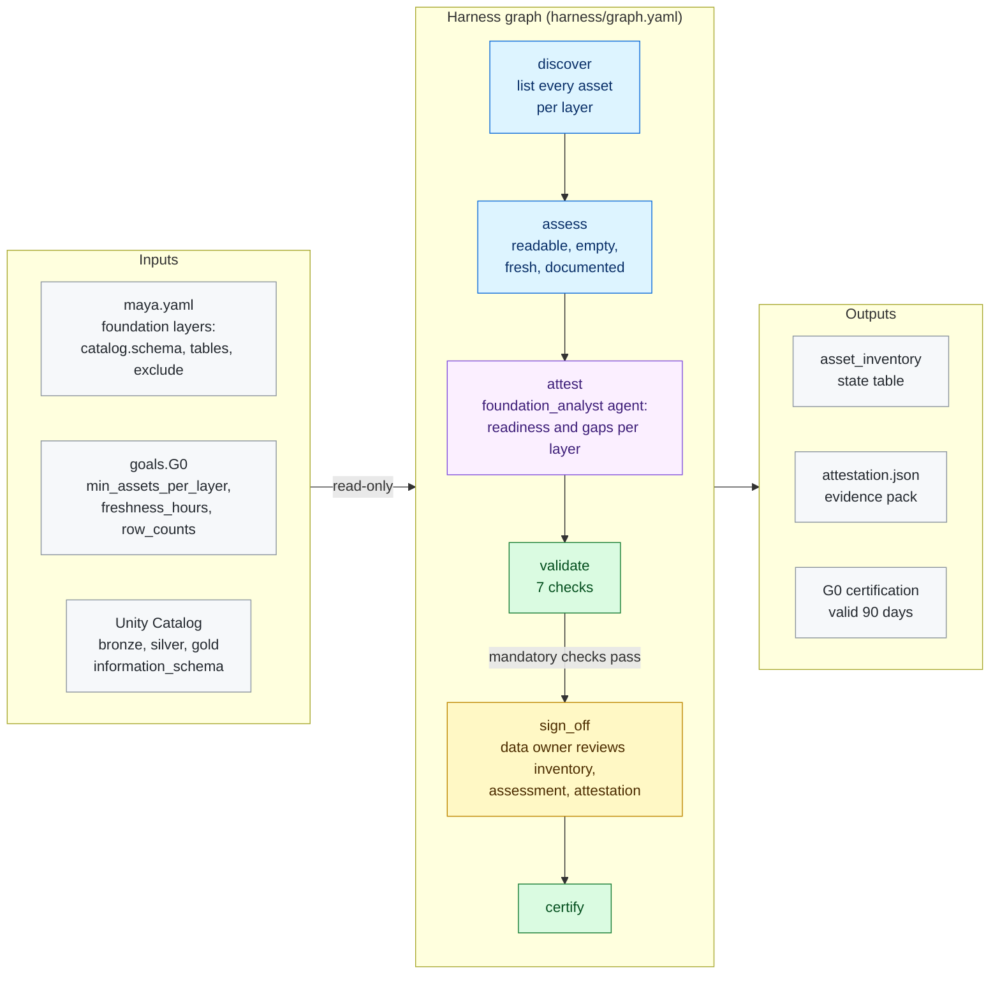

# G0 · Foundation intake

**Milestone:** AI Enabled &nbsp;·&nbsp; **Prerequisites:** none &nbsp;·&nbsp; **Certified by:** data owner
&nbsp;·&nbsp; **Certification valid:** 90 days

G0 is read-only. It confirms the existing foundation is in place and registers every asset the later goals work on. It writes nothing to the foundation; its only output in the workspace is MAYA's own state.

## Architecture

Node colours: blue = MAYA code, purple = Omnigent agent, yellow = approval gate, green = validator and certification, grey = inputs and outputs. See [the architecture overview](../../../docs/ARCHITECTURE.md) for how goals fit together.

## What the customer provides

- The list of foundation schemas per layer (Bronze, Silver, Gold) and any tables to leave out.
- Freshness expectations per layer (`freshness_hours`), if the data is expected to update on a schedule.
- A data owner who signs off the inventory and the analyst's attestation, or a decision to self-certify G0 (`self_certified:` in `maya.yaml`) when the foundation is already governed elsewhere.

## Checks

The goal is certified only when all 6 mandatory checks pass against the live workspace and the approvers have
signed off. Advisory checks are reported and never block.

| Check | Severity | Checklist | What it proves |
|-------|----------|-----------|----------------|
| `layers_populated` | mandatory | foundation.layers | Every declared layer contains at least min_assets_per_layer assets |
| `assets_readable` | mandatory | foundation.access | Every in-scope asset can be queried |
| `no_empty_tables` | mandatory | foundation.quality | No in-scope table or view is empty |
| `layer_freshness` | mandatory | foundation.freshness | Each layer with a freshness_hours limit was updated within it |
| `inventory_recorded` | mandatory | foundation.inventory | The asset inventory state table matches what was discovered in this run |
| `attestation_complete` | mandatory | foundation.attestation | The analyst attested every layer and every gap is tied to a discovered asset |
| `undocumented_assets` | advisory | foundation.metadata | Assets without a description (input to G1 |

## Package contents

| File | Role |
|------|------|
| `code/gate_checks.py` | Extra checks on gate items and approver edits |
| `code/intake.py` | Code nodes: generic, read-only discovery and assessment of the foundation declared in maya.yaml |
| `goal.yaml` | The goal's standard: prerequisites, outputs, checks, certification |
| `harness/agents/foundation_analyst.md` | Agent instructions |
| `harness/agents/foundation_analyst.yaml` | Omnigent agent definition |
| `harness/graph.yaml` | The harness graph shown above |
| `harness/schemas/attestation.schema.json` | Schema an agent's result must match |
| `harness/schemas/gates/assessment.schema.json` | Schema of an item an approver reviews at a gate |
| `harness/schemas/gates/attestation.schema.json` | Schema of an item an approver reviews at a gate |
| `harness/schemas/gates/inventory.schema.json` | Schema of an item an approver reviews at a gate |
| `inputs.schema.json` | JSON Schema for this goal's block under `goals:` in `maya.yaml` |
| `validator/checks.py` | One function per check |

## Learn more

- Run it on the example: [Tutorial, 8. G0 Foundation intake](../../../docs/TUTORIAL.md#8-g0-foundation-intake)
- Run it on your own foundation: [Tutorial, 7. Step 5 · G0 Foundation intake (or self-certify it)](../../../docs/TUTORIAL_YOUR_FOUNDATION.md#7-step-5--g0-foundation-intake-or-self-certify-it)
