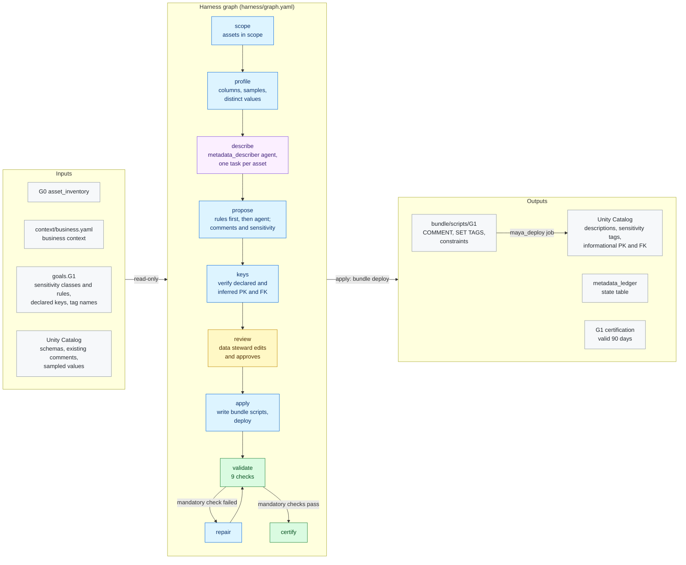

# G1 · Metadata

**Milestone:** AI Enabled &nbsp;·&nbsp; **Prerequisites:** G0 &nbsp;·&nbsp; **Certified by:** data steward, data owner
&nbsp;·&nbsp; **Certification valid:** 90 days

G1 describes every foundation asset at table, view and column level, classifies column sensitivity, and verifies primary and foreign keys. Deterministic rules run first; the describer agent covers the rest. Everything is reviewed, then delivered to Unity Catalog through the project bundle.

## Architecture

Node colours: blue = MAYA code, purple = Omnigent agent, yellow = approval gate, green = validator and certification, grey = inputs and outputs. See [the architecture overview](../../../docs/ARCHITECTURE.md) for how goals fit together.

## What the customer provides

- Business context for the describer: what the data product is for, its main entities and terms (`context/business.yaml`).
- The sensitivity classes the organisation uses and rules for known sensitive columns (for example, every `*email*` column is `pii`).
- Primary keys that must exist, and whether MAYA may sample data values to write better descriptions (`allow_data`).
- A data steward who reviews and edits the proposed descriptions and classifications before they are applied.

## Checks

The goal is certified only when all 8 mandatory checks pass against the live workspace and the approvers have
signed off. Advisory checks are reported and never block.

| Check | Severity | Checklist | What it proves |
|-------|----------|-----------|----------------|
| `table_descriptions` | mandatory | metadata.tables | Every in-scope table and view has a description in Unity Catalog |
| `column_descriptions` | mandatory | metadata.columns | Every column of every full-scope asset has a description |
| `description_quality` | mandatory | metadata.quality | Descriptions are specific (minimum length |
| `sensitivity_tagged` | mandatory | governance.classification | Every in-scope column carries a sensitivity tag with an allowed value |
| `sensitivity_rules` | mandatory | governance.classification | Columns matched by a sensitivity rule carry the class the rule requires |
| `declared_keys` | mandatory | metadata.keys | Every primary key declared in maya.yaml exists as a constraint |
| `keys_hold` | mandatory | metadata.keys | Every primary key is unique and not null |
| `proposals_applied` | mandatory | metadata.lineage | Unity Catalog matches the approved proposals |
| `key_coverage` | advisory | metadata.keys | Full-scope tables without a verified primary key (informational) |

## Package contents

| File | Role |
|------|------|
| `code/apply.py` | Apply: approved proposals become bundle scripts (one per asset and step), deployed through the project bundle |
| `code/common.py` | Shared helpers for G1 nodes and checks |
| `code/gate_checks.py` | Extra checks on gate items and approver edits |
| `code/keys.py` | Keys: declared (maya.yaml) and describer-proposed primary / foreign keys, verified against the data |
| `code/ledger.py` | Ledger state table: what each run delivered, used for drift |
| `code/profile.py` | Scope + profiling: what to describe (from G0's certified inventory) and statistics for each asset |
| `code/proposals.py` | Describer input, and turning describer results into reviewed proposals (rules win over the agent) |
| `goal.yaml` | The goal's standard: prerequisites, outputs, checks, certification |
| `harness/agents/metadata_describer.md` | Agent instructions |
| `harness/agents/metadata_describer.yaml` | Omnigent agent definition |
| `harness/graph.yaml` | The harness graph shown above |
| `harness/schemas/description.schema.json` | Schema an agent's result must match |
| `harness/schemas/gates/review.schema.json` | Schema of an item an approver reviews at a gate |
| `inputs.schema.json` | JSON Schema for this goal's block under `goals:` in `maya.yaml` |
| `validator/checks.py` | One function per check |

## Learn more

- Run it on the example: [Tutorial, 9. G1 Metadata](../../../docs/TUTORIAL.md#9-g1-metadata)
- Run it on your own foundation: [Tutorial, 8. Step 6 · G1 Metadata on your tables](../../../docs/TUTORIAL_YOUR_FOUNDATION.md#8-step-6--g1-metadata-on-your-tables)
