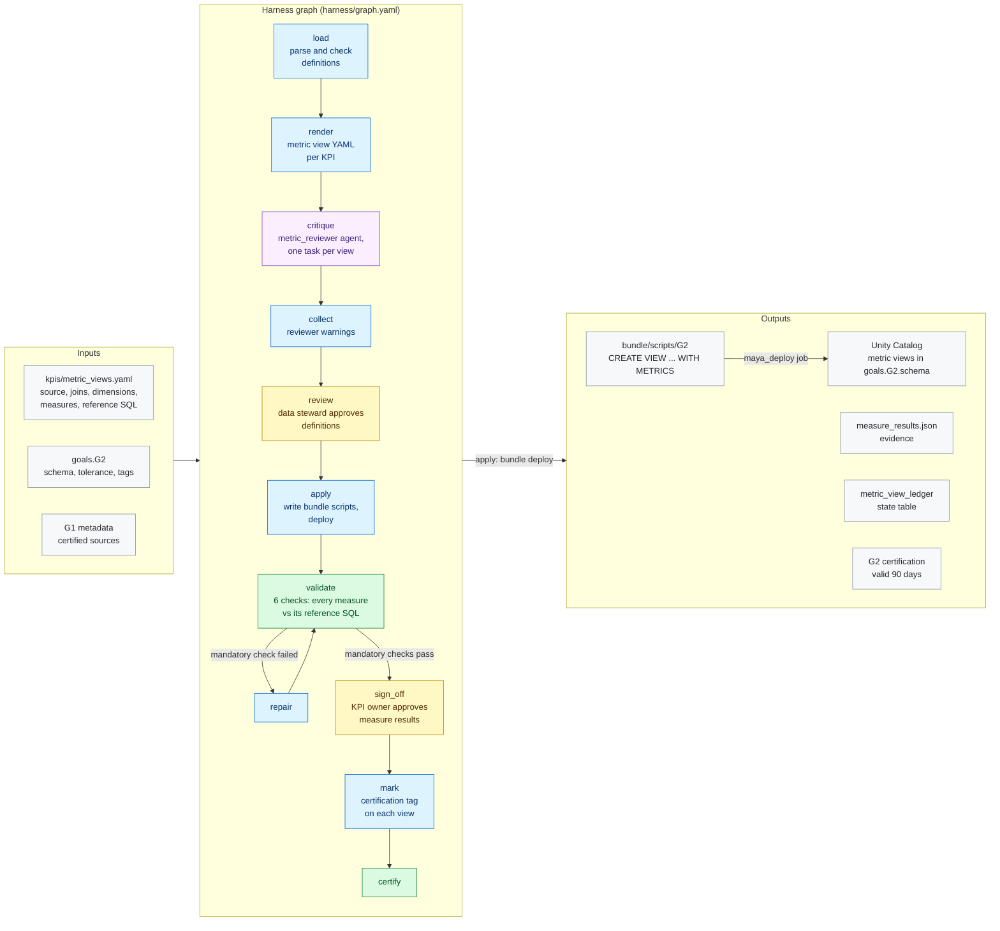

# G2 · Metric views

**Milestone:** AI Enabled &nbsp;·&nbsp; **Prerequisites:** G1 &nbsp;·&nbsp; **Certified by:** kpi owner, data steward
&nbsp;·&nbsp; **Certification valid:** 90 days

G2 defines every KPI once, as a Unity Catalog metric view. The customer supplies each view's definition and, for every measure, an independent reference SQL. MAYA renders and creates the views, keeps their tags and grants across re-creation, and proves every measure equals its reference before the KPI owner signs off.

## Architecture

Node colours: blue = MAYA code, purple = Omnigent agent, yellow = approval gate, green = validator and certification, grey = inputs and outputs. See [the architecture overview](../../../docs/ARCHITECTURE.md) for how goals fit together.

## What the customer provides

- The list of KPIs, each with its business definition, owner, and the Gold (or Silver) table it is built on.
- For every measure: how it is calculated, its display name, description, synonyms and format.
- For every measure: an independent reference SQL, written by someone who knows the numbers, that MAYA compares the metric view against.
- A KPI owner who signs off the measure results.

## Checks

The goal is certified only when all 5 mandatory checks pass against the live workspace and the approvers have
signed off. Advisory checks are reported and never block.

| Check | Severity | Checklist | What it proves |
|-------|----------|-----------|----------------|
| `metric_views_exist` | mandatory | AE-6.1 | Every KPI in the definitions exists as a Unity Catalog metric view |
| `definitions_applied` | mandatory | AE-6.1 | The definition read back from Unity Catalog is exactly the approved one |
| `business_friendly` | mandatory | AE-6.2 | Every measure and dimension has a display name |
| `measures_match_reference` | mandatory | AE-6.3 | Every measure equals its independent reference SQL within tolerance (overall and by the given dimensions) |
| `views_described` | mandatory | AE-5.1 | Every metric view has a specific description |
| `reviewer_warnings` | advisory | AE-6.2 | Warnings raised by the reviewer agent on views created or changed in this run (informational) |

## Package contents

| File | Role |
|------|------|
| `code/apply.py` | Apply: metric views become bundle scripts, deployed through the project bundle |
| `code/common.py` | Shared helpers for G2 nodes and checks |
| `code/compare.py` | Measure versus reference SQL: queries the metric view with MEASURE() and the reference SQL independently, then compares them |
| `code/definitions.py` | Load, render and review: checks the customer's definitions and renders each metric view |
| `code/gate_checks.py` | Extra checks on gate items and approver edits |
| `code/ledger.py` | Ledger state table: what each run delivered, used for drift |
| `goal.yaml` | The goal's standard: prerequisites, outputs, checks, certification |
| `harness/agents/metric_reviewer.md` | Agent instructions |
| `harness/agents/metric_reviewer.yaml` | Omnigent agent definition |
| `harness/graph.yaml` | The harness graph shown above |
| `harness/schemas/gates/measure_results.schema.json` | Schema of an item an approver reviews at a gate |
| `harness/schemas/gates/review.schema.json` | Schema of an item an approver reviews at a gate |
| `harness/schemas/review.schema.json` | Schema an agent's result must match |
| `inputs.schema.json` | JSON Schema for this goal's block under `goals:` in `maya.yaml` |
| `validator/checks.py` | One function per check |

## Learn more

- Run it on the example: [Tutorial, 10. G2 Metric views](../../../docs/TUTORIAL.md#10-g2-metric-views)
- Run it on your own foundation: [Tutorial, 9. Step 7 · G2 Your KPIs as metric views](../../../docs/TUTORIAL_YOUR_FOUNDATION.md#9-step-7--g2-your-kpis-as-metric-views)
