# G3 · Semantic model

**Milestone:** AI Enabled &nbsp;·&nbsp; **Prerequisites:** G1, G2 &nbsp;·&nbsp; **Certified by:** business owner
&nbsp;·&nbsp; **Certification valid:** 90 days

G3 builds the business taxonomy over the data product: domain, then subdomain, then page. The customer declares domains and subdomains; pages can be declared fully, partly, or left to MAYA. Agents design the missing pages and place every Silver, Gold and metric-view asset on exactly one page.

## Architecture

```mermaid
flowchart LR
    subgraph IN["Inputs"]
        direction LR
        tx["semantic/taxonomy.yaml<br/>domains, subdomains,<br/>pages: declared or auto"]
        gi["goals.G3<br/>schema, layers,<br/>tag keys, min_confidence"]
        pre["G1 metadata and<br/>G2 metric views"]
    end
    subgraph H["Harness graph (harness/graph.yaml)"]
        direction TB
        load["load<br/>parse taxonomy"] --> plan["plan<br/>what is declared,<br/>what MAYA designs"]
        plan --> design["design<br/>page_designer agent,<br/>one task per subdomain"]
        design --> resolve["resolve<br/>final pages,<br/>assets to place"]
        resolve --> assign["assign<br/>asset_assigner agent,<br/>one task per batch"]
        assign --> assemble["assemble<br/>semantic model,<br/>glossary"]
        assemble --> review["review<br/>business owner edits<br/>and approves"]
        review --> apply["apply<br/>write bundle scripts,<br/>deploy"]
        apply --> validate["validate<br/>8 checks"]
        validate -->|"mandatory check failed"| repair["repair"] --> validate
        validate -->|"mandatory checks pass"| mark["mark<br/>record ledger"]
        mark --> certify["certify"]
    end
    subgraph OUT["Outputs"]
        direction LR
        bun["bundle/scripts/G3<br/>tag policies, registry,<br/>tags, lookup function"]
        gt["Governed tags<br/>domain, subdomain, page<br/>on every asset"]
        regy["Ontology registry<br/>ontology_nodes, page_objects,<br/>business_glossary"]
        fn["ontology_lookup()<br/>table function"]
        led["semantic_ledger<br/>state table"]
        cert["G3 certification<br/>valid 90 days"]
    end
    IN --> H
    H -->|"apply: bundle deploy"| OUT
    bun -->|"maya_deploy job"| gt
    bun --> regy
    bun --> fn

    classDef c fill:#ddf4ff,stroke:#0969da,color:#0a3069
    classDef a fill:#fbefff,stroke:#8250df,color:#3e1f79
    classDef g fill:#fff8c5,stroke:#bf8700,color:#4d2d00
    classDef v fill:#dafbe1,stroke:#1a7f37,color:#044f1e
    classDef io fill:#f6f8fa,stroke:#8c959f,color:#24292f
    class load,plan,resolve,assemble,apply,repair,mark c
    class design,assign a
    class review g
    class validate,certify v
    class tx,gi,pre,bun,gt,regy,fn,led,cert io
```

Node colours: blue = MAYA code, purple = Omnigent agent, yellow = approval gate, green = validator and certification, grey = inputs and outputs. See [the architecture overview](../../../docs/ARCHITECTURE.md) for how goals fit together.

## What the customer provides

- The domains and subdomains of the business, each with a description and an owner.
- The business names of the pages users expect, as far as they are known (MAYA designs the rest).
- Business terms for the glossary, if they are not already the metric views' measures.
- A business owner who reviews where every asset lands before the taxonomy is applied.

## Checks

The goal is certified only when all 6 mandatory checks pass against the live workspace and the approvers have
signed off. Advisory checks are reported and never block.

| Check | Severity | Checklist | What it proves |
|-------|----------|-----------|----------------|
| `taxonomy_registered` | mandatory | AE-7.1 | The ontology registry in Unity Catalog holds exactly the approved domains |
| `governed_tags` | mandatory | AE-7.2 | The domain |
| `every_asset_tagged` | mandatory | AE-7.2 | Every Silver |
| `one_page_per_asset` | mandatory | AE-7.2 | The registry places every asset on exactly one page |
| `glossary_loaded` | mandatory | AE-7.3 | The business glossary holds every term |
| `lookup_works` | mandatory | AE-7.4 | ontology_lookup() answers every glossary term and every page with the page and objects it lives on |
| `pages_populated` | advisory | AE-7.1 | Pages declared without any asset (informational) |
| `confident_assignments` | advisory | AE-7.2 | Asset placements made by an agent below the confidence threshold (informational) |

## Package contents

| File | Role |
|------|------|
| `code/apply.py` | Apply: the approved semantic model becomes bundle scripts, deployed through the project bundle |
| `code/common.py` | Shared helpers for G3 nodes and checks: where the registry lives, the tag keys, the assets in scope |
| `code/gate_checks.py` | Extra checks on gate items and approver edits |
| `code/ledger.py` | Ledger state table: what each run delivered, used for drift |
| `code/taxonomy.py` | Load, plan, resolve and assemble the taxonomy: declared domains and subdomains, declared or designed pages |
| `goal.yaml` | The goal's standard: prerequisites, outputs, checks, certification |
| `harness/agents/asset_assigner.md` | Agent instructions |
| `harness/agents/asset_assigner.yaml` | Omnigent agent definition |
| `harness/agents/page_designer.md` | Agent instructions |
| `harness/agents/page_designer.yaml` | Omnigent agent definition |
| `harness/graph.yaml` | The harness graph shown above |
| `harness/schemas/assignment.schema.json` | Schema an agent's result must match |
| `harness/schemas/design.schema.json` | Schema an agent's result must match |
| `harness/schemas/gates/semantic_model.schema.json` | Schema of an item an approver reviews at a gate |
| `inputs.schema.json` | JSON Schema for this goal's block under `goals:` in `maya.yaml` |
| `validator/checks.py` | One function per check |

## Learn more

- Run it on the example: [Tutorial, 11. G3 Semantic model](../../../docs/TUTORIAL.md#11-g3-semantic-model)
- Run it on your own foundation: [Tutorial, 10. Step 8 · G3 Your business taxonomy](../../../docs/TUTORIAL_YOUR_FOUNDATION.md#10-step-8--g3-your-business-taxonomy)
