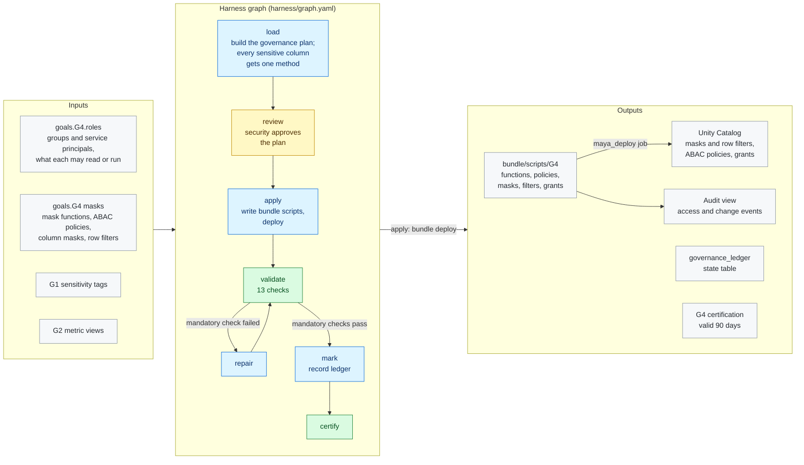

# G4 · Governance and access

**Milestone:** AI Enabled &nbsp;·&nbsp; **Prerequisites:** G1, G2 &nbsp;·&nbsp; **Certified by:** security
&nbsp;·&nbsp; **Certification valid:** 90 days

G4 delivers least-privilege access and protects sensitive data, all declared in YAML. Every column G1 tagged sensitive is masked by exactly one declared method. MAYA delivers the functions, policies, masks, row filters, grants and an audit view through the project bundle, and never revokes grants it did not make.

## Architecture

Node colours: blue = MAYA code, purple = Omnigent agent, yellow = approval gate, green = validator and certification, grey = inputs and outputs. See [the architecture overview](../../../docs/ARCHITECTURE.md) for how goals fit together.

## What the customer provides

- Which data is sensitive and how each class must appear to each audience (hidden, redacted, hashed, partial).
- The groups (account-level) or service principals for consumers, engineers and pipelines, created by the customer's identity team.
- Which rows each audience may see, where row filters apply.
- A security or privacy owner who approves the governance plan.

## Checks

The goal is certified only when all 9 mandatory checks pass against the live workspace and the approvers have
signed off. Advisory checks are reported and never block.

| Check | Severity | Checklist | What it proves |
|-------|----------|-----------|----------------|
| `sensitive_data_protected` | mandatory | AE-3.4 | Every column tagged sensitive is masked by exactly one declared policy or column mask |
| `functions_as_declared` | mandatory | AE-3.4 | Every mask and row filter function exists in Unity Catalog exactly as declared |
| `policies_as_declared` | mandatory | AE-3.4 | Every declared tag-based (ABAC) policy exists on its schema exactly as declared |
| `column_masks_as_declared` | mandatory | AE-3.4 | Every declared column mask is attached |
| `row_filters_as_declared` | mandatory | AE-3.4 | Every declared row filter is attached |
| `grants_as_declared` | mandatory | AE-8.2 | Every role holds exactly the privileges declared for it (groups and service principals only) |
| `catalog_access` | mandatory | AE-8.2 | Every role principal can use the catalogs it reads from |
| `unity_catalog_only` | mandatory | AE-8.1 | Every object of the data product is a Unity Catalog object |
| `audit_available` | mandatory | AE-8.4 | The audit view exists and returns the access and change events of the product schemas |
| `consumer_exposure` | advisory | AE-8.2 | Privileges that consumer principals hold on Bronze or Silver (left as is; informational) |
| `other_grants` | advisory | AE-8.2 | Grants in the product schemas not declared here |
| `writers_exempt` | advisory | AE-3.4 | Identities that wrote tables from masked sources recently but are not exempt from the masks (they would copy masked values) |
| `jobs_run_as_service_principals` | advisory | AE-8.3 | Jobs that run as a person or carry a personal token (advisory in dev; CI/CD sets service principals) |

## Package contents

| File | Role |
|------|------|
| `code/apply.py` | Apply: the approved plan becomes bundle scripts, deployed through the project bundle |
| `code/common.py` | Shared helpers for G4: principals, scopes (layers and product schemas), and live reads of Unity Catalog |
| `code/gate_checks.py` | Extra checks on gate items and approver edits |
| `code/ledger.py` | Ledger state table: what each run delivered, used for drift |
| `code/plan.py` | Load: turns the YAML into one explicit plan of functions, ABAC policies, column masks, row filters and grants |
| `goal.yaml` | The goal's standard: prerequisites, outputs, checks, certification |
| `harness/graph.yaml` | The harness graph shown above |
| `harness/schemas/gates/governance_plan.schema.json` | Schema of an item an approver reviews at a gate |
| `inputs.schema.json` | JSON Schema for this goal's block under `goals:` in `maya.yaml` |
| `validator/checks.py` | One function per check |

## Learn more

- Run it on the example: [Tutorial, 12. G4 Governance and access](../../../docs/TUTORIAL.md#12-g4-governance-and-access)
- Run it on your own foundation: [Tutorial, 11. Step 9 · G4 Your access model](../../../docs/TUTORIAL_YOUR_FOUNDATION.md#11-step-9--g4-your-access-model)
