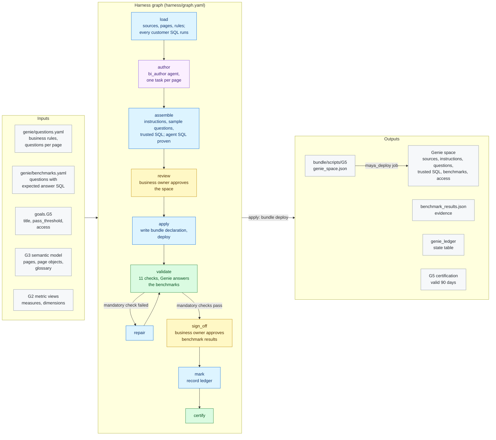

# G5 · Genie space

**Milestone:** AI Ready &nbsp;·&nbsp; **Prerequisites:** G2, G3 &nbsp;·&nbsp; **Certified by:** business owner
&nbsp;·&nbsp; **Certification valid:** 90 days

G5 delivers a Genie space over the metric views and Gold that answers business questions correctly. The customer supplies business rules, the questions users ask per page and benchmarks with expected answers. MAYA builds the space from the certified semantic model, the bi_author agent fills each page up to the minimum number of questions, and Genie's answers must pass the benchmark threshold before the business owner signs off.

## Architecture

Node colours: blue = MAYA code, purple = Omnigent agent, yellow = approval gate, green = validator and certification, grey = inputs and outputs. See [the architecture overview](../../../docs/ARCHITECTURE.md) for how goals fit together.

## What the customer provides

- The business rules Genie must follow (what revenue means, which defaults apply, how names are shown).
- The questions users ask, ideally at least five per semantic page, in their own words; trusted SQL for the most important ones.
- Ten or more benchmark questions with the SQL that gives the right answer, and the pass threshold.
- Which groups may use the space (their data access comes from G4), and a business owner who approves the space and the benchmark results.

## Checks

The goal is certified only when all 9 mandatory checks pass against the live workspace and the approvers have
signed off. Advisory checks are reported and never block.

| Check | Severity | Checklist | What it proves |
|-------|----------|-----------|----------------|
| `space_exists` | mandatory | AR-1.1 | The Genie space exists and is the one MAYA manages for this project |
| `space_as_approved` | mandatory | AR-1.2 | Sources |
| `curated_sources_only` | mandatory | AR-1.1 | Every data source is a metric view or a Gold asset; none is Bronze (Silver only where allowed) |
| `instructions_complete` | mandatory | AR-1.2 | The instructions state every business rule |
| `questions_per_page` | mandatory | AR-1.2 | Every page of the semantic model has at least the minimum number of sample questions |
| `benchmarks_defined` | mandatory | AR-1.3 | At least the minimum number of benchmark questions |
| `benchmarks_pass` | mandatory | AR-1.3 | Genie answers at least the pass threshold of the benchmark questions correctly |
| `trusted_sql_runs` | mandatory | AR-1.4 | Every trusted SQL in the space runs on the warehouse and reads only the space's sources |
| `access_granted` | mandatory | AR-1.1 | Every declared group or service principal holds its permission on the space |
| `critical_questions_trusted` | advisory | AR-1.4 | Questions marked critical without trusted SQL (informational) |
| `benchmark_review` | advisory | AR-1.3 | Benchmark answers Genie's evaluation could not grade automatically (informational) |

## Package contents

| File | Role |
|------|------|
| `code/apply.py` | Apply: the approved space becomes one bundle declaration, deployed through the project bundle |
| `code/common.py` | Shared helpers: the certified semantic model, the space's sources, SQL checks, the space definition and its comparison with the live space |
| `code/gate_checks.py` | Extra checks on gate items and approver edits |
| `code/ledger.py` | Ledger state table: what each run delivered, used for drift |
| `code/space.py` | Load, author and assemble: checks the customer's files, prepares each page for the bi_author agent and builds the space |
| `goal.yaml` | The goal's standard: prerequisites, outputs, checks, certification |
| `harness/agents/bi_author.md` | Agent instructions |
| `harness/agents/bi_author.yaml` | Omnigent agent definition |
| `harness/graph.yaml` | The harness graph shown above |
| `harness/schemas/authoring.schema.json` | Schema an agent's result must match |
| `harness/schemas/gates/benchmark_results.schema.json` | Schema of an item an approver reviews at a gate |
| `harness/schemas/gates/space.schema.json` | Schema of an item an approver reviews at a gate |
| `inputs.schema.json` | JSON Schema for this goal's block under `goals:` in `maya.yaml` |
| `validator/checks.py` | One function per check |

## Learn more

- Run it on the example: [Tutorial, 18.1 G5 Genie space](../../../docs/TUTORIAL.md#181-g5-genie-space)
- Run it on your own foundation: [Tutorial, 17. Next: G5 Genie space on your data product](../../../docs/TUTORIAL_YOUR_FOUNDATION.md#17-next-g5-genie-space-on-your-data-product)
