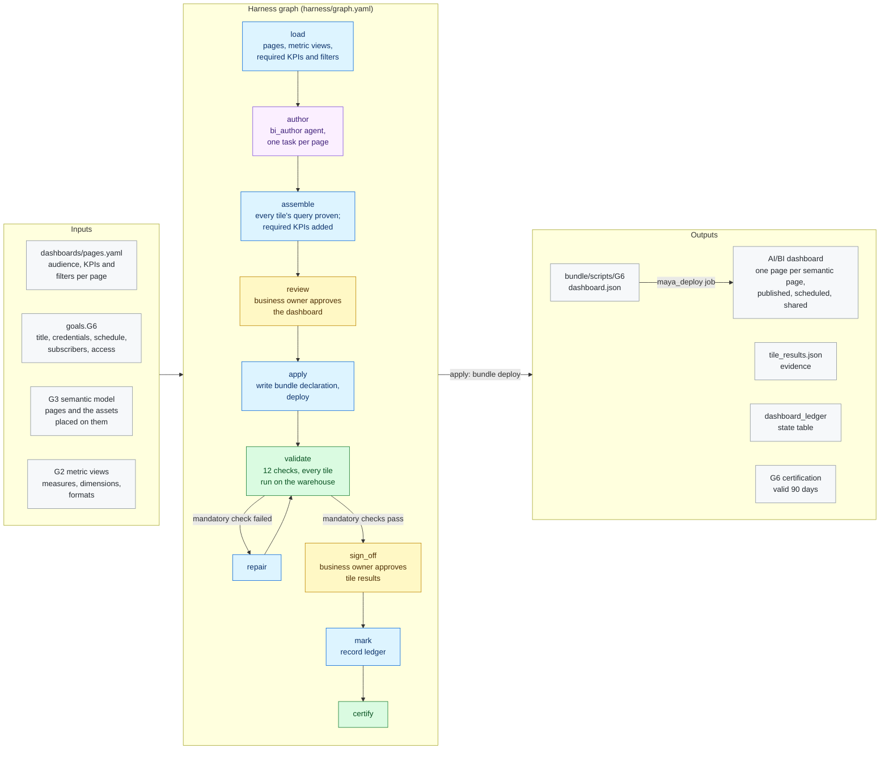

# G6 · AI/BI dashboards

**Milestone:** AI Ready &nbsp;·&nbsp; **Prerequisites:** G2, G3 &nbsp;·&nbsp; **Certified by:** business owner
&nbsp;·&nbsp; **Certification valid:** 90 days

G6 delivers one AI/BI dashboard over the certified metric views, with one page per page of the semantic model, named the same way. The customer says which KPIs and filters each page must show and for which audience, and how the dashboard is distributed. The bi_author agent drafts each page's tiles; MAYA builds the dashboard as code, proves every tile's query runs, publishes and schedules it.

## Architecture

Node colours: blue = MAYA code, purple = Omnigent agent, yellow = approval gate, green = validator and certification, grey = inputs and outputs. See [the architecture overview](../../../docs/ARCHITECTURE.md) for how goals fit together.

## What the customer provides

- For each page that matters: who uses it, which KPIs it must show and which filters it needs (pages not listed are drafted from the metric views alone).
- How the dashboard is distributed: embedded or viewer credentials, the refresh schedule and who receives the scheduled snapshot.
- Which groups may open the dashboard (their data access comes from G4), and a business owner who approves the dashboard and the tile results.

## Checks

The goal is certified only when all 10 mandatory checks pass against the live workspace and the approvers have
signed off. Advisory checks are reported and never block.

| Check | Severity | Checklist | What it proves |
|-------|----------|-----------|----------------|
| `dashboard_exists` | mandatory | AR-2.1 | The dashboard exists where MAYA delivered it |
| `dashboard_as_approved` | mandatory | AR-2.1 | Datasets |
| `metric_views_only` | mandatory | AR-2.1 | Every dataset of the dashboard is a metric view; none is a table or an SQL query |
| `tiles_use_measures` | mandatory | AR-2.1 | Every tile shows at least one metric view measure and groups only by the view's dimensions |
| `tiles_run` | mandatory | AR-2.1 | The query behind every tile runs on the warehouse |
| `pages_follow_semantic_pages` | mandatory | AR-2.2 | One dashboard page per page of the semantic model |
| `content_as_declared` | mandatory | AR-2.2 | Every KPI and filter the customer declared for a page is on that page |
| `published` | mandatory | AR-2.3 | The latest version is published |
| `schedule_as_declared` | mandatory | AR-2.3 | The refresh schedule and its subscribers are exactly as declared |
| `access_granted` | mandatory | AR-2.3 | Every declared group or service principal holds its permission on the dashboard |
| `distribution_set` | advisory | AR-2.3 | No refresh schedule or no subscribers declared (informational) |
| `tiles_with_data` | advisory | AR-2.1 | Tiles whose query returns no rows (informational) |

## Package contents

| File | Role |
|------|------|
| `code/apply.py` | Apply: the approved dashboard becomes one bundle declaration, deployed through the project bundle |
| `code/common.py` | Shared helpers: metric views and pages it builds on, tile checks, the dashboard in AI/BI format and its comparison with the live one |
| `code/gate_checks.py` | Extra checks on gate items and approver edits |
| `code/layout.py` | Load, author and assemble: resolves the required KPIs and filters, prepares each page for the bi_author agent and builds the dashboard |
| `code/ledger.py` | Ledger state table: what each run delivered, used for drift |
| `goal.yaml` | The goal's standard: prerequisites, outputs, checks, certification |
| `harness/agents/bi_author.md` | Agent instructions |
| `harness/agents/bi_author.yaml` | Omnigent agent definition |
| `harness/graph.yaml` | The harness graph shown above |
| `harness/schemas/gates/dashboard.schema.json` | Schema of an item an approver reviews at a gate |
| `harness/schemas/gates/tile_results.schema.json` | Schema of an item an approver reviews at a gate |
| `harness/schemas/page_layout.schema.json` | Schema an agent's result must match |
| `inputs.schema.json` | JSON Schema for this goal's block under `goals:` in `maya.yaml` |
| `validator/checks.py` | One function per check |

## Learn more

- Run it on the example: [Tutorial, 18.2 G6 AI/BI dashboards](../../../docs/TUTORIAL.md#182-g6-aibi-dashboards)
- Run it on your own foundation: [Tutorial, 18. Next: G6 AI/BI dashboards on your data product](../../../docs/TUTORIAL_YOUR_FOUNDATION.md#18-next-g6-aibi-dashboards-on-your-data-product)
