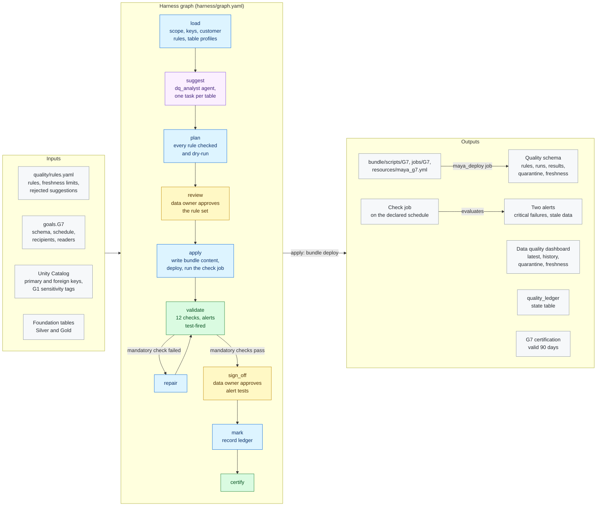

# G7 · Data quality monitoring

**Milestone:** AI Ready &nbsp;·&nbsp; **Prerequisites:** G1 &nbsp;·&nbsp; **Certified by:** data owner
&nbsp;·&nbsp; **Certification valid:** 90 days

G7 puts data quality rules on the foundation, checks them on a schedule, shows the results on a data quality dashboard and alerts on critical rule failures and stale data. Rules come from the customer's rules file, from the keys in Unity Catalog and from the dq_analyst agent, which suggests rules from each table's profile. MAYA dry-runs every rule, delivers the result tables, the check job, the alerts and the dashboard through the project bundle, runs the job and test-fires every alert.

## Architecture

Node colours: blue = MAYA code, purple = Omnigent agent, yellow = approval gate, green = validator and certification, grey = inputs and outputs. See [the architecture overview](../../../docs/ARCHITECTURE.md) for how goals fit together.

## What the customer provides

- The rules the data owner requires per table (not null, unique, accepted values, ranges, SQL conditions, references, row counts) and their severity; the keys in Unity Catalog and the agent's suggestions add more.
- Freshness limits per layer or table (default: G0's freshness_hours).
- When the check job runs, who the alerts and job failures notify, and which groups may read the results.
- A data owner who approves the rule set (turning down suggestions in the rules file's reject list) and the alert tests.

## Checks

The goal is certified only when all 9 mandatory checks pass against the live workspace and the approvers have
signed off. Advisory checks are reported and never block.

| Check | Severity | Checklist | What it proves |
|-------|----------|-----------|----------------|
| `dq_tables_ready` | mandatory | AR-2.4 | The rules |
| `rules_as_approved` | mandatory | AR-2.4 | The deployed rules are exactly the approved ones |
| `checks_ran` | mandatory | AR-2.4 | The latest check run |
| `quarantine_protected` | mandatory | AR-2.4 | Quarantined rows hold no column that G1 classified as sensitive |
| `dashboard_published` | mandatory | AR-2.4 | The data quality dashboard is exactly the approved one |
| `access_granted` | mandatory | AR-2.4 | Every declared reader can read the quality schema and holds its permission on the dashboard |
| `job_scheduled` | mandatory | AR-7.2 | The check job runs the delivered checks on the declared schedule and notifies the recipients on failure |
| `alerts_as_declared` | mandatory | AR-7.2 | The critical-failure and stale-data alerts exist with the declared query |
| `alerts_fire` | mandatory | AR-7.2 | Every alert triggers when its condition is met (test-fired with a test row |
| `rules_passing` | advisory | AR-2.4 | Rules failing in the latest check run (the data |
| `data_fresh` | advisory | AR-7.2 | Tables whose last data change is older than their freshness limit (informational) |
| `recipients_set` | advisory | AR-7.2 | No recipients declared for the alerts and job failures (informational) |

## Package contents

| File | Role |
|------|------|
| `code/apply.py` | Apply, repair, record and export: writes the bundle content, deploys it and runs the check job once |
| `code/common.py` | Shared helpers: the quality schema, the monitored tables and their profile, the SQL of each rule type |
| `code/deliver.py` | The approved plan as bundle content: quality schema, rule scripts, check job, alerts and dashboard (a pure function of the plan) |
| `code/gate_checks.py` | Extra checks on gate items and approver edits |
| `code/ledger.py` | Ledger state table: what each run delivered, used for drift |
| `code/live.py` | The delivered job, alerts and dashboard read back from the workspace; alert evaluation |
| `code/rules.py` | Load, suggest and plan: customer, key and suggested rules, each checked against its table and dry-run |
| `goal.yaml` | The goal's standard: prerequisites, outputs, checks, certification |
| `harness/agents/dq_analyst.md` | Agent instructions |
| `harness/agents/dq_analyst.yaml` | Omnigent agent definition |
| `harness/graph.yaml` | The harness graph shown above |
| `harness/schemas/gates/alert_tests.schema.json` | Schema of an item an approver reviews at a gate |
| `harness/schemas/gates/quality_plan.schema.json` | Schema of an item an approver reviews at a gate |
| `harness/schemas/suggestions.schema.json` | Schema an agent's result must match |
| `inputs.schema.json` | JSON Schema for this goal's block under `goals:` in `maya.yaml` |
| `validator/checks.py` | One function per check |

## Learn more

- Run it on the example: [Tutorial, 18.3 G7 Data quality monitoring](../../../docs/TUTORIAL.md#183-g7-data-quality-monitoring)
- Run it on your own foundation: [Tutorial, 19. Next: G7 data quality monitoring on your data product](../../../docs/TUTORIAL_YOUR_FOUNDATION.md#19-next-g7-data-quality-monitoring-on-your-data-product)
