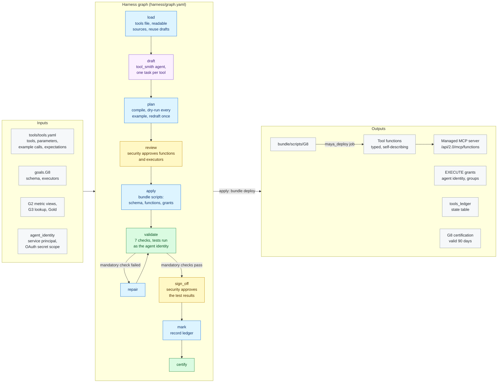

# G8 · Agent tools

**Milestone:** AI Ready &nbsp;·&nbsp; **Prerequisites:** G2, G3 &nbsp;·&nbsp; **Certified by:** security
&nbsp;·&nbsp; **Certification valid:** 90 days

G8 turns the business actions agents may call into Unity Catalog SQL table functions with typed parameters and a description on the function, every parameter and every result column. The product owner lists the tools with example calls and what they must return; the tool_smith agent drafts each function's SQL on the metric views and Gold and its descriptions. MAYA dry-runs every example, delivers the functions and the EXECUTE grants through the project bundle, runs every example as the agent identity and lists the tools through the workspace's managed MCP server.

## Architecture

Node colours: blue = MAYA code, purple = Omnigent agent, yellow = approval gate, green = validator and certification, grey = inputs and outputs. See [the architecture overview](../../../docs/ARCHITECTURE.md) for how goals fit together.

## What the customer provides

- The tools agents may call (CR-AR-3.1): per tool its intent, typed parameters and example calls with what they must return (row counts, columns, or rows that equal independent SQL); optionally the SQL itself.
- The agent identity: a service principal with an OAuth secret in a secret scope the deployer can read, and its data access as a G4 role.
- Who else may run the tools, and a security approver for the functions and grants (CR-AR-3.2).

## Checks

The goal is certified only when all 6 mandatory checks pass against the live workspace and the approvers have
signed off. Advisory checks are reported and never block.

| Check | Severity | Checklist | What it proves |
|-------|----------|-----------|----------------|
| `tools_deployed` | mandatory | AR-3.1 | Every tool is a SQL table function with exactly the approved parameters and result columns |
| `sql_as_approved` | mandatory | AR-3.1 | Each function runs exactly the approved SQL |
| `self_describing` | mandatory | AR-3.2 | The function |
| `tests_pass` | mandatory | AR-3.3 | Every example call returns what the product owner expects |
| `execute_granted` | mandatory | AR-3.3 | Every executor |
| `mcp_listed` | mandatory | AR-3.4 | The workspace's managed MCP server lists every tool with its description and typed inputs |
| `numbers_tested` | advisory | AR-3.3 | Tools whose tests check only the shape of the result |

## Package contents

| File | Role |
|------|------|
| `code/apply.py` | Apply, repair, record and export: the approved plan as bundle scripts (schema, functions, grants), deployed |
| `code/common.py` | Shared helpers: the tools file, readable schemas, the SQL of a tool function (DDL, typed calls) and how a test result is compared |
| `code/gate_checks.py` | Extra checks on gate items and approver edits |
| `code/ledger.py` | Ledger state table: what each run delivered, used for drift |
| `code/tools.py` | Load and plan: the tools, the sources they may read, the tool_smith drafts and the dry run of every example |
| `goal.yaml` | The goal's standard: prerequisites, outputs, checks, certification |
| `harness/agents/tool_smith.md` | Agent instructions |
| `harness/agents/tool_smith.yaml` | Omnigent agent definition |
| `harness/graph.yaml` | The harness graph shown above |
| `harness/schemas/gates/tool_plan.schema.json` | Schema of an item an approver reviews at a gate |
| `harness/schemas/gates/tool_tests.schema.json` | Schema of an item an approver reviews at a gate |
| `harness/schemas/tool_draft.schema.json` | Schema an agent's result must match |
| `inputs.schema.json` | JSON Schema for this goal's block under `goals:` in `maya.yaml` |
| `validator/checks.py` | One function per check |

## Learn more

- Run it on the example: [Tutorial, 18.4 G8 Agent tools](../../../docs/TUTORIAL.md#184-g8-agent-tools)
- Run it on your own foundation: [Tutorial, 20. Next: G8 agent tools on your data product](../../../docs/TUTORIAL_YOUR_FOUNDATION.md#20-next-g8-agent-tools-on-your-data-product)
