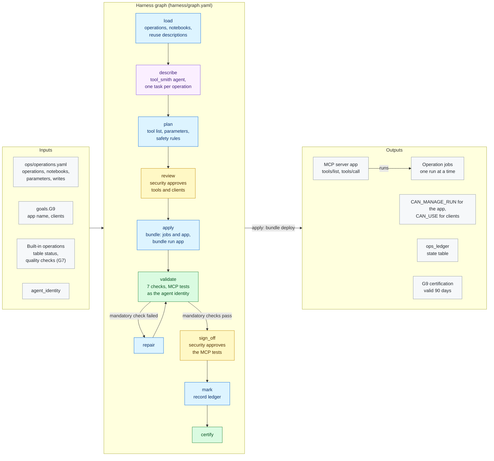

# G9 · Operations MCP server

**Milestone:** AI Ready &nbsp;·&nbsp; **Prerequisites:** G4, G7 &nbsp;·&nbsp; **Certified by:** security
&nbsp;·&nbsp; **Certification valid:** 90 days

G9 gives agents safe hands on the data product's operations: a custom MCP server, deployed as a Databricks App, whose tools start the product's operational jobs (load new files, show table status, run the quality checks) and report their runs. The platform team lists the operations with their notebooks and typed parameters; the tool_smith agent writes each tool's description. Every operation is its own job with one run at a time and a timeout; the app may only run those jobs, operations that write validate first unless asked to run, and only the declared clients may call it. MAYA tests every tool through the deployed server as the agent identity.

## Architecture

Node colours: blue = MAYA code, purple = Omnigent agent, yellow = approval gate, green = validator and certification, grey = inputs and outputs. See [the architecture overview](../../../docs/ARCHITECTURE.md) for how goals fit together.

## What the customer provides

- The operations agents may start (CR-AR-4.1): per operation its intent, notebook, typed parameters, whether it writes data, a timeout and fixed settings; the built-in table status and quality check operations are added unless turned off.
- The app name and the clients (groups or service principals) that may call the server; the agent identity is always one.
- A security approver for the tools, their safety rules and the test results (CR-AR-4.2).

## Checks

The goal is certified only when all 6 mandatory checks pass against the live workspace and the approvers have
signed off. Advisory checks are reported and never block.

| Check | Severity | Checklist | What it proves |
|-------|----------|-----------|----------------|
| `jobs_as_approved` | mandatory | AR-4.1 | Each operation is a job running its notebook with the approved typed parameters |
| `results_are_json` | mandatory | AR-4.1 | Every operation |
| `tools_listed` | mandatory | AR-4.2 | The server lists exactly the approved tools with their descriptions and typed inputs |
| `safe_by_design` | mandatory | AR-4.3 | Data-changing operations default to a dry run |
| `least_privilege` | mandatory | AR-4.4 | OAuth only; the app's service principal holds CAN_MANAGE_RUN on its operation jobs and nothing else; the declared clients may use it |
| `server_running` | mandatory | AR-4.2 | The MCP server app runs the delivered source |
| `recent_failures` | advisory | AR-7.2 | Operation runs that failed in the last 7 days (informational) |

## Package contents

| File | Role |
|------|------|
| `code/apply.py` | Apply: the approved plan becomes bundle content (see deliver.py); the bundle deploys the jobs and the app, then |
| `code/common.py` | Shared helpers for G9: the operations (the customer's and MAYA's built-in ones), the job and app keys, and an MCP |
| `code/deliver.py` | Delivery: pure functions of the approved plan. The bundle gets one job per operation (the operation's notebook, |
| `code/gate_checks.py` | Extra checks on gate items and approver edits |
| `code/ledger.py` | Ledger state table: what each run delivered, used for drift |
| `code/operations.py` | Load and plan: the operations agents may run (the customer's and MAYA's built-in ones), the tool_smith agent's |
| `goal.yaml` | The goal's standard: prerequisites, outputs, checks, certification |
| `harness/agents/tool_smith.md` | Agent instructions |
| `harness/agents/tool_smith.yaml` | Omnigent agent definition |
| `harness/graph.yaml` | The harness graph shown above |
| `harness/schemas/gates/mcp_tests.schema.json` | Schema of an item an approver reviews at a gate |
| `harness/schemas/gates/ops_plan.schema.json` | Schema of an item an approver reviews at a gate |
| `harness/schemas/tool_description.schema.json` | Schema an agent's result must match |
| `inputs.schema.json` | JSON Schema for this goal's block under `goals:` in `maya.yaml` |
| `templates/app/app.py` | MAYA operations MCP server (a Databricks App, delivered by G9) |
| `templates/app/requirements.txt` | Python packages of the MCP server app |
| `templates/ops/quality_checks.py` | Built-in operation notebook: runs the G7 quality checks and returns the failing rules and stale tables |
| `templates/ops/table_status.py` | Built-in operation notebook: row counts, last change and freshness of the product's tables |
| `validator/checks.py` | One function per check |

## Learn more

- Run it on the example: [Tutorial, 18.5 G9 Operations MCP server](../../../docs/TUTORIAL.md#185-g9-operations-mcp-server)
- Run it on your own foundation: [Tutorial, 21. Next: G9 operations MCP server on your data product](../../../docs/TUTORIAL_YOUR_FOUNDATION.md#21-next-g9-operations-mcp-server-on-your-data-product)
