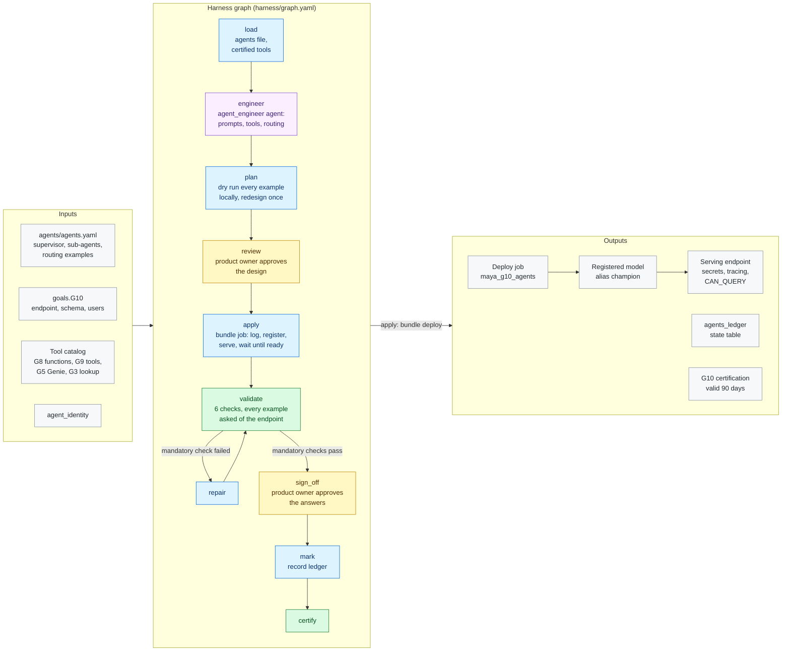

# G10 · Agents

**Milestone:** AI Ready &nbsp;·&nbsp; **Prerequisites:** G5, G8, G9 &nbsp;·&nbsp; **Certified by:** product owner
&nbsp;·&nbsp; **Certification valid:** 90 days

G10 builds the data product's agents: a supervisor that routes each question to sub-agents with small tool sets (the G8 tool functions, the G5 Genie space, the G9 operations tools and the G3 ontology lookup). The product owner names the agents, their purposes and routing examples; the agent_engineer agent writes the prompts, tool sets and routing, and MAYA adds the rules every prompt carries. MAYA runs every routing example locally before anything is deployed; the bundle then delivers the code and a job that registers the agents in Unity Catalog and serves them on Model Serving with every resource declared and tracing on. MAYA asks the served agents every example and certifies once the product owner signs off.

## Architecture

Node colours: blue = MAYA code, purple = Omnigent agent, yellow = approval gate, green = validator and certification, grey = inputs and outputs. See [the architecture overview](../../../docs/ARCHITECTURE.md) for how goals fit together.

## What the customer provides

- The agents (CR-AR-5.1): a supervisor and at least two sub-agents, each with a purpose and optionally the tools it must have, and routing examples: questions with the sub-agent(s) each must reach.
- The serving endpoint name, the schema of the registered model, the language model endpoint and who may query it.
- The agent identity (shared with G8 and G9), whose OAuth secret the endpoint reads from the secret scope.
- A product owner who approves the design and the served agents' answers.

## Checks

The goal is certified only when all 4 mandatory checks pass against the live workspace and the approvers have
signed off. Advisory checks are reported and never block.

| Check | Severity | Checklist | What it proves |
|-------|----------|-----------|----------------|
| `routed_as_designed` | mandatory | AR-5.1 | A supervisor routes to at least two sub-agents with small tool sets |
| `registered_and_served` | mandatory | AR-5.2 | Registered in Unity Catalog (alias champion) and served at that version with the agent identity's credentials from a secret scope and every tool declared as a resource |
| `grounded_and_traced` | mandatory | AR-5.3 | Every prompt forbids inventing numbers |
| `access_granted` | mandatory | AR-5.2 | Every declared user may query the endpoint |
| `numbers_in_tool_results` | advisory | AR-5.3 | Numbers in served answers that appear in no tool result of that answer (informational) |
| `semantic_routing` | advisory | AR-5.4 | The supervisor can look business terms up in the semantic model before routing |

## Package contents

| File | Role |
|------|------|
| `code/apply.py` | Apply: the approved plan becomes bundle content (see deliver.py); the bundle deploys the model's schema and the |
| `code/common.py` | Shared helpers for G10: the agents file, the tool catalog the agents may use (G8 functions, G3 lookup, G5 Genie, G9 |
| `code/deliver.py` | Delivery: pure functions of the approved plan. The bundle gets the schema of the registered model (a deploy |
| `code/design.py` | Load and plan: the product owner's agents, the tool catalog, the agent_engineer's prompts, tool sets and |
| `code/gate_checks.py` | Extra checks on gate items and approver edits |
| `code/ledger.py` | Ledger state table: what each run delivered, used for drift |
| `goal.yaml` | The goal's standard: prerequisites, outputs, checks, certification |
| `harness/agents/agent_engineer.md` | Agent instructions |
| `harness/agents/agent_engineer.yaml` | Omnigent agent definition |
| `harness/graph.yaml` | The harness graph shown above |
| `harness/schemas/design.schema.json` | Schema an agent's result must match |
| `harness/schemas/gates/agent_tests.schema.json` | Schema of an item an approver reviews at a gate |
| `harness/schemas/gates/agents_plan.schema.json` | Schema of an item an approver reviews at a gate |
| `inputs.schema.json` | JSON Schema for this goal's block under `goals:` in `maya.yaml` |
| `templates/agent/agent.py` | MAYA agents runtime (delivered by G10): a supervisor that routes each question to sub-agents with small tool sets |
| `templates/agent/deploy_agent.py` | MAYA G10 deploy task (run by the bundle job maya_g10_agents): package the agents, register them in Unity Catalog and |
| `validator/checks.py` | One function per check |

## Learn more

- Run it on the example: [Tutorial, 18.6 G10 Agents](../../../docs/TUTORIAL.md#186-g10-agents)
- Run it on your own foundation: [Tutorial, 22. Next: G10 agents on your data product](../../../docs/TUTORIAL_YOUR_FOUNDATION.md#22-next-g10-agents-on-your-data-product)
