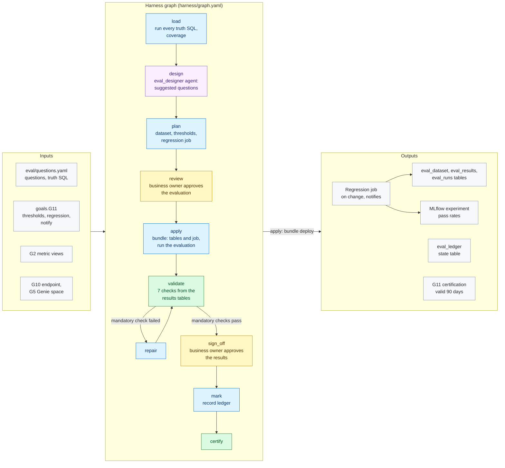

# G11 · Evaluation

**Milestone:** AI Ready &nbsp;·&nbsp; **Prerequisites:** G10 &nbsp;·&nbsp; **Certified by:** business owner
&nbsp;·&nbsp; **Certification valid:** 90 days

G11 proves the AI answers are right, and keeps proving it. The business owner writes the evaluation dataset: business questions, each with SQL on the governed metric views that gives the right answer. MAYA runs every truth SQL, shows the measures no question covers and more questions proposed by the eval_designer agent. The bundle delivers the dataset and results tables and a regression job that asks the served agents and the Genie space every question, has a language model judge each answer against the truth rows, records the results in Unity Catalog and MLflow, runs again whenever a source table changes and fails with a notification when a pass rate drops below its threshold. MAYA runs it once and certifies on its results.

## Architecture

Node colours: blue = MAYA code, purple = Omnigent agent, yellow = approval gate, green = validator and certification, grey = inputs and outputs. See [the architecture overview](../../../docs/ARCHITECTURE.md) for how goals fit together.

## What the customer provides

- The evaluation dataset (CR-AR-6.1): at least 20 business questions, each naming its period, with the SQL on the metric views that gives the right answer (at most 50 rows).
- The pass thresholds for the agents and the Genie space (CR-AR-6.2), and who is notified when the regression job fails (CR-AR-6.3).
- A business owner who approves the dataset and the results.

## Checks

The goal is certified only when all 5 mandatory checks pass against the live workspace and the approvers have
signed off. Advisory checks are reported and never block.

| Check | Severity | Checklist | What it proves |
|-------|----------|-----------|----------------|
| `dataset_ready` | mandatory | AR-6.1 | Enough business questions |
| `agents_accurate` | mandatory | AR-6.2 | The served agents answer at least the pass threshold of the questions correctly |
| `genie_accurate` | mandatory | AR-6.2 | The Genie space answers at least its pass threshold of the questions correctly |
| `evaluated_current` | mandatory | AR-6.2 | The recorded run evaluated the approved dataset against the agents certified now |
| `regression_armed` | mandatory | AR-6.3 | The regression job reruns the evaluation on change (or on a schedule) and notifies the owners when it fails |
| `tracked_in_mlflow` | advisory | AR-6.2 | The evaluation run is in MLflow with its pass rates |
| `measures_covered` | advisory | AR-6.1 | Measures of the metric views that no question asks about (informational) |

## Package contents

| File | Role |
|------|------|
| `code/apply.py` | Apply: the approved plan becomes bundle content (see deliver.py); the bundle deploys the tables and the |
| `code/common.py` | Shared helpers for G11: the evaluation dataset (questions with truth SQL on the governed metric views), what the |
| `code/dataset.py` | Load and plan: the business owner's evaluation questions, each truth SQL run on the governed metric views, the |
| `code/deliver.py` | Delivery: pure functions of the approved plan. The bundle gets the evaluation schema and tables (deploy |
| `code/gate_checks.py` | Extra checks on gate items and approver edits |
| `code/ledger.py` | Ledger state table: what each run delivered, used for drift |
| `goal.yaml` | The goal's standard: prerequisites, outputs, checks, certification |
| `harness/agents/eval_designer.md` | Agent instructions |
| `harness/agents/eval_designer.yaml` | Omnigent agent definition |
| `harness/graph.yaml` | The harness graph shown above |
| `harness/schemas/gates/eval_plan.schema.json` | Schema of an item an approver reviews at a gate |
| `harness/schemas/gates/eval_results.schema.json` | Schema of an item an approver reviews at a gate |
| `harness/schemas/suggestions.schema.json` | Schema an agent's result must match |
| `inputs.schema.json` | JSON Schema for this goal's block under `goals:` in `maya.yaml` |
| `templates/eval/run_eval.py` | MAYA G11 evaluation task (run by the bundle job maya_g11_evaluation): ask the served agents and the Genie space every |
| `validator/checks.py` | One function per check |

## Learn more

- Run it on the example: [Tutorial, 18.7 G11 Evaluation](../../../docs/TUTORIAL.md#187-g11-evaluation)
- Run it on your own foundation: [Tutorial, 23. Next: G11 evaluation on your data product](../../../docs/TUTORIAL_YOUR_FOUNDATION.md#23-next-g11-evaluation-on-your-data-product)
