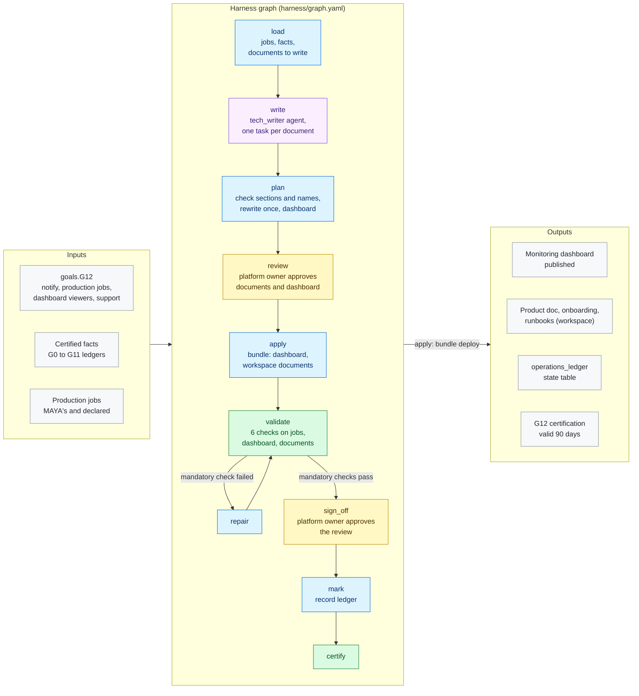

# G12 · Operations and documentation

**Milestone:** AI Ready &nbsp;·&nbsp; **Prerequisites:** G10, G11 &nbsp;·&nbsp; **Certified by:** platform owner
&nbsp;·&nbsp; **Certification valid:** 90 days

G12 makes the data product run without its builders and lets new users find their way. MAYA reads the production jobs (its own scheduled or triggered jobs and the declared jobs that feed the product) and checks each one runs on its own, retries and notifies the owners on failure. The bundle delivers a monitoring dashboard (evaluation pass rates, data quality, freshness, production job runs, agent traffic) and the documentation the tech_writer agent writes from what the earlier goals certified: product documentation, an onboarding page and a runbook per production job and served component.

## Architecture

Node colours: blue = MAYA code, purple = Omnigent agent, yellow = approval gate, green = validator and certification, grey = inputs and outputs. See [the architecture overview](../../../docs/ARCHITECTURE.md) for how goals fit together.

## What the customer provides

- Who every production job must notify on failure, how many retries each task needs, and the jobs outside MAYA that feed the product (CR-AR-7.1); MAYA checks them and never changes them.
- Who may view the monitoring dashboard (CR-AR-7.3) and where users and operators get help.
- A platform owner who approves the documentation (CR-AR-7.4, CR-AR-8.1, CR-AR-8.2) and the review.

## Checks

The goal is certified only when all 5 mandatory checks pass against the live workspace and the approvers have
signed off. Advisory checks are reported and never block.

| Check | Severity | Checklist | What it proves |
|-------|----------|-----------|----------------|
| `jobs_operable` | mandatory | AR-7.1 | Every production job runs on its own |
| `monitored` | mandatory | AR-7.3 | The monitoring dashboard is published with every query running |
| `runbooks` | mandatory | AR-7.4 | A runbook for every production job and served component |
| `documented` | mandatory | AR-8.1 | The product documentation covers data |
| `onboarding` | mandatory | AR-8.2 | The onboarding page tells a new user how to get access |
| `recent_failures` | advisory | AR-7.1 | Production jobs whose recent runs failed (informational) |

## Package contents

| File | Role |
|------|------|
| `code/apply.py` | Apply: the approved plan becomes bundle content (see deliver.py) and the bundle deploys it: the monitoring |
| `code/common.py` | Shared helpers for G12: the production jobs (MAYA's scheduled or triggered bundle jobs and the declared jobs that feed |
| `code/deliver.py` | Delivery: pure functions of the approved plan. The bundle gets the monitoring dashboard (a deploy declaration, |
| `code/docs.py` | Load and plan: the production jobs and their operability, the facts about the data product (read from what the |
| `code/gate_checks.py` | Extra checks on gate items and approver edits |
| `code/ledger.py` | Ledger state table: what each run delivered, used for drift |
| `code/monitoring.py` | Monitoring dashboard: one AI/BI dashboard over what the earlier goals record (evaluation runs, data quality and |
| `goal.yaml` | The goal's standard: prerequisites, outputs, checks, certification |
| `harness/agents/tech_writer.md` | Agent instructions |
| `harness/agents/tech_writer.yaml` | Omnigent agent definition |
| `harness/graph.yaml` | The harness graph shown above |
| `harness/schemas/document.schema.json` | Schema an agent's result must match |
| `harness/schemas/gates/operations_plan.schema.json` | Schema of an item an approver reviews at a gate |
| `harness/schemas/gates/operations_review.schema.json` | Schema of an item an approver reviews at a gate |
| `inputs.schema.json` | JSON Schema for this goal's block under `goals:` in `maya.yaml` |
| `validator/checks.py` | One function per check |

## Learn more

- Run it on the example: [Tutorial, 18.8 G12 Operations and documentation](../../../docs/TUTORIAL.md#188-g12-operations-and-documentation)
- Run it on your own foundation: [Tutorial, 24. Next: G12 operations and documentation on your data product](../../../docs/TUTORIAL_YOUR_FOUNDATION.md#24-next-g12-operations-and-documentation-on-your-data-product)
